As your organization’s support engineer, you’ve been asked to help fix an issue between your resources in the US and northern Europe. You have existing infrastructure of virtual networks in two different regions. The VMs in the US virtual network (VNet1) are unable to get a ping response from the VMs in northern Europe (VNet2).

Checking the topology, you can see that there are VPN gateways and connections.

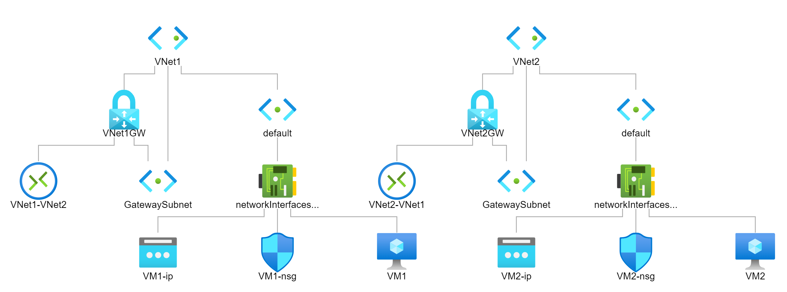

In this exercise, you'll troubleshoot and resolve the connectivity issue.

1. Open the Azure portal in a new tab.

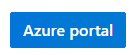

## Test the connection

1. We're going to test the connection between the two VMs, by sending a ping request between them.

1. In the search bar, type **virtual machines** then, under Services, select **Virtual machines**.

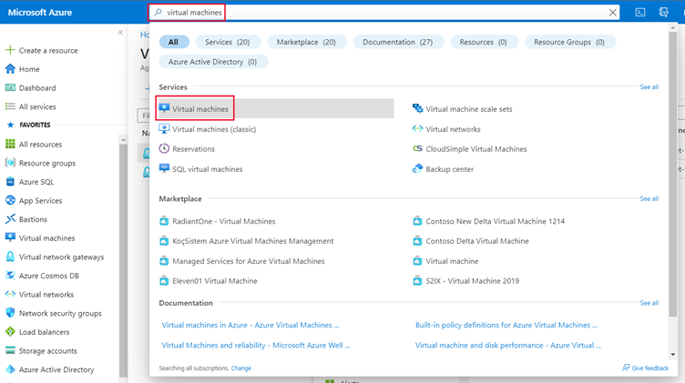

1. From the list of VMs, select VM1.

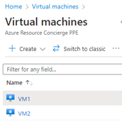

1. Make a note of the **Public IP address** and **Private IP address**.

:::image type="content" source="../media/5-networking-ip-address.png" alt-text="Screenshot of VM1 showing networking the private and public IP addresses." lightbox="../media/5-networking-ip-address-lightbox.png":::

1. Repeat the last two steps for VM2 and note the Public IP address and Private IP address.

1. On the right, in the Cloud Shell, connect to VM1 with SSH to the public IP address:

```azurecli

ssh azureuser@<VM1 public IP address>;

```

> [!NOTE]
> Replace &lt;VM1 public IP address&gt; with the public IP address you noted for VM1.

1. At the prompt, ` Are you sure you want to continue connecting (yes/no)? ` type yes.

1. At the prompt for a password, type azur3Pa55w.rd.

1. Your prompt should change to `azureuser@VM1:~$`.

1. This means you have successfully connected to VM1.

1. Ping the private IP address of VM2.

```

ping <private IP address VM2>

```

> [!NOTE]>
> Replace &lt;private IP address VM2&gt; with the private IP address you noted for VM2. 

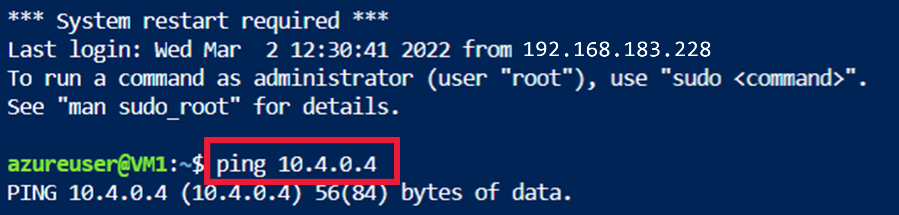

1. We can confirm that the two machines cannot connect, as there is no response from VM2.

## Troubleshoot the gateways

You’ll check the types are correct for both gateways.

1. Go to the Azure portal.

1. In the search bar, type **virtual network gateways**, and then select the service to continue.

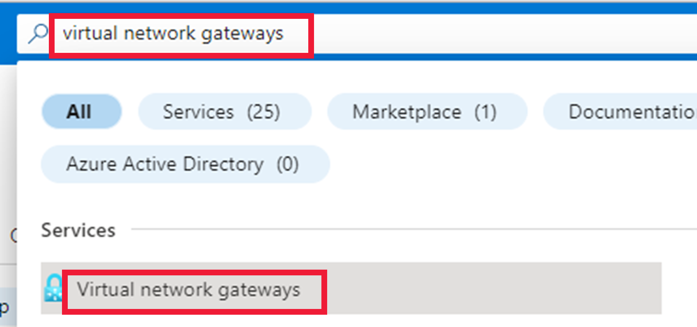

1. Select **VNet1GW**.

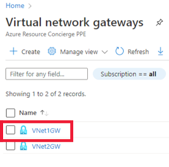

1. Confirm that the VPN type is route-based, and the gateway type is VPN.

:::image type="content" source="../media/5-vpn-routebased.png" alt-text="Screenshot showing the Gateway and VPN Type." lightbox="../media/5-vpn-routebasedlightbox.png":::

1. Scroll down the page to check the tunnel Ingress and Egress. Can you see a time when something might have happened to cause a problem?

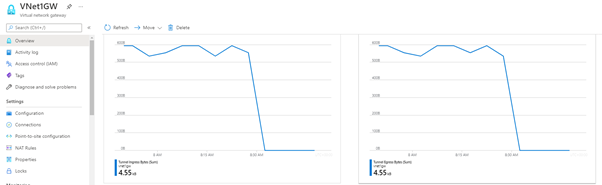

1. Repeat for VNet2GW.

## Troubleshoot the virtual networks

You’ll now check the address spaces don’t overlap for the two virtual networks.

1. In the search bar, type **virtual networks**, and then select the **Virtual network** service.

1. Select **VNet1**.


1. Make a note of the **Address space**.

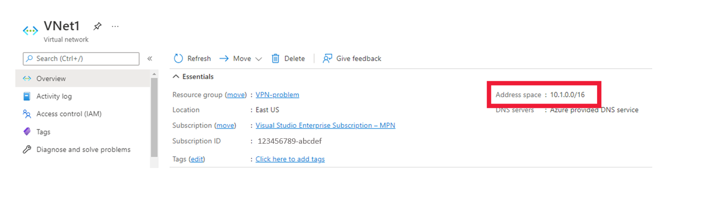

1. Select **VNet2**, and check that the address spaces do not overlap.

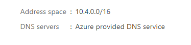

1. The two address spaces are different, so we can rule out any problems with them.

1. You’ll now check the subnets are correctly set up.

1. Select **VNet1**, then select **Subnets**.

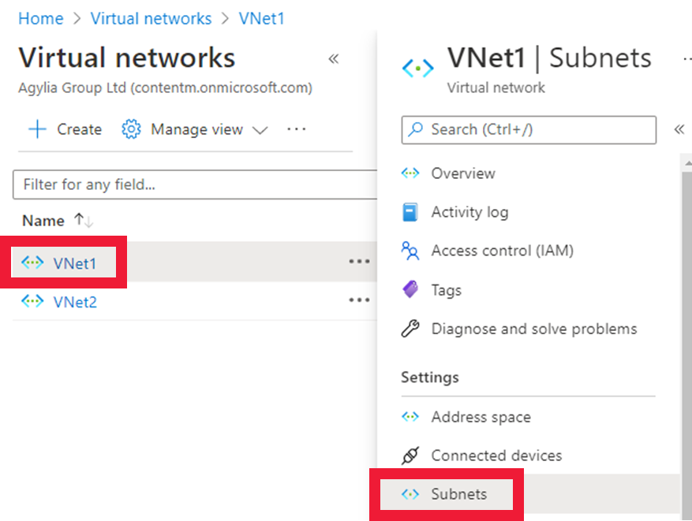

1. Check the **subnet address** is a subset of the **address space**.

1. Repeat for **VNet2**.


1. The **GatewaySubnet** addresses have been correctly created and correspond with the default range.

## Check the gateway connections

1. In the search bar, type virtual network gateway and then select **virtual network gateways**.

1. The two gateways will be displayed.

1. Select **VNet1GW**.

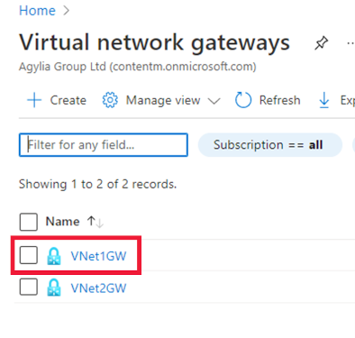

1. Select **Connections**.


1. The issue seems to be with the connections between the gateways.


1. Select **Refresh** to check that there is still an issue with connection.


1. A connection can still not be made, so you’ll check the shared keys.

1. Select **VNet1-VNet2**.

1. Select **Shared key**.

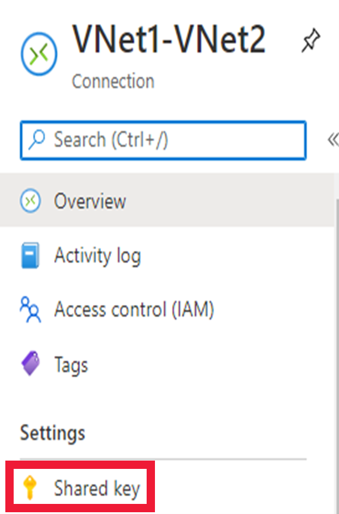

1. Make a note of the **Shared key**.

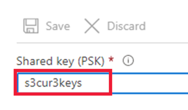

1. On the breadcrumb trail, select **VNet1GW**, then select **VNet2-VNet1**.

1. Select **Shared key**.

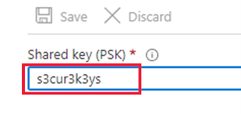

1. The shared keys are not the same. For the connections to work, the shared key must be identical.

1. Now that you’ve found the issue, you’ll resolve it in the next exercise.
