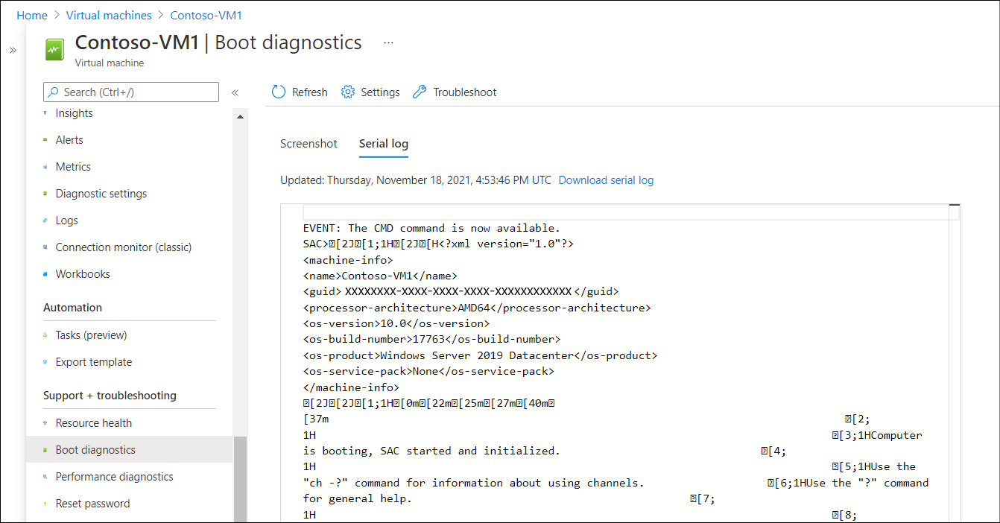
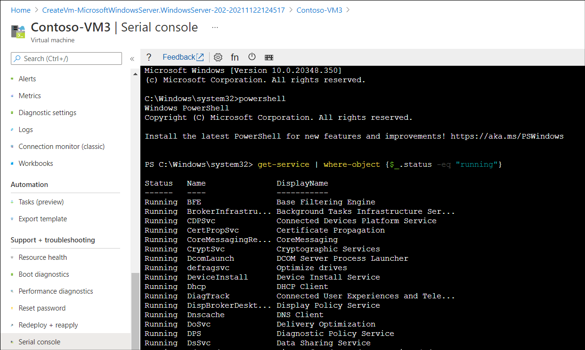

Windows Server is a robust and reliable operating system. However, occasionally startup problems can occur. It's important that you can identify the cause of a startup problem, and know how to resolve the issue.

## What tools can I use to identify the causes?

It's important to know which of the startup problem you’re facing. You can use the following tools to help make this determination:

- Boot diagnostics

- Azure Serial Console

### Review boot diagnostics

Boot diagnostic screenshots can be very useful in determining the specific cause of a startup problem in your Windows Server VM. When you create a Windows VM in Azure, you can enable boot diagnostics. To verify this setting is enabled, use the following procedure:

1. During VM creation, select the **Management** tab.

1. Ensure that **Boot diagnostics** is configured: **Enable with managed storage account (recommended)**.

> [!NOTE]
> This is enabled by default.

To review boot diagnostics for a VM, in the Azure portal, select the appropriate VM, and then:

1. In the navigation pane, select **Boot diagnostics** in the **Support + troubleshooting** section.

1. In the details pane, select **Screenshot** to review an image of the VM's screen output as recorded during the last startup attempt.

1. Select the **Serial log** tab to review a log file recorded during the last startup attempt, as displayed in the following screenshot.

> [!TIP]
> You can also download the serial log for additional review.

The following screenshot displays the output from the Serial log recorded from a Windows Server VM that started successfully.

### Use the Azure Serial Console for Windows

It's quite common to be unable to establish a connection to a VM that fails during startup. After all, if the operating system fails to start correctly, you might not be able to connect using more common methods, such as RDP, SSH, or Bastion. In these circumstances, you attempt to use the Azure Serial Console.

In order to use the Serial Console, your VM must have been configured to use the option **Enable with custom storage account** for the Boot diagnostics setting.

You can use the Serial Console to connect to a VM via the Azure portal. Use the following procedure:

1. In the portal, navigate to and select the appropriate VM.

1. In the navigation pane, in the **Support + troubleshooting** section, select **Serial console**.

1. If you successfully connect, the prompt is SAC>.

1. Then, run the following commands to enable Windows PowerShell connectivity to the VM:

   1. At the SAC> prompt, enter `cmd`.

   1. Press `<esc><tab>` to switch to the channel running your CMD instance.

   1. When you've selected the correct channel, press **Enter** and then sign in with administrative credentials.

   1. At the command prompt, enter `powershell'.

You can now use Windows PowerShell to run cmdlets to investigate and resolve your startup problem. The following screenshot displays the PowerShell prompt in the serial console for a Windows Server VM called Contoso-VM3. The administrator has executed the `Get-Service | Where-Object {$_.Status -eq "Running"}` command to review running services.

## What are the common boot errors?

Each server computer is different, but there are a number of common boot problems that are more frequently encountered. These include:

- BitLocker errors

- Blue screen errors

- CRITICAL SERVICE FAILED errors

- Stuck at Windows Update

> [!TIP]
> To be sure about which problem you face, ensure you review the boot diagnostics for your VM. The screenshot is often indicative of the problem. 

The following sections discuss the details about these specific startup issues.

### Troubleshoot BitLocker errors

BitLocker offers protection for your operating system drive through whole drive encryption. The OS drive is unlocked during the early phase of startup.

When you start up your VM, if it fails to start, review the screenshots in boot diagnostics. You'll be dealing with a BitLocker issue if the screenshots display any of the following messages:

- Plug in the USB driver that has the BitLocker key

- You’re locked out! Enter the recovery key to get going again (Keyboard Layout: US) The wrong sign-in info has been entered too many times, so your PC was locked to protect your privacy.

- Enter the password to unlock this drive [ ] Press the Insert Key to see the password as you type.

- Enter your recovery key Load your recovery key from a USB device.

The typical reason for these errors is that the VM couldn't locate the BitLocker Recovery Key to decrypt the drive. To resolve this problem:

1. Stop and deallocate the VM.

1. Restart your VM.

This procedure forces your VM to retrieve the BitLocker Recovery Key file from the Azure Key Vault. If this is unsuccessful, review the additional reading links at the end of this module for additional guidance.

### Troubleshoot blue screen errors

If your VM doesn’t start, review the screenshots in boot diagnostics. If you see a blue screen, use the following guidance to attempt a resolution.

There are any number of reasons why a computer stops and displays a blue screen. Common reasons include:

- Device driver problems

- Corrupted system file

- Memory corruption

- Inappropriate memory access by an installed app

> [!TIP]
> If you've recently made a configuration change, such as updating a driver or installing a new app, then consider reverting the computer's configuration to an earlier point in time. 

If that's unsuccessful, or not relevant, then use the following high-level steps to progress the problem's resolution. Collect a memory dump file:

1. Take a snapshot of the OS disk of the affected VM as a backup.

1. Attach the OS disk to a recovery VM.

1. Connect to the recovery VM.

1. Navigate to the attached OS disk and locate the memory dump file (in \Windows folder).

1. Submit a support ticket to Microsoft and attach the memory dump file to the submission.

If you cannot locate a dump file, you'll need to enable the dump log and Serial Console. On the recovery VM:

1. Open an elevated command prompt.

1. Run the script documented here: [Enable dump log and Serial Console](/troubleshoot/azure/virtual-machines/troubleshoot-common-blue-screen-error).

1. Detach the OS disk from the failed VM and reattach it to the failed VM.

1. Restart the failed VM to recreate the problem. A dump file is now produced.

### Troubleshoot CRITICAL SERVICE FAILED errors

If your VM fails to start, check the boot diagnostics for recent screenshots. If you see either of the following errors, your VM is experiencing a critical service failure:

- "Your PC ran into a problem and needs to restart. You can restart. For more information about this issue and possible fixes, visit https://windows.com/stopcode. If you call a support person, give them this info: Stop code: CRITICAL SERVICE FAILED"

- "Your PC ran into a problem and needs to restart. We're just collecting some error info, and then we'll restart for you. If you'd like to know more, you can search online later for this error: CRITICAL_SERVICE_FAILED"

These problems generate a blue screen, and so are caused by the same issues as for other blue screen errors. The resolution is also the same.

### Troubleshoot Stuck at Windows Update errors

If you review the boot diagnostics for recent screenshots for a failed VM, and you notice one of the following errors, you're dealing with a problem related to Windows Update:

- Installing Windows ##% Don't turn off your PC. This will take a while Your PC will restart several times.

- Keep your PC on until this is done. Installing update # of #...

- We couldn't complete the updates. Undoing changes Don't turn off your computer.

- Failure configuring Windows updates. Reverting changes. Do not turn off your computer.

If you suspect that your startup problem relates to a failed update, use the following high-level procedure to attempt recovery:

1. Take a snapshot of the OS disk of the affected VM as a backup.

1. Attach the OS disk to a recovery VM.

1. Connect to the recovery VM.

1. Open an elevated command prompt and run the `dism /image:F:\ /get-packages > c:\temp\Patch_level.txt` command to list recent updates.

    > [!NOTE]
    > Your `/image:` drive letter might vary.

1. Review the `Patch_level.txt` file from the bottom up. Locate the update that's in either of the following states:

    - Install Pending

    - Uninstall Pending

1. Run the `dism /Image:<Attached OS disk>:\ /Remove-Package /PackageName:<PACKAGE NAME TO DELETE>` command to remove the pending updates.

1. Detach the OS disk and recreate the VM.

> [!TIP]
> If you've got a recent backup, attempt to use that to recover your VM. That might be quicker. 

