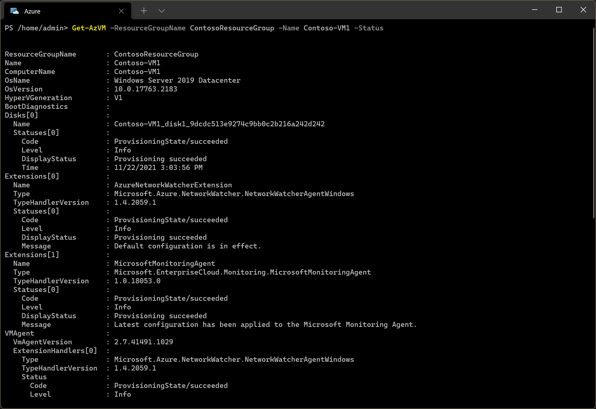

Azure VM extensions provide post-deployment configuration and automation tasks for your Azure VMs. For example, you can use VM extensions to:

- Perform software installation

- Provide anti-virus protection

- Run a script inside the VM

## Review extension status

If you experience problems with VM extensions, then use the following guidance to attempt resolution. The first thing to check is the status of any installed extensions. If the extension you want isn't running, then you'll need to determine why. One possible reason is that the VM Agent isn't running. If the agent isn't running, your extensions won't work correctly.

> [!NOTE]
> The VM Agent is required to manage, install, and execute extensions.

You can check the VM Agent status and the status of any installed extensions by using the `get-AzVM` PowerShell cmdlet:

1. Open a Cloud Shell instance and connect to the appropriate Azure subscription.

1. Run the following command:

    - `Get-AzVM -ResourceGroupName $RGName -Name $vmName -Status`

The returned output describes available extensions and their state. It also indicates the status of the VM Agent. The following screenshot displays the output from this command for a VM called Contoso-VM1 in the resource group ContosoResourceGroup. There are two VM extensions:

- AzureNetworkWatcherExtension

- MicrosoftMonitoringAgent

Both are provisioned successfully. Details about the VM agent is also displayed towards the end of the output. It's status is Ready, and the version is 2.7.41491.1029.

You can get specific details about a particular extension by using the following PowerShell command: `Get-AzVMExtension -ResourceGroupName $RGName -VMName $vmName -Name $ExtensionName`.

> [!TIP]
> You can also review an extension's state using the portal.

## Review extension logs

Extensions logs can be used to locate more information about the extension and its problem. In Windows:

- Extension logs reside in the C:\WindowsAzure\Logs\Plugins folder.

- Extension settings and status files reside in the C:\Packages\Plugins folder.

If, after reviewing the logs, you're uncertain where the problem lies, you might need to consult additional documentation that is specific to the particular extension. This additional information can be found in a link in the Summary unit of this module.

> [!TIP]
> If your extension is showing in a failed state, then consider removing and then reinstalling the extension. 

