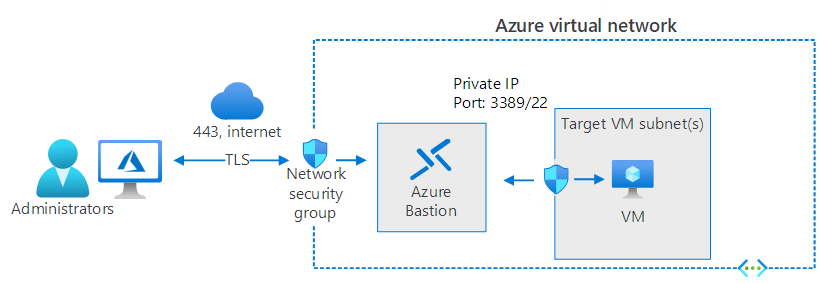

Administrators must necessarily connect to their Azure VMs remotely. When you first create and configure your Windows Server VM in Azure, you typically define the ways in which administrators can remotely connect. These include:

- Remote Desktop Protocol (RDP). Uses TCP port 3389 for connectivity.

- Secure Shell (SSH). Uses TCP port 22 for connectivity.

> [!NOTE]
> RDP is selected by default.

In addition to these methods, you can also enable and configure Windows Admin Center and Azure Cloud Shell to enable remote management of your Azure VMs.

## Troubleshoot RDP connections

If you're using RDP to connect to your Azure VMs, you might occasionally encounter problems. These problems might include:

- The remote desktop service on the target VM.

- The underlying network connection.

- The remote desktop client on your administrative computer.

If you're experiencing connection issues, test the connection. Open the Azure portal and use the following procedure:

1. Navigate to the VM you want to connect to.

1. Select **Connect** in the **Settings** section of the navigation pane.

1. Review, and if necessary, update the settings for RDP.

   > [!TIP]
   > Make a note of the Public IP address and TCP port being used. These are required for the remote desktop client. 

1. Select the **Test your connection** link.

1. Select **RDP** in the Service list, and then select **Test connection**.

If this basic connectivity test is successful, then attempt to reconnect using the recorded details. If you’re unsuccessful, then consider the following:

- Verify that RDP is a supported connection type for this VM. Should you be using Azure Bastion, for example?

- Check any Network Security Group rules to ensure that they're not blocking the RDP traffic:

   1. In the portal, in the navigation pane, select **Networking**.

   1. In the details pane, select **Effective security rules**. Verify traffic on TCP port 3389 is permitted.

- If traffic is permitted, then consider resetting the virtual machine's NIC.

- If that doesn't resolve the issue, if possible, restart the VM itself.

> [!IMPORTANT]
> Are you sure you have the right username and password for the target VM? If you're unsure, check the username and reset the password. Then update the details in your remote desktop client connection profile.

A final thing to consider is that it's possible that Azure Firewall or Windows Defender Firewall might be blocking the required ports.

## Consider implementing Azure Bastion

Azure Bastion is a service you can use to securely connect to your Azure VMs remotely, without needing to expose remote administrative ports to the internet. When you use RDP, you expose TCP port 3389 on the internet. Due to these protocol vulnerabilities, it's highly undesirable to expose the RDP (or SSH) ports to the internet. Azure Bastion provides a solution.

Bastion host servers:

- Are designed and configured to withstand attacks.

- Provide RDP and SSH connectivity to your Azure workloads behind the bastion.

The following diagram displays the architecture of a typical Azure Bastion deployment. In this diagram:

- The bastion host is deployed in the Azure virtual network.

- A user connects to the Azure portal using any HTML5 browser over TLS.

- The user selects the VM to connect to.

- The Bastion host establishes the RDP/SSH connection to the target VM.

In this scenario, the administrator connects using TCP port 443, and the RDP port is not exposed to the internet. By using Azure Bastion, you can simplify, and secure, the process of establishing a remote management connection.

