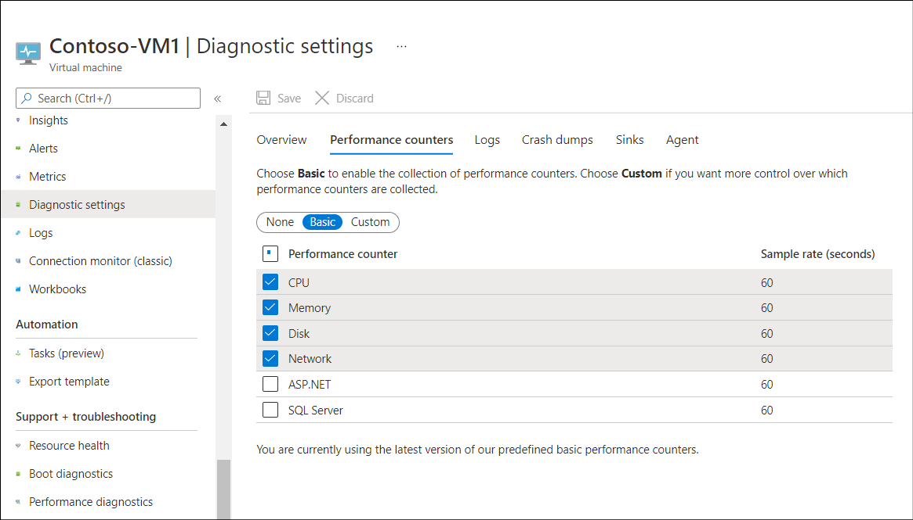
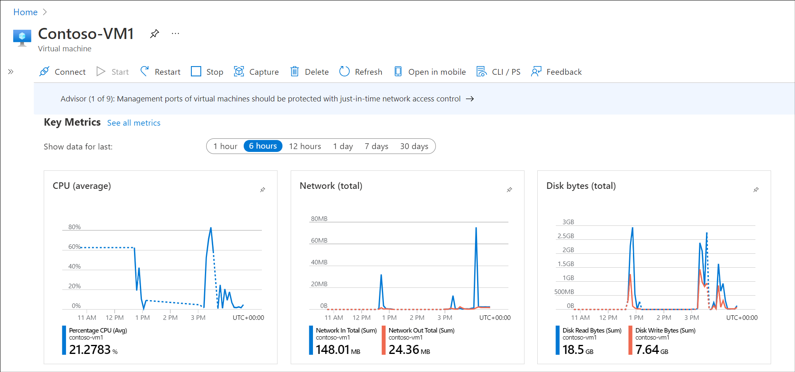

When you deploy Windows Server on a physical computer, you purchase the required hardware after careful consideration of the expected workload. If you find that the performance of the server is disappointing, it might be because you underspecified the hardware. Unfortunately, it can be difficult to add resources to a physical server computer after deployment. However, if you deploy your workload on a Windows Server VM running in Azure, you are able to adjust the resource characteristics of the VM more easily.

## What resources should you monitor?

All computers use four key resources. These are described in the following table.

| Resource| Description|
| :--- | :--- |
| Memory| Programs and data load from a disk into memory before a program manipulates the data. In servers that run multiple programs or where datasets are extremely large, increasing the amount of installed memory can help improve server performance. Windows Server uses a memory model in which it doesn't reject memory requests by applications that exceed the computer's total available memory. Rather, it performs paging for these requests. During paging, Windows Server moves data and programs in memory that are currently not in use by the processors to the paging file, which is an area on the hard disk. This frees up physical memory to satisfy the excess requests. However, if a hard disk is comparatively slow, it has a negative effect on performance. You can reduce the need for paging by adding more memory.|
| Processor| Processor speed is an important factor in determining your server's overall computing capacity. Processor speed can be defined as the number of operations that can be performed in a measured period. For example, a billion processor cycles per second is one gigahertz (GHz). Servers with multiple processors and processors with multiple cores generally perform processor-intensive tasks with greater efficiency and speed than a single processor or single-core processor computers. Processor architecture is also important.|
| Disk| Server hard disks store programs and data. Consequently, the throughput of hard disks affects the speed of your server, especially when the server is performing disk-intensive tasks. Some hard disks (HDDs) have moving parts, and it takes time to position the read/write heads over the appropriate disk sector to retrieve the requested information. By selecting faster disks (such as SSDs) you can alleviate the potential for a disk subsystem to create a performance bottleneck.|
| Network| The network is a critical part for performance monitoring because many network applications depend on the performance of network communications. Poor network performance can cause slow or unresponsive applications and server functionality. Therefore, network capacity planning is very important. While planning network capacity, you must consider bandwidth capacity and the capacity of any network devices, such as router and switch capacity. In many cases, optimizing the configuration of network devices such as switches or routers improves the performance of a network and network applications.|

If you experience unsatisfactory performance, you must review the workload running on the server in relation to that workload's use of these four resources. This approach helps you to determine which resource is degrading performance. You can then adjust that resource on the target VM.

## What tools are available for performance monitoring?

You can use the following tools to monitor performance of Windows Server. You can use these same tools whether the server is installed as physical computer or whether it's a VM running in Azure or elsewhere. The tools are:

- Performance Monitor. Provides both real-time and log-based performance monitoring.

- Windows Admin Center. Enables you to add the same objects and counters as those provided by Performance Monitor.

- System Insights. Provides performance data and capacity planning in the following areas:

  - CPU

  - Network

  - Physical disk

  - Storage consumption

  - Volume consumption

- VM diagnostics. Enables you to receive alerts on high-level resources usage.

  - Guest-level monitoring. Collects data that relates to the four core resources, and enables you to add additional counters.

  - Storage account diagnostics. Provides storage IO performance focused data.

- VM performance diagnostics. Enables you to generate reports and review insights on performance-related objects.

### Enable guest-level monitoring

Before you can use guest-level monitoring, you must enable it. You can do that from the Azure portal:

1. Select the appropriate VM.

1. In the navigation pane, select the **Diagnostics settings** link, and then in the details pane, select **Enable guest-level monitoring**.

1. After monitoring is enabled, you can select specific performance counters. By default, the following objects are analyzed:

    - CPU

    - Memory

    - Disk

    - Network

To adjust performance data that's collected, for the appropriate VM, in **Diagnostics settings**, in the detail pane, select the **Performance counters** tab. The following screenshot displays this tab.

You can fine-tune the counters you want to collect. As displayed in the preceding screenshot, by default, Basic is selected, which means data relating to the four key resources is gathered.

### Enable storage account diagnostics

You can also enable and configure storage account diagnostics. To do this, in the portal:

1. Select the appropriate VM and then, in the navigation pane, select **Disks**.

1. Select the appropriate disk, and on the **Overview** page, you can review the following:

    - Disk Bytes/sec (Throughout)

    - Disk Operations/sec (IOPS)

    - Disk QD (Queue Depth)

If you want to review additional metrics for the selected disk, in the navigation pane, select **Metrics**. You can then select the metrics that you're interested in.

### Monitor resources

To review the data being monitored, in the portal, select the Overview page for the appropriate VM. In the details pane, select the Monitoring tab. You can review the default metrics, which in this case are CPU (average), Network (total), and Disk bytes (total).

### Run performance diagnostics

In addition to guest-level monitoring, you can also run performance diagnostics on your VMs. Supported performance troubleshooting scenarios include:

- Quick checks on known issues and best practices.

- Scenarios around complex problems that involve:

  - Slow VM performance

  - High usage of resources such as processor, disk space, and memory

To enable performance diagnostics, complete the following procedure:

1. Select the appropriate VM and in the navigation pane, in the **Support + troubleshooting** section, select **Performance diagnostics**.

1. In the details pane, select **Install performance diagnostics**.

1. On the **Run diagnostics** pane, select the check box to acknowledge the license terms, and then select **OK**.

1. After installation is complete, and the diagnostics are run, select the report from the list and review its contents for insights.

## Remediate poor performance

If you identify poor performance in your VMs, you should determine whether you need to take action. If the performance issue is a due to expected high-demand of the VM, and this is expected to decline, you might decide to take no action. If, however, you think that the demand will continue at a higher level, or even increase, you must remediate the issue.

Review the documentation on the [Observing bottlenecks](/troubleshoot/azure/virtual-machines/troubleshoot-performance-virtual-machine-linux-windows) page to help you identify performance problems.

Essentially, you have two choices:

- Reduce the workload on the VM. In this situation, perhaps you decide to distribute the load you've identified to other VMs. You'd be wise to continue monitoring to ensure that this eases the problem on the targeted VM.

- Add resource to the VM. Unlike physical servers, it's comparatively easy to add resource to an Azure VM. You can simply resize the VM.

If you decide to resize your VM, you can choose between many predefined sizes. Some are general purpose, and others are optimized for specific scenarios. For example, H-Series VM sizes are optimized for high performance computer VMs. Review and then select a more appropriate VM size for your workload.

> [!WARNING]
> Consider that different size VMs have different costs attached. 

You could also consider using Azure virtual machine scale sets for high demand workloads. The VMs in Azure virtual machine scale set all have the same configuration and run the same applications. As demand grows, the number of VMs running in the scale set can increase. As demand slackens, excess VMs can be shut down. Virtual machine scale sets are ideal for scenarios that include compute and big-data workloads.

> [!NOTE]
> Virtual machine scale sets can respond to increases and decreases in demand by changing the number of VM instances, and also by changing the size of VM instances.

