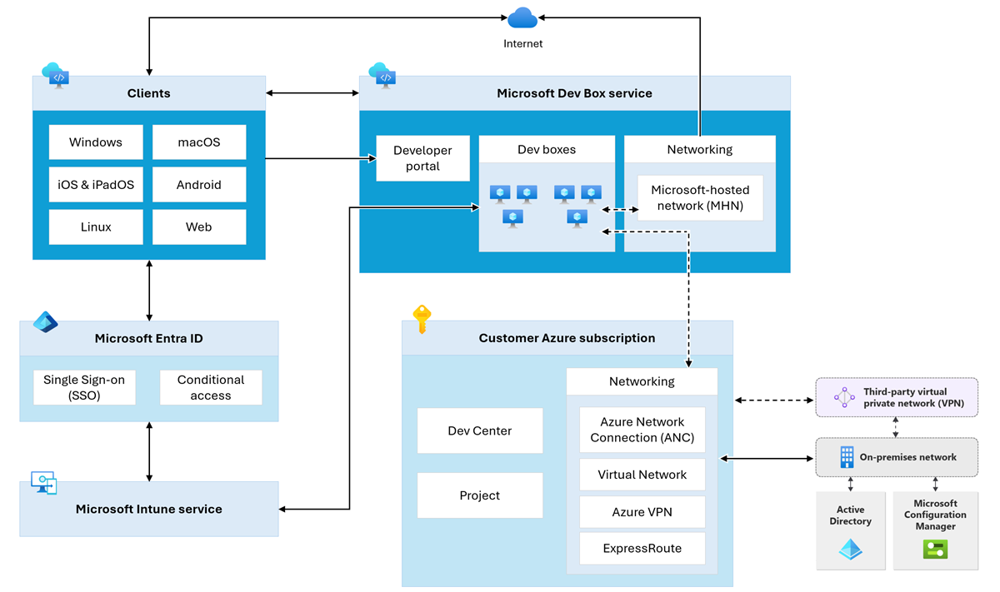

In this unit, you learn how the various Microsoft technology components form the building blocks of an organization’s IT architectural system, with Microsoft Dev Box as one of the key components. 

The diagram shows how Microsoft Dev Box service fits in a typical organization’s IT infrastructure with their on-premises systems connected to the Azure cloud. This high-level architecture guides you on how to deploy Microsoft Dev Box service for a mid-sized to a large enterprise. 

  

The various components of this typical architecture include:

- **Microsoft Dev Box service** has the developer portal which is used by the developers to provision Dev Box machines. Most of the time these machines are hosted in the Microsoft-owned network.

- Once the Dev Box service is set up properly, the Dev Box machines can be accessed by various **clients** including Windows, macOS, iOS, Linux, and Android through the Microsoft-hosted network.

- **Microsoft Entra ID** (formerly Azure Active Directory) is used by the clients to access the Dev Box machines securely through a Single Sign On (SSO) experience along with applying conditional policies based on factors such as user identity, location, device compliance, application sensitivity, etc.

- **Microsoft Intune** is utilized to enroll developer local client machine and Dev Box machines utilizing Microsoft Entra ID for authentication. Device compliance status is managed by Intune and it is used by Entra ID to provide conditional access to network resources. 

- Azure resources needed for Dev Box service such as Dev center and projects are created and owned by the **customer Azure subscription**. When the Azure network connection is used to configure Dev Box machines, it is managed by the customer subscription. When the on-premises network connects directly to Azure cloud, services like Azure Virtual Network, Azure VPN, and Azure ExpressRoute are part of the customer's subscription.   