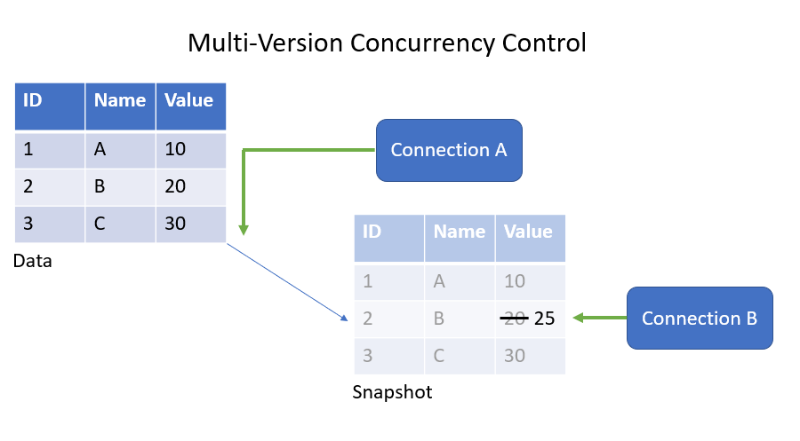

Most database management systems (DBMS) use locks to enforce concurrency control, but PostgreSQL supplements locking with an alternative approach. PostgreSQL uses a system called Multi-Version Concurrency Control (MVCC) that allows multiple versions of the same row to exist to improve concurrency. With this system, each query sees a previous snapshot of the data that is transactionally consistent. MVCC ensures a transaction that is reading data doesn't block a transaction that is writing data and vice versa.

For example, Connection A is performing a query that scans all of the rows of a table. At the same time, Connection B is performing a query that updates some of the rows. MVCC allows both of the queries to run at the same time by creating another version of the affected rows. In this way, Connection B can perform the updates without affecting Connection A. This process is achieved by each row version having an **xmin** value for the *visible since* transaction and an **xmax** value for the *visible until* transaction. With MVCC, Connection A will ignore any modifications that occurred after the Connection A query started.



## Transactions

Transactions in a DBMS are an atomic unit of work, therefore the transaction either commits in its entirety or not at all. Transactions are also used for concurrency purposes. With isolation levels, the effect that one transaction can have on other, concurrent transactions, can be defined.

You start a transaction with a BEGIN TRANSACTION or START TRANSACTION. You complete a transaction with either COMMIT, to save all of the changes made in the transaction, or ROLLBACK, to undo any changes made by the transaction. For example:

```sql
BEGIN TRANSACTION;
    UPDATE production.workorder
        SET stockedqty=7
        WHERE workorderid=1;
COMMIT;
```
