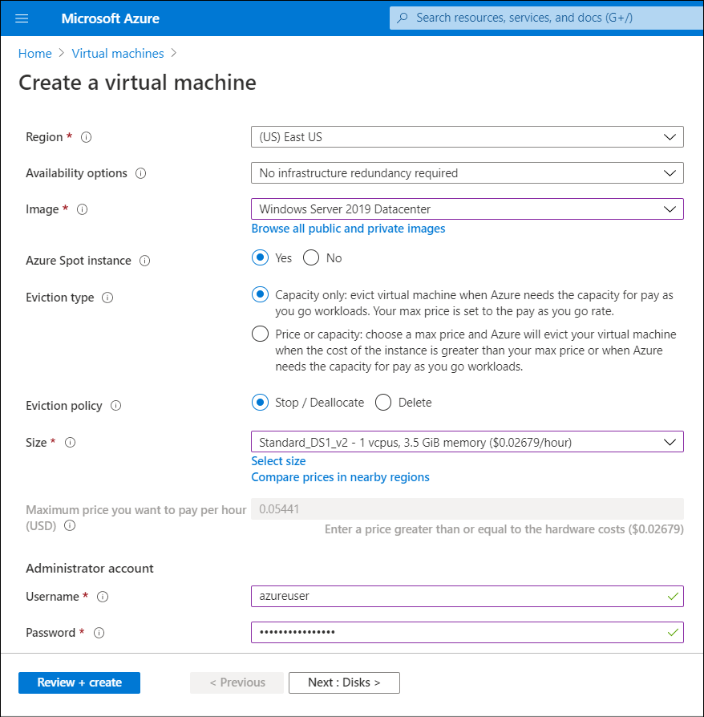

Contoso can also use *Azure Spot instance* when they create their VMs to manage costs. In addition, by using *Azure Reservations*, Contoso can create cost savings for their Azure workloads.

## Use Spot VMs

Using Spot VMs enables you to make the most of unused capacity in the Azure infrastructure. This can result in a significant cost saving. However, whenever Azure needs the capacity allocated to Spot VMs, the Azure infrastructure evicts those VMs with only a 30-second notice.

> [!TIP]
> Use Spot VMs for workloads that can handle interruptions. These could include, for example, batch processing jobs, test environments, and large compute workloads.

When you deploy Spot VMs, Azure allocates the VMs if there is capacity available. The amount of available capacity varies based on factors such as size, region, and time of day.

You create Spot VMs when you initially create the VM. On the **Create a virtual machine** blade, for the **Azure Spot instance** option, select **Yes**. You must then configure the values described in the following table.

|Value|Description|
|------------------------------------------|------------------------------------------------------------|
|**Eviction type**|Azure Spot offers two eviction methods. **Capacity only** evicts the VM when Azure needs the capacity for pay-as-you-go workloads. Your maximum price is set to the pay-as-you-go rate. With **Price or capacity**, you choose a maximum price and Azure evicts your VM when the cost of the instance is greater than your maximum price, or when Azure needs the capacity for pay-as-you-go workloads.|
|**Eviction policy**|You choose what happens to the VM when it's evicted. Upon eviction, the VM can be stopped and deallocated if you plan to re-deploy or need access to the disk after eviction. If you don't, the VM can be deleted to clean up the VM and disks.|
|**Maximum price you want to pay per hour**|You must enter a price greater than or equal to the hardware costs. Provided your selected price is greater than the platform price and Azure has excess capacity, you'll be allocated capacity.|

> [!CAUTION]
> There is no service-level agreement (SLA) for Spot VMs.

You can opt to receive in-VM notifications through Azure Scheduled Events. This notifies you if your VMs are being evicted, and you'll have 30 seconds to complete any jobs and perform shutdown tasks prior to the eviction.

## Use Azure Reservations

If you've VM workloads that are static and predictable, you can use *Azure Reservations* to potentially save a significant amount off the pay-as-you-go cost. The savings depend on the VM size and how long the VM is running. You commit to reserved instances in one-year or three-year terms. You can make payment in full for the entire commitment period, or the commitment can be billed monthly. After it's reserved, Microsoft matches up the reservation to running instances and deducts the hours from your reservation. You can purchase reservations through the Azure portal using the following procedure:

1. In the Azure portal, in the search box, enter **Reservations**, and then from the drop-down list, select **Reservations**.
2. On the **Reservations** blade, select **Purchase Now**.
3. On the **Purchase reservations** blade, select the appropriate resource. For example, select **Virtual machine**.
4. On the **Select the product you want to purchase** blade, choose the product, and then select **Select**.
