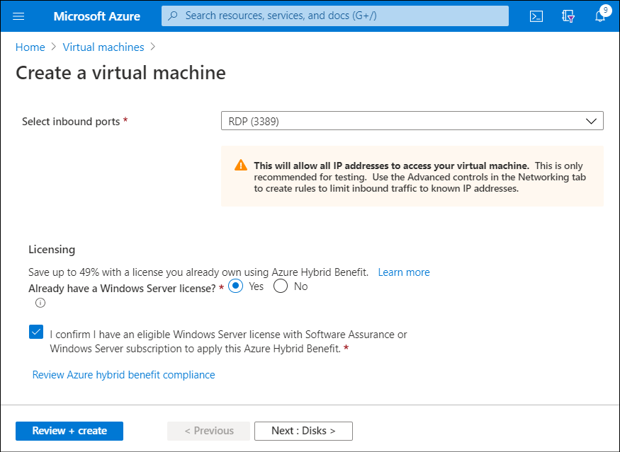

Contoso IT operations has invested in numerous Windows Server licenses for their on-premises servers. They would like to repurpose these licenses on Azure. The *Azure Hybrid Benefit* offer enables Contoso to use these licenses for the VMs they create on Azure.

> [!NOTE]
> To be eligible for this offer, your Windows licenses must be covered by Software Assurance.

## Azure Hybrid Benefit for Windows Server

Azure Hybrid Benefit is a pricing offer that'll help to maximize the value of your existing on-premises Windows Server license investment while you’re migrating to Azure. When you want to implement Azure Hybrid Benefit, the following guidelines apply:

- Each two-processor license or each set of 16-core licenses is entitled to two instances of up to 8 cores or one instance of up to 16 cores.
- You can only use Standard Edition licenses either on-premises or in Azure, but not both. This means you can't use the same license for an Azure VM and an on-premises server.
- Datacenter Edition benefits allow for simultaneous use of both on-premises computers and Azure VMs, meaning that the license covers two running Windows Server computers.

> [!NOTE]
> Most organizations license Windows Server by processor core. You'll probably use that model for calculating potential savings.

Applying the benefit is easy. When you create a VM, you can specify the licensing model. Use the following procedure when you create a VM in the Azure portal:

1. On the **Create a virtual machine** blade, for the **Already have a Windows Server license?** option, select **Yes**.
2. Select the check box for **I confirm I have an eligible Windows Server license with Software Assurance or Windows Server subscription to apply this Azure Hybrid Benefit**.

> [!NOTE]
> You can also use PowerShell or Azure CLI to complete this task.



You can also change the licensing option for an existing VM. For example, to convert existing Windows Server VMs to Azure Hybrid Benefit for Windows Server, run the following PowerShell command:

```PowerShell
$vm = Get-AzVM -ResourceGroup "rg-name" -Name "vm-name"
$vm.LicenseType = "Windows_Server"
Update-AzVM -ResourceGroupName rg-name -VM $vm
```

To change the VM back to pay-as-you-go, run the following PowerShell command:

```PowerShell
$vm = Get-AzVM -ResourceGroup "rg-name" -Name "vm-name"
$vm.LicenseType = "None"
Update-AzVM -ResourceGroupName rg-name -VM $vm
```

At any time, you can verify the licensing type for an existing VM. Run the following command in Azure Cloud Shell:

```PowerShell
Get-AzVM -ResourceGroup "myResourceGroup" -Name "myVM"
```

The following output indicates that the VM is licensed with Azure Hybrid Benefit for Windows Server licensing:

```PowerShell
Type                     : Microsoft.Compute/virtualMachines
Location                 : westus
LicenseType              : Windows_Server
```

The following output indicates that the VM is licensed without Azure Hybrid Benefit for Windows Server licensing:

```PowerShell
Type                     : Microsoft.Compute/virtualMachines
Location                 : westus
LicenseType              :
```

> [!NOTE]
> This example output displays only the relevant portion of the output for the `get-AzVM` cmdlet.
