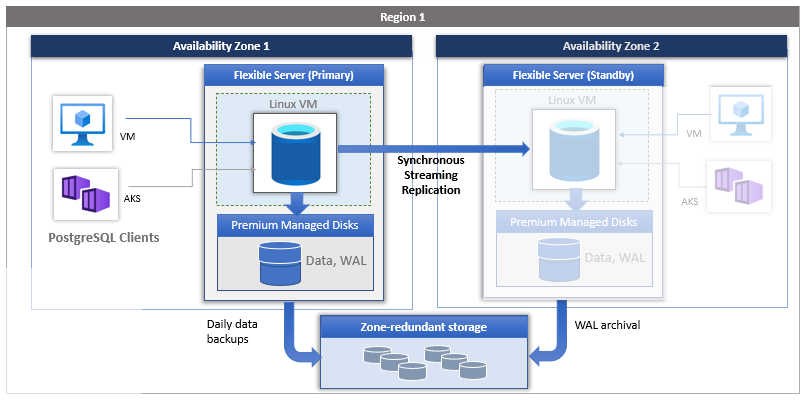

The parameter **wal_level** allows you to define how much information should be written to the log. There are two options: LOGICAL or REPLICA. REPLICA is the default. This parameter is set when the server is started.

## High availability

High availability is an Azure Database for PostgreSQL service, which provides a standby server ready to take over if there's a failure on your live server. High availability in Azure Database for PostgreSQL flexible server uses replication to automatically update the standby server with data changes.

When you configure high availability for Azure Database for PostgreSQL flexible server, the **primary** server is placed in one availability zone, and a **standby** server is created in a different availability zone. Data is replicated from the primary server to the standby server using PostgreSQL streaming replication in synchronous mode.

Each availability zone consists of one or more data centers. Availability zones have their own power supplies, cooling systems, network infrastructure, etc., making them independent of each other. Three copies of data files and write-ahead log (WAL) files are stored on locally redundant storage within each availability zone, providing physical isolation between primary and standby servers. If one availability zone fails, the other two likely continue working. Availability zones within a region are connected by fast fibre networks with round-trip latency of less than 2 milliseconds.


> [!NOTE]
> Not all regions have availability zones.

With high availability, data is duplicated all the time the database is in use, providing an up-to-date copy of the original. If there's a crash, the replica can be used in place of the original. Replication has a **primary** server and a **standby** server. The **primary** server sends WAL log files to the **standby** server, which receives the WAL log files.

The standby server reports back to the primary server with information such as the last write-ahead log it wrote, and the last position flushed to disk, etc. To define the minimum frequency for the WAL receiver to send back a report, set the **wal_receiver_status_interval** parameter. The **max_replication_slots** parameter defines the maximum number of replication slots that the server can be support. When **wal_level** is set to REPLICA, **max_replication_slots** must be at least one, however, the allowed value range is between and 2 and 262,143.

The **max_wal_senders** parameter sets the maximum number of WAL sender processes.



The primary and standby servers are monitored, and appropriate actions are taken to remediate issues including triggering a failover to the standby server. The following, lists the zone redundant high availability statuses:

- **Initializing** - In the process of creating a new standby server.
- **Replicating** - Data Replication is in steady state and healthy.
- **Healthy** - The standby is being updated by the primary.
- **Failing Over** - The primary database server is in the process of failing over to the standby.
- **Removing Standby** - In the process of deleting standby server.
- **Not Enabled** - Zone redundant high availability isn't enabled.

You can add high availability for an existing database server. If you're enabling or disabling high availability on a live server, perform the operation when there's little activity.

From the Azure portal:

1. Navigate to your Azure Database for PostgreSQL server.
1. From the **Overview** section, select your current **Configuration**. The **Compute + Storage** section is displayed.
1. Under High availability, select **High Availability (zone redundant)** check box to enable high availability. High availability isn't supported for Burstable tier.

It's important to note that high availability is a disaster recovery option. You can't use the standby server for any other purpose, such as allowing access to read-only databases. You can, however, configure replication between two Azure Database for PostgreSQL servers using a publisher and subscriber model. This configuration maintains two servers with data being replicated between them. You then have full access to the subscriber server and can use the databases for any purpose. You practice this configuration in the exercise at the end of this module.

## Logical decoding

Logical decoding also uses data sent to the write-ahead log. As the name suggests, it decodes the entries in the write ahead log to make them understandable. All INSERT, UPDATE, and DELETE changes are available to logical decoding.

Logical decoding might be used for auditing, analytics, or any other reason you might be interested in knowing what changed, and when it changed.

Logical decoding extracts changes from all tables in the database. It differs from replication in that it can't send these changes to another PostgreSQL instances. Instead, a PostgreSQL extension is plugin to stream the changes.

Logical decoding allows the contents of the write-ahead log to be decoded into an easy-to-understand format, which can be interpreted without knowledge of the database structure. Azure Database for PostgreSQL supports logical decoding and the **wal2json** plugin, which is installed on Azure Database for Postgres servers.

Other extensions can be used, such as the pglogical extension, which allows logical streaming replication.

To use logical decoding, in **Server parameters**, set:

- **wal_level** to LOGICAL
- **max_replication_slots** = 10
- **max_wal_senders** = 10

The server must be restarted after these changes are made.

To use the **pglogical** extension from the Azure portal:

1. Navigate to your Azure Database for PostgreSQL server.
1. Select **Server parameters**, and search for **shared_preload_libraries**. From the drop-down box, select **pglogical**.
1. Search for **azure.extensions**. From the drop-down box, select **pglogical**.
1. To apply the changes, restart the server.

You must also grant the admin user permissions for replication:

```sql
ALTER ROLE <adminname> WITH REPLICATION;
```

For more information, review the [pglogical extension documentation](/azure/postgresql/flexible-server/concepts-logical#pglogical-extension) online documentation.

Logical decoding outputs data changes as a stream called a [logical replication slot](https://www.postgresql.org/docs/current/logicaldecoding-explanation.html#LOGICALDECODING-REPLICATION-SLOTS).

1. Each slot has one output plugin, which you can define.
1. Each slot provides changes from only one database, but a database can have multiple slots.
1. Each data change is normally emitted once per slot.
1. If PostgreSQL restarts, a slot could re-emit changes, which the client needs to handle.
1. Slots must be monitored. Unconsumed slots hold on to all the WAL files for those unconsumed changes. This situation can lead to storage full or transaction ID wraparound.
