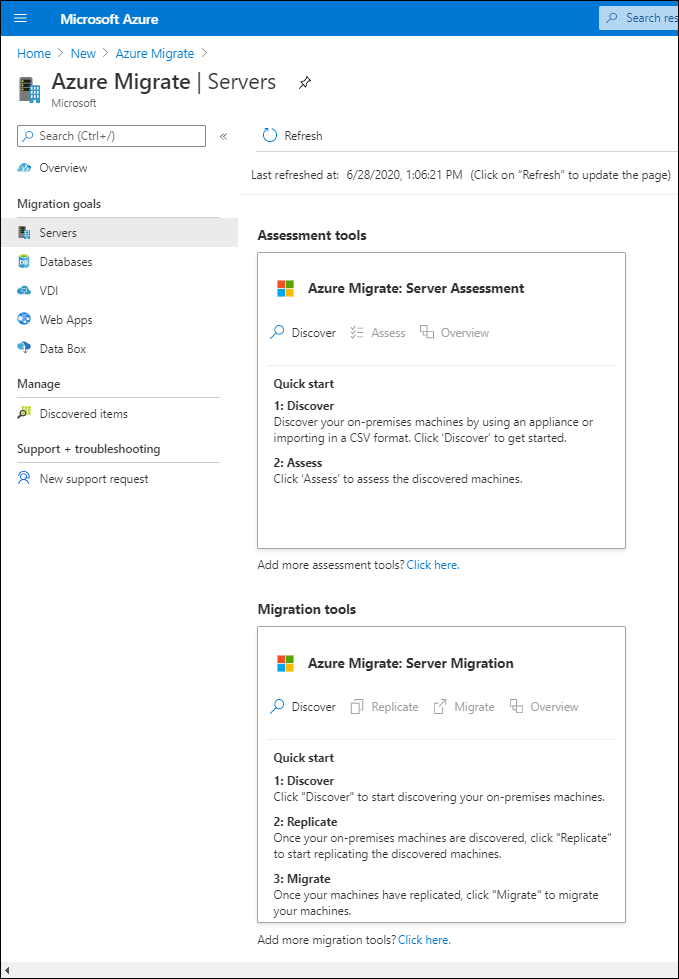

After the Contoso IT department has selected the workloads that want to migrate, they are ready to undertake a project-planning stage. They'll need to know the four main technical implementation steps involved in actually moving a server workload to an Azure VM workload using Azure Migrate:

1. Prepare Azure for the Azure Migrate: Server Migration tool.
2. Prepare the on-premises VMs for migration.
3. Replicate the on-premises VMs.
4. Migrate the VMs.

## Preplanning

Before reviewing the main steps in detail, you should note that these steps are only part of the overall migration. Most of the work is in the preplanning phases that involve a thorough assessment of the business model, the current processes and systems, and finally, what will be envisioned in Azure. In other words, how will the business process present in Azure when the migration is completed? The following table identifies various considerations.

|Consideration|Details|
|--------------|-------|
|Business motivations |IT Leadership must work closely with business partners to understand what they want to achieve with the migration. The business drivers should focus on addressing business growth, limiting risks, and specifying the extent of the migration.|
|Migration goals|Migration goals are used to determine the best migration method.|
|Solution design|After understanding the goals and requirements, IT Leadership will design and review a deployment solution, and identify the migration process, including the Azure services that they will use for the migration.|

## Technical implementation

Next, it's important to consider the steps involved in a technical implementation phase, as outlined in this section.

### 1. Prepare Azure for the Azure Migrate: Server Migration tool

You require the following Azure components to migrate your on-premises VMs to Azure:

- A virtual network (VNet) in which Azure VMs are connected when they're created during migration.
- The **Azure Migrate: Server Migration** tool provisioned and configured.

You can start the imported image and configure the Server Migration tool using the following steps:

   1. Set up the prerequisites.
   2. Point the tool to the Azure subscription.
   3. Add any Windows-based credentials for discovery.

After configuration completes, it will take some time for the tool to enumerate all the VMs. After the enumeration is complete, the VMs will be listed in the Azure Migrate tool for your review.

### 2. Prepare on-premises VMs

After migration, you will connect to the Azure VMs and allow Azure to manage the VMs. To do this, perform the relevant steps: 

- For access over the internet:
   - Enable Remote Desktop Protocol (RDP) or Secure Shell (SSH) on the on-premises VM.
   - Ensure that Transmission Control Protocol (TCP) and User Datagram Protocol (UDP) rules are added for the **Public** profile.
   - Check that RDP or SSH is allowed in the OS firewall.
- For access over site-to-site virtual private network (VPN):
   - Enable RDP or SSH on the on-premises VM.
   - Check that RDP or SSH is allowed in the operating system firewall.
   - For the Windows OS, set the operating system's system area network (SAN) policy on the on-premises VM to **OnlineAll**.
   - Install the Azure agent.
- Other considerations:
   - For Windows, there should be no Windows updates pending on the VM when triggering a migration. If there are, you won't be able to log into the VM until the update completes.
   - After migration, check boot diagnostics to review a screenshot of the VM.

### 3. Replicate the on-premises VMs

Before you can run a migration to Azure, you need to set up and enable replication. With discovery completed, you can begin replication of the VMs to Azure. Perform the following steps:

1. In the Azure Migrate project select **Servers**, select **Azure Migrate: Server Migration**, and then select **Replicate**.

   

2. In **Replicate**, select **Source settings**, select **Are your machines virtualized?**, and then select **Yes**.
3. In **On-premises appliance**, select the name of the Azure Migrate appliance that you set up, and then select **OK**.  
4. In **Virtual machines**, select the VMs you want to replicate, taking into account the following:
   - If you've run an assessment for the VMs, you can apply VM sizing and disk type (premium/standard) recommendations from the assessment results. To do this, in **Import migration settings from an Azure Migrate assessment?**, select the **Yes** option.
   - If you didn't run an assessment, or you don't want to use the assessment settings, select the **No** options.
   - If you selected to use the assessment, select the VM group and assessment name.
5. In **Virtual machines**, search for VMs as needed, and select each VM you want to migrate. Then select **Next: Target settings**.
6. In **Target settings**, select the Azure subscription and region to which you'll migrate, and then specify the resource group in which the Azure VMs will reside after migration.
8. In **Virtual Network**, select the Azure VNet/subnet to which the Azure VMs will be joined after migration.
8. In **Azure Hybrid Benefit**:
   - Select **No** if you don't want to apply Azure Hybrid Benefit, and then select **Next**.
   - Select **Yes** if you have Windows Server machines that are included in your active Software Assurance or Windows Server subscriptions, and you want to apply the benefit to the machines you're migrating. Then select **Next**.
9. In **Compute**, review the VM name, size, OS disk type, and availability set. (VMs must conform with Azure requirements.)
   - **VM size**. If you're using assessment recommendations, the VM size dropdown list will contain the recommended size. Otherwise, Azure Migrate chooses a size based on the closest match in the Azure subscription. Alternatively, pick a manual size in Azure VM size.
   - **OS disk**. Specify the OS (boot) disk for the VM. The OS disk is the disk that has the operating system bootloader and installer.
   - **Availability set**. If the VM should be in an Azure availability set after migration, specify the set. The set must be in the target resource group you specify for the migration.
10. In **Disks**, specify whether the VM disks should be replicated to Azure, select the disk type (standard SSD/HDD or premium-managed disks) in Azure, and then select **Next**.
    - You can exclude disks from replication.
    - If you exclude disks, won't be present on the Azure VM after migration.
11. In **Review and start replication**, review the settings, then select **Replicate** to start the initial replication for the servers.

### 4. Migrate the VMs

You should first run a quick test migration (followed by a full migration to migrate the VMs) by performing the following steps:

1. In **Migration goals**, select **Servers**, select **Azure Migrate: Server Migration**, and then select **Test migrated servers**.
1. Right-click or access the context menu for the VM to test, and then select **Test migrate**.
1. In **Test Migration**, select the Azure VNet in which the Azure VM will be located after the migration. We recommend you use a nonproduction VNet.
1. When the Test migration job starts, monitor the job in the portal notifications.
1. After the migration completes, find the migrated Azure VM in **Virtual Machines** in the Azure portal. The machine name will have the suffix **-Test**.
1. After the test finishes, right-click or access the context menu for the Azure VM in **Replicating machines**, and then select **Clean up test migration**.

This concludes the test migration. The following list is the full migration steps:

1. In the **Azure Migrate project**, choose **Servers**, select **Azure Migrate: Server Migration**, and then select **Replicating servers**.
2. In **Replicating machines**, right-click or access the context menu for **VM**, and then select **Migrate**.
3. In **Migrate**, select to **Shut down virtual machines and perform a planned migration with no data loss**, select **Yes**, and then select **OK**.

    > [!NOTE]
    > By default, Azure Migrate shuts down the on-premises VM, and runs an on-demand replication to synchronize any VM changes that occurred since the last replication occurred. This ensures no data loss. If you don't want to shut down the VM, select **No**.

4. When the migration job starts for the VM, track the job in Azure notifications.
5. After the job finishes, you can review and manage the VMs from the **Virtual Machines** page.
