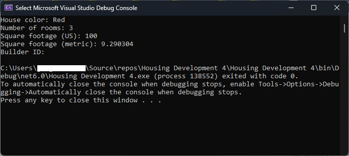

This exercise is a chance for you to practice putting it all together before moving on to your Guided Project.

## Objectives

- Define properties in a class.
- Define a method in a class.
- Use a class in an application.
- Define an overloaded method.
- Add a static/global method to the class library.

## Exercise

1.	Open Visual Studio Community.

1.	Select “Create a new project”.

1.	Select “Console App (.NET Framework)” and select “Next”.

1.	Name your project *Housing Development 4* and choose where to save it, then select “Create”.

1.	In the Solution Explorer window, right-click on your project and select “Add” -> “Class”.

1.	Name your class *House* and select “Add”.

1.	In the House class, create two private fields: _numberOfRooms and _squareFootage.

    ```CSharp
    using System;
    using System.Collections.Generic;
    using System.Linq;
    using System.Text;
    using System.Threading.Tasks;

    namespace Housing_Development_4
    {
        internal class House
        {
            private int _numberOfRooms;
            private double _squareFootage;
        }
    }
    ```

1.	Create a property called Color that sets and gets the house color.
    ```CSharp
    using System;
    using System.Collections.Generic;
    using System.Linq;
    using System.Text;
    using System.Threading.Tasks;

    namespace Housing_Development_4
    {
        internal class House
        {
            private int _numberOfRooms;
            private double _squareFootage;

            public string Color { get; set; }
        }
    }
    ```

1.  Add a method called SetNumberOfRooms() that returns the number of rooms.
    ```CSharp
    using System;
    using System.Collections.Generic;
    using System.Linq;
    using System.Text;
    using System.Threading.Tasks;

    namespace Housing_Development_4
    {
        internal class House
        {
            private int _numberOfRooms;
            private double _squareFootage;

            public string Color { get; set; }

            public void SetNumberOfRooms(int numberOfRooms)
            {
                _numberOfRooms = numberOfRooms;
            }
        }
    }
    ```

1.	Add a method called GetNumberOfRooms() that returns the number of rooms.
    ```CSharp
    using System;
    using System.Collections.Generic;
    using System.Linq;
    using System.Text;
    using System.Threading.Tasks;

    namespace Housing_Development_4
    {
        internal class House
        {
            private int _numberOfRooms;
            private double _squareFootage;

            public string Color { get; set; }

            public int GetNumberOfRooms()
            {
                return _numberOfRooms;
            }
        }
    }
    ```

1.	Create an overloaded method called SquareFootage() that has two versions of the method, one to calculate the square footage by the US standard measurement system and the other using the metric system.

    ```CSharp
    using System;
    using System.Collections.Generic;
    using System.Linq;
    using System.Text;
    using System.Threading.Tasks;

    namespace Housing_Development_4
    {
        internal class House
        {
            private int _numberOfRooms;
            private double _squareFootage;

            public string Color { get; set; }

            public int GetNumberOfRooms()
            {
                return _numberOfRooms;
            }

            // Overloaded method #1
            public double SquareFootage(double length, double width)
            {
                return length * width;
            }

            // Overloaded method #2
            public double SquareFootage(double length, double width, bool isMetric)
            {
                if (isMetric)
                {
                    return length * width * 0.3048;
                }
                
                return length * width;
            }
        }
    }
    ```

1. Create a static/global property for the builderID.

    ```CSharp
    using System;
    using System.Collections.Generic;
    using System.Linq;
    using System.Text;
    using System.Threading.Tasks;

    namespace Housing_Development_4
    {
        internal class House
        {
            private int _numberOfRooms;
            private double _squareFootage;

            public string Color { get; set; }

            public int GetNumberOfRooms()
            {
                return _numberOfRooms;
            }

            // Overloaded method #1
            public double SquareFootage(double length, double width)
            {
                return length * width;
            }

            // Overloaded method #2
            public double SquareFootage(double length, double width, bool isMetric)
            {
                if (isMetric)
                {
                    return return length * width * 0.3048;
                }
                else
                {
                    length * width;
                }
            }

            public static string BuilderID { get; set; }
        }
    }
    ```

1.	In the Program.cs file, create an instance of the House class and set its color to red.
    ```CSharp
        using Housing_Development_Project_4 // this statement is automatically generated

        House house = new House();
        house.Color = "Red";
    ```
1.	Set the number of rooms to 3 using the SetNumberOfRooms() method.
     ```CSharp
    using Housing_Development_Project_4 // this statement is automatically generated

    House house = new House();
    house.Color = "Red";
    house.SetNumberOfRooms(3);
    ```
1.	Calculate and print square footage using the two overloaded versions of SquareFootage().
    ```CSharp
        using Housing_Development_Project_4 // this statement is automatically generated

        House house = new House();
        house.Color = "Red";
        house.SetNumberOfRooms(3);

        Console.WriteLine("House color: " + house.Color);
        Console.WriteLine("Number of rooms: " + house.GetNumberOfRooms());
        Console.WriteLine("Square footage (US): " + house.SquareFootage(10, 10));
        Console.WriteLine("Square footage (metric): " + house.SquareFootage(10, 10, true));
    ```
1. Set the `BuilderID` property to "American Builders".
    ```CSharp
        using Housing_Development_Project_4 // this statement is automatically generated

        House house = new House();
        house.Color = "Red";
        house.SetNumberOfRooms(3);

        Console.WriteLine("House color: " + house.Color);
        Console.WriteLine("Number of rooms: " + house.GetNumberOfRooms());
        Console.WriteLine("Square footage (US): " + house.SquareFootage(10, 10));
        Console.WriteLine("Square footage (metric): " + house.SquareFootage(10, 10, true));
        Console.WriteLine("Builder ID: " + House.BuilderID); // static property
    ```
>>Notice that the static property you created is not referenced like the other members of the instance. Even though it is the last thing you added to your code, because it is static, it is created first by the compiler when your application started and is not a part of the instance members of your object. It is also called differently, using the class name rather than an object name. For example, `House.BuilderID` (House is the class name) is used to call your static property, not `house.Color` (instance/object name).

1.	Run your code. Your output should look like the following.



## Recap
This exercise gave you a chance to put many of the things you learned into practice. You created a class that has methods and properties and then used that class from your Program.cs file. I hope you notice that although methods typically perform actions on an object, they can also set and get data without performing an action, as in your GetNumberOfRooms and SetNumberOfRooms methods. In addition to methods and properties, you created an overridden method and a static method. Congratulate yourself on learning several skills that are fundemental to creating an object-oriented program!