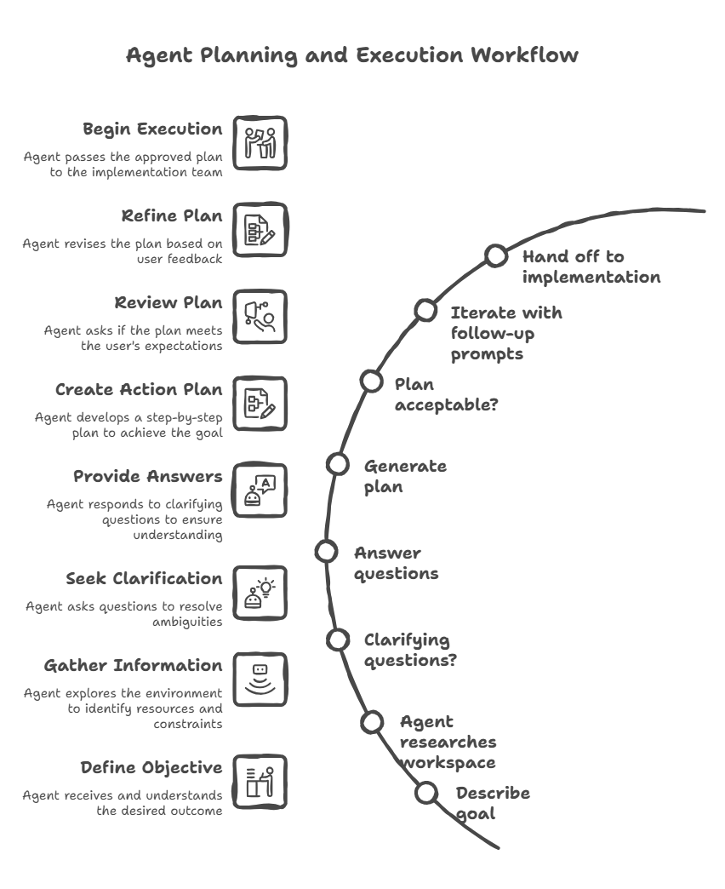

## Understand the GitHub Copilot agent types

GitHub Copilot in Visual Studio Code provides three built-in agents, each operating under a different level of autonomy and with a different relationship to your workspace:

- **Agent**: A fully autonomous implementation agent. It decomposes a goal into sub-tasks, executes tool calls (file reads, writes, terminal commands, MCP server calls), and applies changes directly to your workspace. The Agent loop runs until the goal is achieved or it reaches an ambiguity it cannot resolve.
- **Ask**: A stateless question-answering agent with read-only workspace access. It can reason about your code, explain concepts, and suggest approaches, but it never writes or executes anything.
- **Plan**: A reasoning-first agent that operates in a deliberate, two-phase model — research and synthesis first, implementation second, with a mandatory human review gate between the two phases.

The distinction that matters for operations work is not just about safety. It is about where in the agentic loop the human judgment sits. With the Agent, you review output after the fact. With the Plan agent, you review and approve the approach before a single tool call that modifies state is made.

## How the Plan agent operates internally

The Plan agent is an instance of a broader agentic pattern called **plan-and-execute**, where reasoning about what to do is separated from doing it. Understanding how the agent gathers information at each stage helps you write better prompts and interpret its output more critically.

### Phase 1: context gathering

When you submit a prompt, the Plan agent does not immediately generate a plan. It first builds a context model of your environment by invoking a set of read-only tools in sequence:

- **Workspace file enumeration**: The agent scans your workspace file tree to understand the project structure — what languages, frameworks, and configuration files are present.
- **Targeted file reads**: Based on the file tree, the agent reads files that are relevant to your request. For an infrastructure prompt, it reads existing Bicep modules, parameter files, and any `bicepconfig.json`. For a PowerShell prompt, it reads existing scripts, module manifests, and `PSScriptAnalyzer` configuration.
- **Custom instructions**: The agent reads `.github/copilot-instructions.md` if it exists in the workspace root. This file is treated as authoritative context that shapes every plan the agent generates in that workspace.
- **Session memory**: The agent reads `/memories/session/` to pick up any context from earlier in the same conversation — previous plans, answers to clarifying questions, or facts you stated earlier.

No external network calls are made to documentation sites or APIs during this phase. The agent's knowledge of Azure services, PowerShell APIs, or Bicep syntax comes from its training data, not from live lookups.

### Phase 2: clarifying questions

If the context gathered in Phase 1 is insufficient to produce an unambiguous plan, the agent surfaces clarifying questions. These questions are not generated randomly — they correspond to decision points in the implementation where different answers lead to meaningfully different plans.

For an operations prompt, typical decision points include:

- **Scope**: Which subscription, resource group, or server is targeted?
- **Dependencies**: Does the new resource need to reference something that already exists, or should it create its own dependencies?
- **Constraints**: Are there naming conventions, compliance requirements, or budget limits that rule out certain approaches?
- **Testing strategy**: Should the plan include a dry-run or what-if validation step, and if so, against which environment?

The quality of the questions the agent asks is a useful signal. If the agent asks no clarifying questions and immediately produces a plan for a complex, underspecified prompt, treat the resulting plan with extra scrutiny — it has made assumptions that may not match your environment.

### Phase 3: plan synthesis

With sufficient context, the agent synthesizes a structured plan. Internally, this involves reasoning about:

- **Dependency ordering**: Which resources or configuration steps must be created before others can reference them.
- **Risk surface**: Which steps are reversible and which are not, and where verification gates should be placed.
- **Tooling alignment**: Which Azure CLI commands, PowerShell cmdlets, or Bicep constructs are appropriate given the constraints and any existing patterns found in the workspace.
- **Verification closure**: What evidence would confirm that each step succeeded, and how that evidence can be collected without human intervention.

The plan output is written to `/memories/session/plan.md` automatically, making it available for reference throughout the rest of the conversation.

### Phase 4: iteration

The plan is not final after the first generation. Each follow-up prompt you submit causes the agent to re-enter the synthesis phase with the updated context — including the previous plan, your feedback, and any new constraints you introduced. The agent does not restart from scratch; it treats the previous plan as a prior that can be amended.

This iterative loop is where Plan mode earns most of its value for operations work. Requirements that emerge mid-conversation — a budget cap, a compliance constraint, a dependency on an existing resource — can be incorporated without losing the context established in earlier turns.



## Access the Plan agent

You can access the Plan agent in two ways:

- **Agent picker**: Open the Chat view (`Ctrl+Alt+I`), and select **Plan** from the agents dropdown.
- **Slash command**: Type `/plan` followed by your task description in the chat input box. For example:

<!-- IMAGE PLACEHOLDER: Portal or UI screenshot
Alt text: The VS Code Chat view showing the agents dropdown with Plan selected.
Suggested source: Custom screenshot needed
Capture instructions: Open VS Code, open Chat view (Ctrl+Alt+I), select the agents dropdown and highlight the Plan option. Capture the Chat view.
Suggested filename: plan-agent-dropdown.png
Priority: High
-->

```text
/plan Create a PowerShell script to audit all expired user accounts in Active Directory
```

## What a plan looks like

When the Plan agent generates a plan, it typically produces three sections:

- **Summary**: A high-level overview of what the plan accomplishes and the approach it takes. Written to be understandable by both technical implementers and non-technical stakeholders.
- **Implementation steps**: Ordered tasks that describe which files to create or modify, what code to write, and how components connect to each other. Steps are sequenced to respect dependencies — a subnet must exist before an NSG can reference it, for example.
- **Verification steps**: Actions to confirm the implementation works correctly, such as running `az deployment what-if`, validating DSC compliance with `Test-DscConfiguration`, or checking resource health after deployment. Verification steps are scoped so they can be executed without requiring production access.

For example, if you ask the Plan agent to create an Azure resource group tagging policy, the plan might include steps to create a policy definition JSON file, assign the policy to a management group, and verify compliance by running an Azure CLI command.

## Where plans are stored

The Plan agent automatically saves its implementation plan to a session memory file at `/memories/session/plan.md`. You can access this file by running the **Chat: Show Memory Files** command in the Command Palette and selecting `plan.md`. Because session memory is cleared when the conversation ends, the plan isn't available in later sessions. If you need to preserve a plan, copy it to a file in your repository before closing the session.

## Plan mode versus Agent mode

The difference between Plan mode and Agent mode is not primarily about capability — both have access to the same underlying model. The difference is about the position of the human review gate in the agentic loop and the side-effect contract each mode operates under.

| Dimension | Plan agent | Agent |
|-----------|-----------|-------|
| **Side effects during reasoning** | None — reads only | Writes files, runs commands, calls tools |
| **Human review gate** | Before any implementation begins | After implementation completes (or during, if errors occur) |
| **Reversibility of mid-task state** | Always reversible — no changes made | Depends on what has been executed |
| **Suited for change management workflows** | Yes — plan is the artifact submitted for approval | No — output is the artifact, which may already be applied |
| **Context window usage** | Lower — no tool call results from implementation steps | Higher — accumulates results from executed tool calls |
| **Ambiguity handling** | Surfaces ambiguity as questions before proceeding | Makes assumptions and proceeds; may fail or require rollback |

The practical implication for operations teams is this: when a task involves multiple interdependent resources, irreversible steps (such as database schema changes or firewall rule modifications), or requires a documented approval trail, Plan mode is the structurally correct choice — not just the safer one.

Use Agent mode when the task is bounded, the workspace state is easily reversible (such as a new feature in a development branch), and rapid iteration matters more than a pre-approved approach.

## Hand off to implementation

After you finalize a plan, you have several options to proceed:

- **Implement in the same session**: Select **Start Implementation** to let the Agent implement the plan directly in your workspace. The Agent receives the plan document as its initial context and begins executing the implementation steps.
- **Continue in Copilot CLI**: Select **Start Implementation** > **Continue in Copilot CLI** to run the implementation as a background session. Copilot CLI creates a Git worktree — an isolated copy of your repository at the current commit — so the implementation runs against a clean state without affecting your working tree.
- **Continue in a cloud agent**: Hand off to a Copilot cloud agent running on GitHub infrastructure. The cloud agent implements the plan and opens a pull request, giving your team a review surface with a full diff, CI pipeline validation, and an auditable approval record.

The handoff mechanism is significant architecturally: the plan document written to `/memories/session/plan.md` becomes the implementation agent's task specification. This means the quality and specificity of the plan directly controls the quality of the implementation — a vague plan produces vague implementation, and a plan with explicit verification gates causes the implementation agent to pause and verify at each gate before proceeding.
