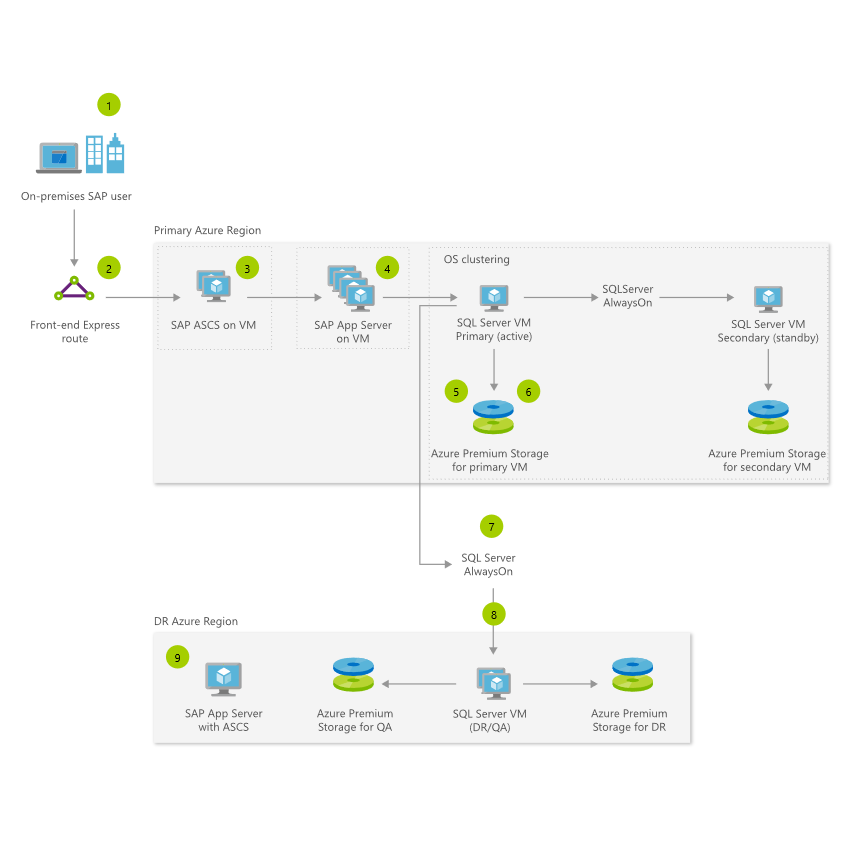

The follwing workflow illustrates how a user request flows through an SAP landscape built on NetWeaver using Azure Virtual Machines to host SAP applications and a SQL Server database. This system takes advantage of OS clustering for high availability, premium storage for faster storage performance and scalability, SQL Server AlwaysOn capability for replication, and a full disaster recovery (DR) configuration for 99.95 percent system availability.

1. Using **Azure Active Directory synchronized with on-premises Active Directory**, SAP application user authenticates from on-premises to SAP landscape on Azure with single sign-on credentials. 

2. Azure high-speed **Express Route Gateway connects on-premises network to Azure virtual machines** and other resources securely. 

3. Sales order request flows into highly available SAP ABAP SAP Central Services (ASCS), and then through SAP application servers running on Azure Virtual Machines scale out file server in an Azure VM 

4. The request moves from the SAP app server to SQL Server running on a primary high-performance Azure VM. 

5. **Primary (active) and secondary (standby) servers running on SAP certified virtual machines are clustered at OS level** for 99.95 percent availability. Data replication is handled through SQL Server AlwaysOn in synchronous mode from primary to secondary, enabling zero Recovery Point Objective (RPO). 

6. SQL Server data is persisted to high-performance Azure Premium Storage. 

7. SQL Server data is replicated disaster recovery virtual machine in another Azure region through Azure’s high-speed backbone network and using SQL Server’s AlwaysOn replication in asynchronous mode. The disaster recovery VM can be smaller than the production VM to save costs. 

8. VMs on the disaster recovery region can be used for nonproduction work to save costs. 

SAP app server with ASCS on the disaster recovery side can be in standby shutdown mode and can be started when needed to save costs.