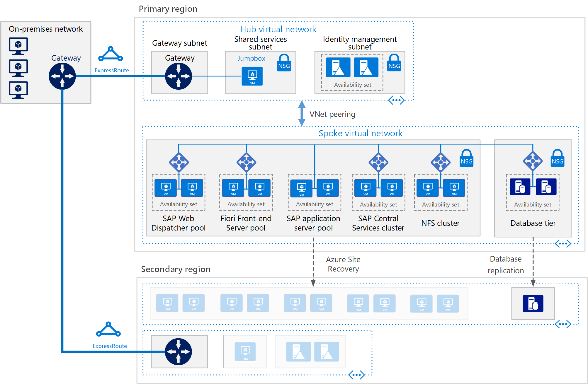

This reference architecture shows a set of proven practices for running S/4HANA and Suite on HANA in a high availability environment that supports disaster recovery on Azure. The Fiori information applies only to S/4HANA applications.

> [!NOTE]
> Deploying this reference architecture requires appropriate licensing of SAP products and other non-Microsoft technologies.

## Architecture

This reference architecture describes a common production system. This architecture is deployed with virtual machine sizes that can be changed to accommodate your organization's needs. To suit your business needs, this configuration can be reduced to a single virtual machine.

The network layout is greatly simplified to demonstrate architectural principals and is not intended to describe a full enterprise network.

The following components are required.

**Azure Virtual Network.** The Azure Virtual Network (VNet) service securely connects Azure resources to each other. In this architecture, a VNet connects to an on-premises environment through a gateway deployed in the hub of a hub-spoke topology. The spoke is the VNet used for the SAP applications and the database tiers.

**Virtual network peering.** This architecture uses multiple virtual networks that are peered together. This topology offers network segmentation and isolation for services deployed on Azure. Peering connects networks transparently through the Microsoft backbone network and does not incur a performance penalty if implemented within a single region. Separate subnets are used for each tier-application (SAP NetWeaver), database, and shared services (such as the jumpbox and Active Directory).

**Virtual machines.** This architecture uses virtual machines running Linux for the application tier and database tier, grouped as follows:

- **Application tier.** Includes the Fiori Front-end Server pool, SAP Web Dispatcher pool, application server pool, and SAP Central Services cluster. For high availability of Central Services on Azure running in Linux virtual machines, a highly available network file share service is required, such as Azure NetApp Files, clustered Network File Shares (NFS) servers, or SIOS DataKeeper. To set up a highly available file share for the Central Services cluster on Red Hat Enterprise Linux, GlusterFS can be configured on Azure virtual machines running Red Hat Enterprise Linux.

- **SAP HANA.** The database tier uses two or more Linux virtual machines in a cluster to achieve high availability in a scale-up deployment. HANA System Replication (HSR) is used to replicate contents between primary and secondary HANA systems. Linux clustering is used to detect system failures and facilitate automatic failover. A storage-based or cloud-based fencing mechanism must be used to ensure the failed system is isolated or shut down to avoid the cluster split-brain condition. In HANA scale-out deployments, database high availability is achieved by configuring standby nodes without the need of the Linux clustering component.

- **Jumpbox.** Also called a bastion host, this secure virtual machine on the network is used to connect to the other virtual machines and is typically deployed as part of the shared services, such as domain controllers and backup services. The jumpbox is deployed on a virtual machine to support SAP HANA Studio, SAPGUI, file transfer, and other functions that are commonly used for installation and administration purposes. For remote desktop protocol (RDP) or secure shell (SSH) services, try Azure Bastion. If only RDP and SSH are used for administration, Azure Bastion is a great alternative.

**Load balancers.** To distribute traffic to virtual machines in the application-tier subnet, load balancers are used. When using Azure Zones, use the Standard Load Balancer. For high availability, use the built-in SAP Web Dispatcher, Azure Load Balancer, or other mechanisms, depending on the traffic type (such as HTTP or SAPGUI) or the required network services (such as SSL termination).

**Availability sets.** Virtual machines for all pools and clusters (Web Dispatcher, SAP application servers, Central Services, and HANA) are grouped into separate availability sets, and at least two virtual machines are provisioned per role. Availability sets increase the availability of applications and virtual machines through management of hosts system faults or maintenance events by distributing role instances onto multiple hosts. An alternative is to use Availability Zones to improve workload availability.

**Zone-redundant gateway.** Azure ExpressRoute or virtual private network (VPN) gateways can be deployed across zones to guard against zone failures. This architecture uses zone-redundant VNet gateways for resiliency rather than a zonal deployment based on the same Availability Zone.

**Proximity placement group.** This logical group places a constraint on VMs deployed in an availability set or a Virtual Machine Scale Set. A proximity placement group favors colocation, meaning that virtual machines reside in the same datacenter to minimize application latency.  

**Network security groups.** To restrict incoming, outgoing, and intra-subnet traffic in the virtual network, you can create network security groups (NSGs).

**Application security groups.** To define fine-grained network security policies based on workloads and centered on applications, use application security groups instead of explicit IP addresses. You can group virtual machines by name and secure applications by filtering traffic from trusted segments of your network.

**Gateway.** A gateway connects distinct networks, extending your on-premises network to the Azure VNet. ExpressRoute is the recommended Azure service for creating private connections that do not go over the public internet, but a site-to-site connection can also be used. To reduce latency, ExpressRoute Global Reach and ExpressRoute FastPath are connectivity options.

**Azure Storage.** To provide data persistence for a virtual machine in the form of virtual hard disk (VHD). Azure Managed Disk is recommended.

## Recommendations

This architecture describes a small, production-level deployment. Your deployment will differ based on your business requirements, so consider these recommendations as a starting point.