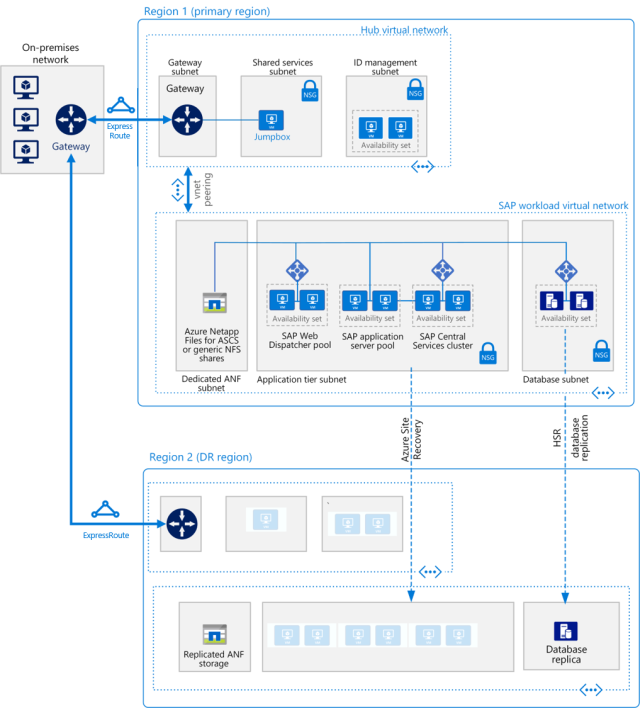

This reference architecture shows a set of proven practices for running S/4HANA and Suite on HANA in a high availability environment that supports disaster recovery on Azure. The Fiori information applies only to S/4HANA applications. 

> [!NOTE]
> Deploying this reference architecture requires appropriate licensing of SAP products and other non-Microsoft technologies.

## Architecture

This reference architecture describes a common production system. This architecture is deployed with virtual machine sizes that can be changed to accommodate your organization's needs. To suit your business needs, this configuration can be reduced to a single virtual machine.

The network layout is greatly simplified to demonstrate architectural principals and is not intended to describe a full enterprise network.

The following components are required.

### Azure Virtual Network

The Azure Virtual Network (VNet) service securely connects Azure resources to each other. In this architecture, a VNet connects to an on-premises environment through a gateway deployed in the hub of a hub-spoke topology. The spoke is the VNet used for the SAP applications and the database tiers.

### Virtual network peering

This architecture uses multiple virtual networks that are peered together. This topology offers network segmentation and isolation for services deployed on Azure. Peering connects networks transparently through the Microsoft backbone network and does not incur a performance penalty if implemented within a single region. Separate subnets are used for each tier-application (SAP NetWeaver), database, and shared services (such as the jumpbox and Active Directory).

### Virtual machines

This architecture uses virtual machines running Linux for the application tier and database tier, grouped as follows:

- **Application tier.** Includes the Fiori Front-end Server pool, SAP Web Dispatcher pool, application server pool, and SAP Central Services cluster. For high availability of Central Services on Azure running in Linux virtual machines, a highly available network file share service is required, such as Azure NetApp Files, clustered Network File Shares (NFS) servers, or SIOS DataKeeper. To set up a highly available file share for the Central Services cluster on Red Hat Enterprise Linux, GlusterFS can be configured on Azure virtual machines running Red Hat Enterprise Linux.

- **SAP HANA.** The database tier uses two or more Linux virtual machines in a cluster to achieve high availability in a scale-up deployment. HANA System Replication (HSR) is used to replicate contents between primary and secondary HANA systems. Linux clustering is used to detect system failures and facilitate automatic failover. A storage-based or cloud-based fencing mechanism must be used to ensure the failed system is isolated or shut down to avoid the cluster split-brain condition. In HANA scale-out deployments, database high availability is achieved by configuring standby nodes without the need of the Linux clustering component.

- **Jumpbox.** Also called a bastion host, this secure virtual machine on the network is used to connect to the other virtual machines and is typically deployed as part of the shared services, such as domain controllers and backup services. The jumpbox is deployed on a virtual machine to support SAP HANA Studio, SAPGUI, file transfer, and other functions that are commonly used for installation and administration purposes. For remote desktop protocol (RDP) or secure shell (SSH) services, try Azure Bastion. If only RDP and SSH are used for administration, Azure Bastion is a great alternative.

### Load balancers

To distribute traffic to virtual machines in the application-tier subnet, load balancers are used. When using Azure Zones, use the Standard Load Balancer. For high availability, use the built-in SAP Web Dispatcher, Azure Load Balancer, or other mechanisms, depending on the traffic type (such as HTTP or SAPGUI) or the required network services (such as SSL termination).

### Availability sets

Virtual machines for all pools and clusters (Web Dispatcher, SAP application servers, Central Services, and HANA) are grouped into separate availability sets, and at least two virtual machines are provisioned per role. Availability sets increase the availability of applications and virtual machines through management of hosts system faults or maintenance events by distributing role instances onto multiple hosts. An alternative is to use Availability Zones to improve workload availability.

### Zone-redundant gateway

Azure ExpressRoute or virtual private network (VPN) gateways can be deployed across zones to guard against zone failures. This architecture uses zone-redundant VNet gateways for resiliency rather than a zonal deployment based on the same Availability Zone.

### Proximity placement group

This logical group places a constraint on VMs deployed in an availability set or a Virtual Machine Scale Set. A proximity placement group favors colocation, meaning that virtual machines reside in the same datacenter to minimize application latency.  

### Network security groups

To restrict incoming, outgoing, and intra-subnet traffic in the virtual network, you can create network security groups (NSGs).

### Application security groups

To define fine-grained network security policies based on workloads and centered on applications, use application security groups instead of explicit IP addresses. You can group virtual machines by name and secure applications by filtering traffic from trusted segments of your network.

### Gateway

A gateway connects distinct networks, extending your on-premises network to the Azure VNet. ExpressRoute is the recommended Azure service for creating private connections that do not go over the public internet, but a site-to-site connection can also be used. To reduce latency, ExpressRoute Global Reach and ExpressRoute FastPath are connectivity options.

### Azure Storage

To provide data persistence for a virtual machine in the form of virtual hard disk (VHD). Azure Managed Disk is recommended.

## Recommendations

This architecture describes a small, production-level deployment. Your deployment will differ based on your business requirements, so consider these recommendations as a starting point.

### Virtual machines

In application server pools and clusters, adjust the number of virtual machines based on your requirements. The Azure Virtual Machines planning and implementation guide includes details about running SAP NetWeaver on virtual machines, and this information also applies to SAP S/4HANA deployment.

For details about SAP support for Azure virtual machine types and throughput metrics (SAPS), see SAP Note 1928533. (To access the SAP notes, you must have an SAP Service Marketplace account.) The SAP Certified and Supported SAP HANA Hardware Directory has a list of certified Azure virtual machines for the HANA database.

### SAP Web Dispatcher

The Web Dispatcher component is used as a load balancer for SAP traffic among the SAP application servers. To achieve high availability of the SAP Web Dispatcher, Azure Load Balancer implements either the failover cluster or the parallel Web Dispatcher setup.

### Fiori Front-end Server (FES)

This architecture addresses broad base requirements and assumes that the Embedded Fiori FES model is used. All the technology components are installed on the S/4 system itself, meaning that each S/4 system has its own Fiori Launchpad. The high availability setup for this deployment model is that of the S/4 system-no additional clustering or virtual machines are required. That's why the architecture diagram does not show the FES component.

The SAP Fiori Deployment Options and System Landscape Recommendations document describes the primary deployment options-either embedded or hub, depending on the scenarios. In achieving simplification and performance, the software releases between the Fiori technology components and the S/4 applications are tightly coupled, making a hub deployment fitting for only a few, narrow use cases.

If you use the FES hub deployment, the FES is an add-on component to the classic SAP NetWeaver ABAP stack. Set up high availability in the same way you protect a three-tier ABAP application stack with clustered or multi-host capability-with a standby server database layer, clustered ASCS layer with high availability NFS for shared storage, and at least two application servers. Traffic is load-balanced via a pair of either clustered or parallel Web Dispatchers.

### Application servers pool

To manage logon groups for ABAP application servers, it's common to use the SMLG transaction to load-balance logon users, SM61 for batch server groups, RZ12 for RFC groups, and so on. These transactions use the load-balancing capability within the message server of the Central Services to distribute incoming sessions or workload among SAP application servers pool for SAPGUIs and RFC traffic.

### SAP Central Services cluster

Central Services can be deployed to a single virtual machine when the Azure single-instance VM availability SLA meets your requirement. However, the virtual machine becomes a potential single point of failure (SPOF) for the SAP environment. For a highly available Central Services deployment, the Azure NetApp Files service and a Central Services cluster are used.

Alternately, an NFS file share can be used for the Linux cluster shared storage.

On an Azure deployment, the application servers connect to the highly available Central Services through the virtual host names of the Central Services or ERS services. These host names are assigned to the cluster frontend IP configuration of the load balancer. An Azure Load Balancer supports multiple frontend IPs, so both the Central Services and ERS virtual IPs (VIPs) can be bound to one load balancer.

Linux cluster support for ASCS multi-SIDs installation on Azure is now supported. Fewer clusters help to simplify the SAP landscape.

### Availability sets

Availability sets distribute servers to different physical infrastructure and update groups to improve service availability. Put virtual machines that perform the same role into an availability set to help guard against downtime caused by Azure infrastructure maintenance and to meet service-level agreements (SLAs). Two or more virtual machines per availability set are required to get the higher SLA.

All virtual machines in a set must perform the same role. Do not mix servers of different roles in the same availability set. For example, don't place an ASCS node in the same availability set with application servers.

You can deploy Azure availability sets within Azure Availability Zones when you use a proximity placement group.

### Networking

This architecture uses a hub-spoke topology, where the hub VNet acts as a central point of connectivity to an on-premises network. The spokes are VNets that peer with the hub, and they can be used to isolate workloads. Traffic flows between the on-premises datacenter and the hub through a gateway connection.

### Network interface cards (NICs)

Traditional on-premises SAP deployments implement multiple NICs per machine to segregate administrative traffic from business traffic. On Azure, the VNet is a software-defined network that sends all traffic through the same network fabric. Therefore, the use of multiple NICs is unnecessary for performance considerations. However, if your organization needs to segregate traffic, you can deploy multiple NICs per virtual machine, connect each NIC to a different subnet, and then use NSGs to enforce different access control policies.
 
Azure NICs support multiple IPs, which supports the SAP recommended practice of using virtual host names for installations as outlined in SAP note 962955. (To access the SAPnotes, you must have an SAP Service Marketplace account.)

### Subnets and NSGs

This architecture subdivides the VNet address space into subnets. Each subnet can be associated with an NSG that defines the access policies for the subnet. Place application servers on a separate subnet so you can secure them more easily by managing the subnet security policies, rather than the individual servers.

When associated with a subnet, an NSG applies to all the servers within the subnet and offers fine-grained control over the servers. Set them up using the portal, PowerShell, or Azure CLI.

### ExpressRoute Global Reach

If your network environment includes two or more ExpressRoute circuits, an option to reduce network hops and lower latency is to use ExpressRoute Global Reach. This is a Border Gateway Protocol (BGP) route peering setup between two or more ExpressRoute circuits for bridging two ExpressRoute routing domains. Global Reach lowers latency when network traffic traverses more than one ExpressRoute circuit and is currently available only for private peering on ExpressRoute circuits.

At this time, there are no network access control list (ACLs) or other attributes that can be changed in Global Reach, which means that all routes learned by a given ExpressRoute circuit (from on-premises and Azure) are advertised across the circuit peering to the other ExpressRoute circuit. It is recommended to establish network traffic filtering on-premises to restrict access to resources.

### ExpressRoute FastPath

Also known as Microsoft Edge Exchange (MSEE) v2, FastPath implements MSEE at the entry point of the Azure network. It reduces network hops for most data packets. FastPath lowers network latency, improves application performance, and is the default for new ExpressRoute connections to Azure.

For existing ExpressRoute circuits, activate FastPath with Azure support.

FastPath does not support VNet peering. If you have other VNets peered with the one that is connected to ExpressRoute, the network traffic from your on-premises network to the other spoke VNets will continue to be sent to the VNet gateway. The workaround is to connect all the VNets to the ExpressRoute circuit directly.

### Load balancers

The SAP Web Dispatcher handles load balancing of HTTP(S) traffic to a pool of SAP application servers. This software load balancer offers application layer services (referred to as layer 7 in the ISO networking model) capable of Secure Sockets Layer (SSL) termination and other offloading functions.

Azure Load Balancer is a network transmission layer service (layer 4), which balances traffic by a 5-tuples hash from the data streams (based on source IP, source port, destination IP, destination port, and protocol type). It's used in cluster setups to direct traffic to the primary service instance or the healthy node in case of a fault. We recommend using Azure Standard Load Balancer for all SAP scenarios.

For traffic from SAP GUI clients connecting an SAP server via DIAG protocol or Remote Function Calls (RFC), the Central Services message server balances the load through SAP application server logon groups. No additional load balancer is needed.

### Azure Storage

Some customers use standard storage for their application servers. Because standard managed disks are not supported, as stated in SAP note 1928533, we recommend using Premium Azure Managed Disks in all cases. Note that a recent update to SAP note 2015553 excludes the use of Standard HDD Storage and Standard SSD Storage for a few specific use cases.

Because application servers do not host any business data, you can also use the smaller P4 and P6 Premium disks to help minimize cost and benefit from the single instance VM SLA in case of a central SAP stack installation.

Azure Storage is also used by Cloud Witness to maintain quorum with a device in a remote Azure region, away from the primary region where the cluster resides.

For the backup data store, we recommend using Azure cool and archive access tiers. These storage tiers are cost-effective ways to store long-lived data that is infrequently accessed.

Ultra SSDs greatly reduce disk latency and benefit performance-critical applications and the SAP database servers.