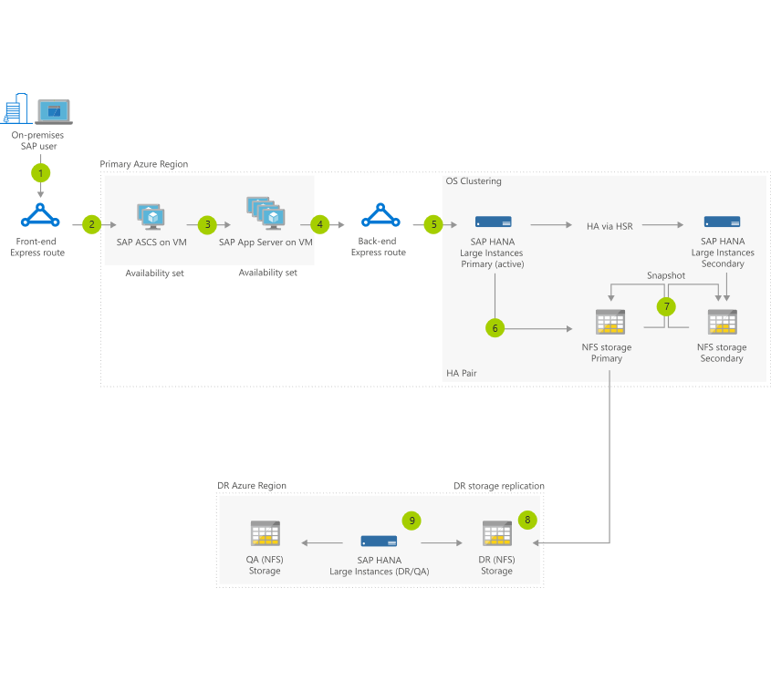

The workflow below illustrates how a user request flows through an SAP landscape built on high-performance Azure Virtual Machines and an in-memory HANA database running on HANA large instances for scalability and performance. This system takes advantage of OS clustering for database performance, high availability using HANA system replication, and a full disaster recovery (DR) configuration for guaranteed system availability.

1. In this example, an on-premises SAP user executes a sales order via Fiori interface, custom interface, or other. 

2. **Azure high-speed express route gateway** is used to connect to Azure Virtual Machines. 

3. Request flows into highly available ABAP SAP Central Services (ASCS) and then through **application servers running on Azure Virtual Machines in an availability set offering** a 99.95 percent uptime SLA. 

4. Request is sent from App Server to SAP HANA running on primary large instance blades. 

5. **Primary and secondary blades are clustered** at OS level for 99.99 percent availability, and data replication is handled through HANA System Replication in synchronous mode (HSR) from primary to secondary enabling zero RPO. 

6. In-memory data of SAP HANA is persisted to high-performance NFS storage. 

7. Data from NFS storage is periodically backed up in seconds, using built-in storage snapshots on the local storage, with no impact to database performance. 

8. Persistent data volume on secondary storage is replicated to dedicated DR system through a **dedicated backbone network for HANA storage replication**. 

9. Large instance on DR side can be used for nonproduction to save costs by mounting both the QA storage and DR replicated volume (read-only).