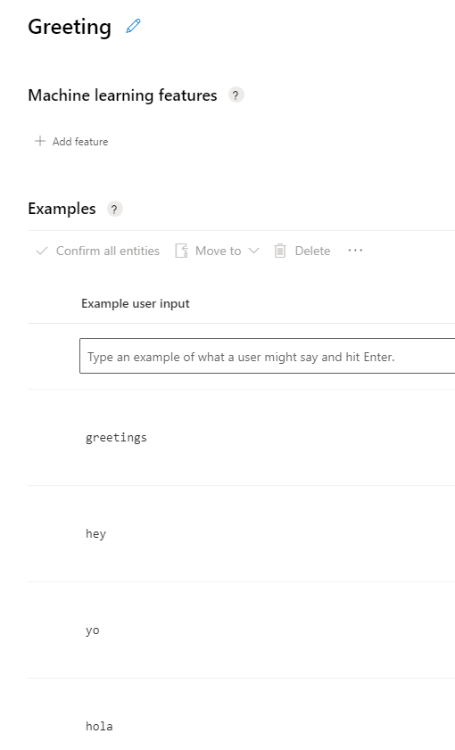
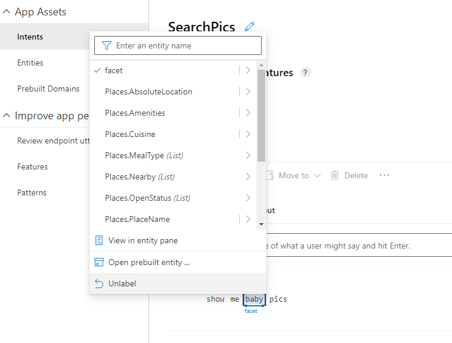

**Utterances** are the phrases that a users might enter when interacting with an app that is tied to your LUIS model. Your LUIS app will need to interpret these utterances and match them to the correct **Intent**. When entering your utterances, keep these aspects in mind:

- Capture a variety of different examples, or alternative ways of saying the same thing
- Vary the length of the utterances from short, to medium, to long
- Vary the location of the *noun* or *subject* of the utterance.  Place it at the beginning, the end, or somewhere in between
- Use correct grammar and incorrect grammar in different utterances to offer good training data examples
- Follow the guidance on the [good utterances](https://docs.microsoft.com/azure/cognitive-services/luis/luis-concept-utterance) page

## Create utterances

1. To get started, ensure you are on the **Intents** page in your LUIS app.
1. Select the **Greeting** intent that you entered in the previous exercise.
1. In the text entry area under **Example user input**, enter a greeting utterance, such as **hello**, and press Enter.
1. The new utterance appears beneath the text entry and the input field is cleared.
1. Repeat the previous steps to create values for each of the following utterances: **hi**, **hola**, **yo**, **hey**, **greetings**.

    > [!TIP]
    > You should always provide at least five example utterances for each intent.

1. Your utterances for the **Greeting** intent should look similar to the following image:
   > [!div class="mx-imgBorder"]
   > 

1. Select **Intents** in the left nav pane.
1. Select the **SearchPic** intent.
1. Add the following values as utterances for the **SearchPics** intent:

    - **find outdoor pics**
    - **are there pictures of a train?**
    - **find pictures of food**
    - **search for photos of boys playing**
    - **give me colorful pictures**
    - **show me beach pics**
    - **I want to find dog photos**
    - **find pictures of German shepherds**
    - **search for pictures of men indoors**
    - **show me pictures of men wearing glasses**
    - **I want to see pics of smiling people**
    - **show me baby pics**

1. Add utterances for **SharePic**.

    - **Share this pic**
    - **Can you tweet that?**
    - **Post to Twitter**

1. Add utterances for **OrderPic**.

    - **Print this picture**
    - **I would like to order prints**
    - **Can I get an 8x10 of that one?**
    - **Order wallets**

1. To finish out the exercise, add some utterances to the existing **None** intent. Make sure these utterances don't match the context of this LUIS app. Some examples are:

    - **I'm hungry for pizza**
    - **Search videos**
    - **Show me how to drive a car**

    >[!TIP]
    >You may have to select **Next** at the bottom of the page to view remaining utterances.

1. Using what you have learned so far, map the subjects in these utterances to the facet entity.

## Map search subjects to the facet entity

Next, we have to teach LUIS how to pick out the search subject as the **facet** entity. Whatever the **facet** entity picks up is what the app will search for.

1. Switch back to the Intents and select the **SearchPics** intent.

1. Hover over the utterance and click the keyword that specifies the _search subject_, and then select the **facet** entity. For example, if the utterance is "show me baby pics", the subject would be "baby".

   > [!TIP]
   > Using multi-word keywords, such as "German shepherds", requires you to click and drag across the keywords.

1. Your progress should look similar to the following image:
   > [!div class="mx-imgBorder"]
   > 

1. Continue mapping the subjects in the intent with the facet entity using this list as a guide:

    - smiling people
    - men
    - glasses
    - men indoors
    - german shepherds
    - dog
    - beach
    - colorful
    - boys playing
    - food
    - train
    - outdoor

## Add utterances with code

In this exercise, you will add some utterances using code.  The code does not add every utterance listed above. The intent is to show an example of how to create the utterances in a code model.

:::zone pivot="csharp"

1. Go to your Visual Studio Code project.
1. After the AddEntities() method, add the following code to create utterances for the **SearchPic** Intent.

   ```csharp

   async static Task AddUtterances(LUISAuthoringClient client, ApplicationInfo app_info)
           {
               var utterances = new List<ExampleLabelObject>()
               {
                   // SearchPic example utterances
                   CreateUtterance ("SearchPic", "find outdoor pics", new Dictionary<string, string>() { {"facet", "outdoor"} } ),
                   CreateUtterance ("SearchPic", "are there pictures of a train?", new Dictionary<string, string>() { { "facet", "train" } }),
                   CreateUtterance ("SearchPic", "find pictures of food", new Dictionary<string, string>()  { { "facet", "food" } }),
                   CreateUtterance ("SearchPic", "search for photos of boys playing", new Dictionary<string, string>()  { { "facet", "boys playing" } }),
                   CreateUtterance ("SearchPic", "give me colorful pictures", new Dictionary<string, string>()  { { "facet", "colorful" } }),
                   CreateUtterance ("SearchPic", "show me beach pics", new Dictionary<string, string>()  { { "facet", "beach" } }),
                   CreateUtterance ("SearchPic", "I want to find dog photos", new Dictionary<string, string>()  { { "facet", "dog" } }),
                   CreateUtterance ("SearchPic", "find pictures of German shepherds", new Dictionary<string, string>()  { { "facet", "German shepherds" } }),
                   CreateUtterance ("SearchPic", "search for pictures of men indoors", new Dictionary<string, string>()  { { "facet", "men indoors" } }),
                   CreateUtterance ("SearchPic", "show me pictures of men wearing glasses", new Dictionary<string, string>()  { { "facet", "men wearing glasses" } }),
                   CreateUtterance ("SearchPic", "I want to see pics of smiling people", new Dictionary<string, string>()  { { "facet", "smiling people" } }),
                   CreateUtterance ("SearchPic", "show me baby pics", new Dictionary<string, string>()  { { "facet", "baby" } }),

               };
               var resultsList = await client.Examples.BatchAsync(app_info.ID, app_info.Version, utterances);
   
               foreach (var x in resultsList)
               {
                   var result = (!x.HasError.GetValueOrDefault()) ? "succeeded" : "failed";
                   Console.WriteLine("{0} {1}", x.Value.ExampleId, result);
               }
           }

           // Create utterance with marked text for entities
           static ExampleLabelObject CreateUtterance(string intent, string utterance, Dictionary<string, string> labels)
           {
               var entity_labels = labels.Select(kv => CreateLabel(utterance, kv.Key, kv.Value)).ToList();
               return new ExampleLabelObject()
               {
                   IntentName = intent,
                   Text = utterance,
                   EntityLabels = entity_labels
               };
           }
           // Mark beginning and ending of entity text in utterance
           static EntityLabelObject CreateLabel(string utterance, string key, string value)
           {
               var start_index = utterance.IndexOf(value, StringComparison.InvariantCultureIgnoreCase);
               return new EntityLabelObject()
               {
                   EntityName = key,
                   StartCharIndex = start_index,
                   EndCharIndex = start_index + value.Length
               };
           }
   ```

1. The code performs a few actions related to the utterances.
1. The AddUtterances() method adds example utterances by creating a list of **ExampleLabelObject** objects, one object for each example utterance.
1. Each example should mark all entities with a dictionary of name/value pairs of entity name and entity value. The entity value should be exactly as it appears in the text of the example utterance.
1. In the utterance *find outdoor pics*, the key label is outdoor and it gets assigned to the **facet** entity.
1. Call Examples.BatchAsync with the app ID, version ID, and the list of examples. The call responds with a list of results. You need to check each example's result to make sure it was successfully added to the model.
1. Now that you have these pieces in place, you can run the code to create the LUIS app, add the intents, entities, and utterances.
1. Once the terminal window opens, issue the command to run the code ``` dotnet run ```.
1. If you receive no error messages, you LUIS app should be created so you can open the LUIS portal and verify all the aspects of the app were created.

:::zone-end

:::zone pivot="python"

1. 1. Go to your Visual Studio Code project.
1. After the add_entities() function, add the following code to create utterances for the **SearchPic** Intent.

   ```python
   # Helper function for creating the utterance data structure.
   # <createUtterance>
   def create_utterance(intent, utterance, *labels):
   
       text = utterance.lower()
   
       def label(name, value):
           value = value.lower()
           start = text.index(value)
           return dict(entity_name=name, start_char_index=start,
                       end_char_index=start + len(value))

       return dict(text=text, intent_name=intent,
                   entity_labels=[label(n, v) for (n, v) in labels])
   # </createUtterance>

   def add_utterances(app_id, app_version):
       # Now define the utterances
       utterances = [create_utterance("SearchPic", "find outdoor pics",
                              ("facet", "outdoor")),
   
                   create_utterance("SearchPic", "are there pictures of a train?",
                               ("facet", "train")),
   
                   create_utterance("SearchPic", "find pictures of food",
                               ("facet", "food")),
   
                   create_utterance("SearchPic", "search for photos of boys playing",
                               ("facet", "boys playing")),

                   create_utterance("SearchPic", "give me colorful pictures",
                               ("facet", "colorful")),

                   create_utterance("SearchPic", "show me beach pics",
                               ("facet", "beach")),

                   create_utterance("SearchPic", "I want to find dog photos",
                               ("facet", "dog")),

                   create_utterance("SearchPic", "find pictures of German shepherds",
                               ("facet", "German shepherds")),

                   create_utterance("SearchPic", "search for pictures of men indoors",
                               ("facet", "men indoors")),

                   create_utterance("SearchPic", "show me pictures of men wearing glasses",
                               ("facet", "men wearing glasses")),

                   create_utterance("SearchPic", "I want to see pics of smiling people",
                               ("facet", "smiling people")),

                   create_utterance("SearchPic", "show me baby pics",
                               ("facet", "baby"))]

       # Add the utterances in batch. You may add any number of example utterances
       # for any number of intents in one call.
       client.examples.batch(app_id, app_version, utterances)
       print("{} example utterance(s) added.".format(len(utterances)))
   ```

1. The code performs a few actions related to the utterances.
1. The add_utterances() function adds example utterances by creating a list of objects. One object for each example utterance.
1. Each example should mark all entities with a dictionary of name/value pairs of entity name and entity value. The entity value should be exactly as it appears in the text of the example utterance.
1. In the utterance *find outdoor pics*, the key label is outdoor and it gets assigned to the **facet** entity.
1. Call client.examples.batch(app_id, app_version, utterances) with the app ID, version ID, and the list of example utterances.
1. Now that you have these pieces in place, you can run the code to create the LUIS app, add the intents, entities, and utterances.
1. Right-click anywhere inside the Python code and choose **Run Python file in Terminal**.
1. If you receive no error messages, you LUIS app should be created so you can open the LUIS portal and verify all the aspects of the app were created.

:::zone-end
