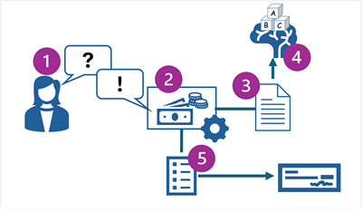
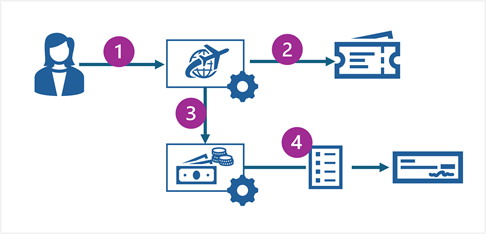

AI agents are smart software services that combine generative AI models with contextual data and the ability to automate tasks based on user input and environmental factors that they perceive.

For example, an organization might build an AI agent to help employees manage expense claims. The agent might use a generative model combined with corporate expenses policy documentation to answer employee questions about what expenses can be claimed and what limits apply. Additionally, the agent could use a programmatic function to automatically submit expense claims for regularly repeated expenses (such as a monthly cellphone bill) or intelligently route expenses to the appropriate approver based on claim amounts.

An example of the expenses agent scenario is shown in the following diagram.

The diagram shows the following process:

1. A user asks the expense agent a question about expenses that can be claimed.
1. The expenses agent accepts the question as a prompt.
1. The agent uses a knowledge store containing expenses policy information to ground the prompt.
1. The grounded prompt is submitted to the agent's language model to generate a response.
1. The agent generates an expense claim on behalf of the user and submits it to be processed and generate a check payment.

In more complex scenarios, organizations can develop *multi-agent* solutions in which multiple agents coordinate work between them. For example, a travel booking agent could book flights and hotels for employees and automatically submit expense claims with appropriate receipts to the expenses agent, as shown in this diagram:

The diagram shows the following process:

1. A user provides details of an upcoming trip to a travel booking agent.
1. The travel booking agent automates the booking of flight tickets and hotel reservations.
1. The travel booking agent initiates an expense claim for the travel costs though the expense agent.
1. The expense agent submits the expense claim for processing.
