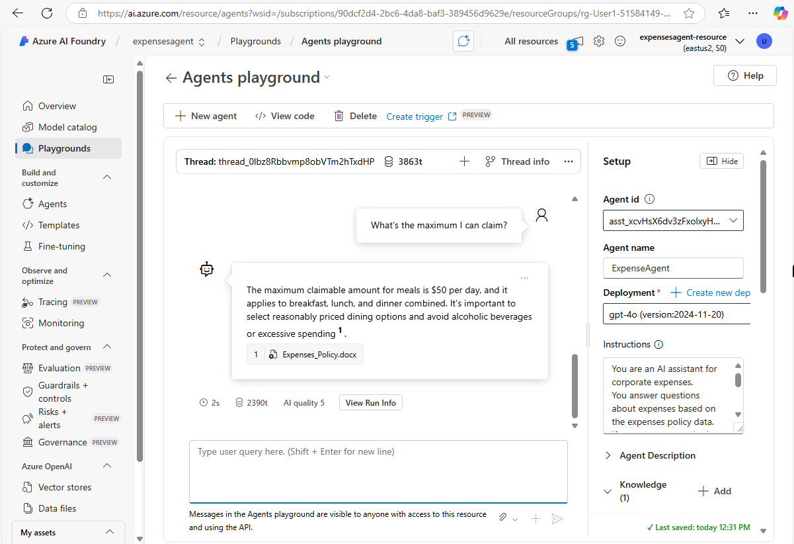

Azure AI Agent Service is a service within Azure AI Foundry that you can use to create, test, and manage AI agents. It provides both a visual agent development experience in the Azure AI Foundry portal and a code-first development experience using the Azure AI Foundry SDK.

## Components of an agent

Agents developed using Azure AI Agent Service have the following elements:

- **Model**: A deployed generative AI model that enables the agent to reason and generate natural language responses to prompts. You can use common OpenAI models and a selection of models from the Azure AI Foundry model catalog.
- **Knowledge**: data sources that enable the agent to ground prompts with contextual data. Potential knowledge sources include Internet search results from Microsoft Bing, an Azure AI Search index, or your own data and documents.
- **Tools**: Programmatic functions that enable the agent to automate *actions*. Built-in tools to access knowledge in Azure AI Search and Bing are provided as well as a code interpreter tool that you can use to generate and run Python code. You can also create custom tools using your own code or Azure Functions.

Conversations between users and agents take place on a *thread*, which retains a history of the messages exchanged in the conversation as well as any data assets, such as files, that are generated.
