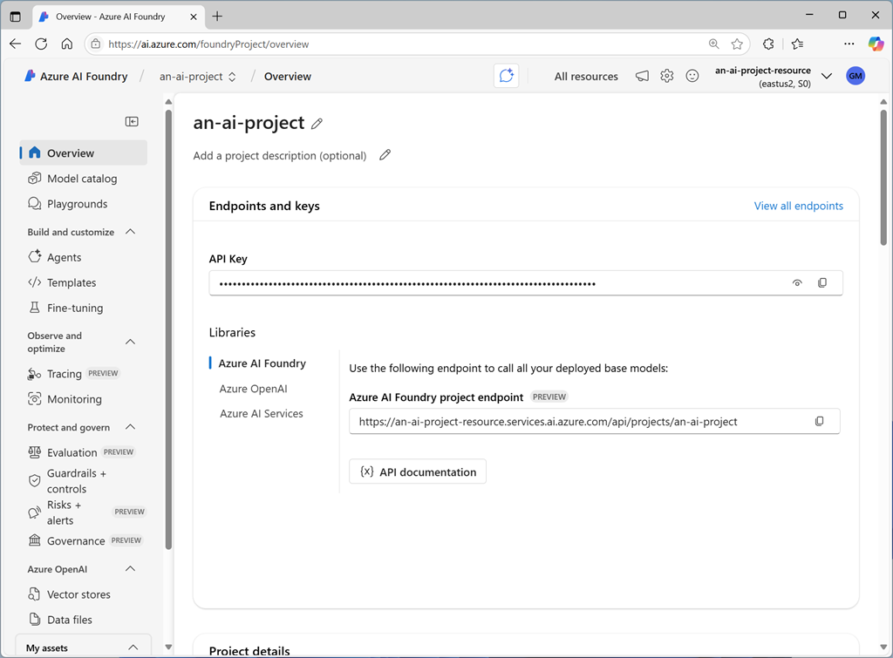

The Azure AI Foundry SDK is a set of packages and services designed to work together to enable developers to write code that uses resources in an Azure AI Foundry project. With the Azure AI Foundry SDK, developers can create applications that connect to a project, access the resource connections and models in that project, and use them to perform AI operations, such as sending prompts to a generative AI model and processing the responses

The SDK provides Python and Microsoft C# .NET libraries that you can use to build AI applications based on Azure AI Foundry projects.

> [!NOTE]
> In the preview release of the SDK, some capabilities may not be available for both languages.

## Installing SDK packages

The core package for working with projects in the Azure AI Foundry SDK is the **Azure AI Projects** library, which enables you to connect to an Azure AI Foundry project and access the resources defined within it.

::: zone pivot="python"

To use the Azure AI Projects library in Python, you can use the **pip** package installation utility to install the **azure-ai-projects** package from PyPi:

```python
pip install azure-ai-projects
```

::: zone-end

::: zone pivot="csharp"

To use the Azure AI Projects library in C#, add the **Azure.AI.Projects** package to your C# project:

```csharp
dotnet add package Azure.AI.Projects --prerelease
```

::: zone-end

## Using the SDK to connect to a project

The first task in most Azure AI Foundry SDK code is to connect to an Azure AI Foundry project. Each project has a unique *connection string*, which you can find on the project's **Overview** page in the Azure AI Foundry portal.

[  ](../media/ai-project-overview.png#lightbox)

You can use that connection string in your code to create an **AIProjectClient** object, which provides a programmatic proxy for the project.

::: zone pivot="python"

The following code snippet shows how to create am **AIProjectClient** object in Python.

```python
from azure.ai.projects import AIProjectClient
from azure.ai.projects.models import ConnectionType
from azure.identity import DefaultAzureCredential
...

project_connection_string = "<region>.api.azureml.ms;<project_id>;<hub_name>;<project_name>"
project_client = AIProjectClient.from_connection_string(
      credential=DefaultAzureCredential(),
      conn_str=project_connection_string,
    )

```

> [!NOTE]
> The code uses the default Azure credentials to authenticate when accessing the project. To enable this authentication, in addition to the **azure-ai-projects** package, you need to install the **azure-identity** package:
>
> `pip install azure-identity`

::: zone-end

::: zone pivot="csharp"

The following code snippet shows how to create am **AIProjectClient** object in C#.

```csharp
using Azure.Identity;
using Azure.AI.Projects;

...

var connectionString = "<region>.api.azureml.ms;<project_id>;<hub_name>;<project_name>";
var projectClient = new AIProjectClient(connectionString, new DefaultAzureCredential());
```

> [!NOTE]
> The code uses the default Azure credentials to authenticate when accessing the project. To enable this authentication, in addition to the **Azure.AI.Projects** package, you need to install the **Azure.Identity** package:
>
> `dotnet add package Azure.Identity`

::: zone-end

> [!TIP]
> To access the project successfully, the Python code must be run in the context of an authenticated Azure session. For example, you could use the Azure command-line interface (CLI) `az-login`  command to sign in before running the code.
