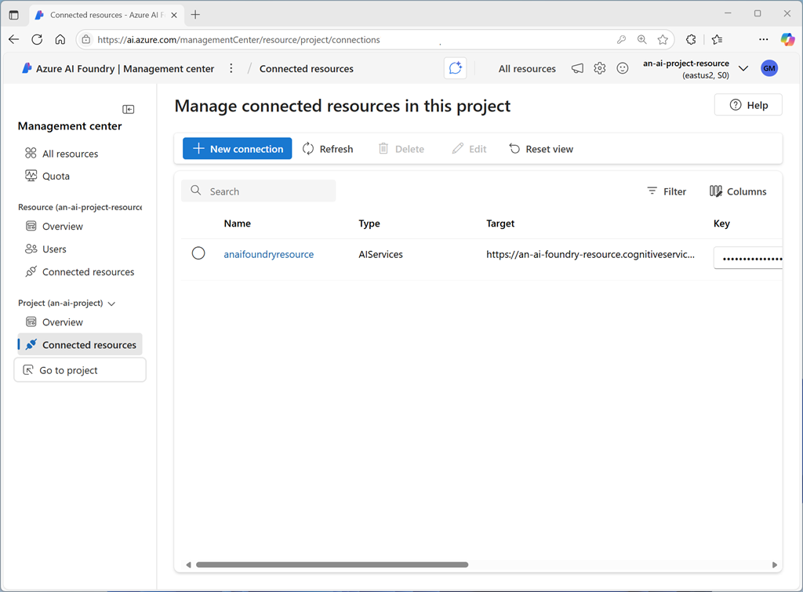

Each Azure AI Foundry project includes **connected resources**, which are defined both at the *hub* and *project* level. Each resource is a *connection* to an external service, such as Azure AI services, Azure storage, Azure AI search, and others.



With the Azure AI Foundry SDK, you can connect to a project and retrieve connections; which you can then use to consume the connected services.

::: zone pivot="python"

The **AIProjectClient** object in Python has a **connections** property, which you can use to access the resource connections in the project. Methods of the **connections** object include:

- `connections.list()`: Returns a collection of connection objects, each representing a connection in the project. You can filter the results by specifying an optional **connection_type** parameter with a valid enumeration, such as `ConnectionType.AZURE_AI_SERVICE`.
- `connections.get(connection_name, include_credentials)`: Returns a connection object for the connection with the name specified. If the **include_credentials** parameter is **True** (the default value), the credentials required to connect to the connection are returned - for example, in the form of an API key for an Azure AI services resource.
- `connections.get_default(connection_type, include_credentials)`: Returns the default connection of the specified type - for example, the default Azure AI services connection defined in the project.

The connection objects returned by these methods include connection-specific properties, which you can use to connect to the associated resource. For example, the following code snippet retrieves the default Azure AI services connection and uses it to instantiate a **TextAnalyticsClient** object in order to use the sentiment analysis functionality of the Azure AI Language service (which is included in an Azure AI services resource).

```python
from azure.ai.projects import AIProjectClient
from azure.ai.projects.models import ConnectionType
from azure.identity import DefaultAzureCredential
from azure.core.credentials import AzureKeyCredential
from azure.ai.textanalytics import TextAnalyticsClient

try:
    # Get project client
    project_connection_string = "<region>.api.azureml.ms;<project_id>;<hub_name>;<project_name>"
    project_client = AIProjectClient.from_connection_string(
      credential=DefaultAzureCredential(),
      conn_str=project_connection_string,
    )

    # Get the properties of the default Azure AI Services connection with credentials
    connection = project_client.connections.get_default(
      connection_type=ConnectionType.AZURE_AI_SERVICES,
      include_credentials=True, 
    )

    # Use the connection information to create a text analytics client
    ai_svc_credential = AzureKeyCredential(connection.key)
    text_analytics_client = TextAnalyticsClient(endpoint=connection.endpoint_url, credential=ai_svc_credential)

    # Use the Language service to analyze some text (to infer sentiment) 
    text = "I hated the movie. It was so slow!"
    sentimentAnalysis = text_analytics_client.analyze_sentiment(documents=[text])[0]
    print("Text: {}\nSentiment: {}".format(text,sentimentAnalysis.sentiment))

except Exception as ex:
    print(ex)
```

> [!NOTE]
> In addition to the **azure-ai-projects** and **azure-identity** packages discussed previously, the sample code shown here assumes that the **azure-ai-textanalytics** package has been installed:
>
> `pip install azure-ai-textanalytics`

::: zone-end

::: zone pivot="csharp"

The **AIProjectClient** object in C# has a **GetConnectionsClient()** method, which returns a **ConnectionsClient** object that you can use to access the resource connections in the project. Methods of the **ConnectionsClient** object include:

- `GetConnections()`: Returns a collection of **ConnectionResponse** objects, each representing a connection in the project. You can filter the results by specifying an optional **ConnectionType** parameter with a valid enumeration, such as `ConnectionType.AzureAIServices`.
- `GetConnection(connectionName)`: Returns a connection object for the connection with the name specified.
- `GetDefaultConnection(connectionType)`: Returns the default connection of the specified type - for example, the default Azure AI services connection defined in the project.

The connection objects returned by these methods include connection-specific properties, which you can use to connect to the associated resource. For example, the following code snippet retrieves the default Azure AI services connection and uses it to instantiate a **TextAnalyticsClient** object in order to use the sentiment analysis functionality of the Azure AI Language service (which is included in an Azure AI services resource).

```csharp
using System;
using Azure;
using Azure.AI.Projects;
using Azure.Identity;
using Azure.AI.TextAnalytics;

namespace my_foundry_client{
    class Program
    {
        static void Main(string[] args)
        {
            try
            {
                // Get project client
                var connectionString = "<region>.api.azureml.ms;<project_id>;<hub_name>;<project_name>";
                var projectClient = new AIProjectClient(connectionString, new DefaultAzureCredential());
        
                // Get the properties of the default Azure AI Services connection with credentials
                var connectionsClient = projectClient.GetConnectionsClient();
                ConnectionResponse connection = connectionsClient.GetDefaultConnection(ConnectionType.AzureAIServices, true);
        
                // Use the connection information to create a text analytics client
                var apiKeyAuthProperties = connection.Properties as ConnectionPropertiesApiKeyAuth;
                var credential = new AzureKeyCredential(apiKeyAuthProperties.Credentials.Key);
                Uri endpoint = new Uri(apiKeyAuthProperties.Target);
                var client = new TextAnalyticsClient(endpoint, credential);
        
                // Use the Language service to analyze some text (to infer sentiment)
                var text = "I hated the movie. It was so slow!";
                DocumentSentiment sentiment = client.AnalyzeSentiment(text);
                Console.WriteLine("Text: " + text);
                Console.WriteLine("Sentiment: " + sentiment.Sentiment);
            }
            catch (Exception ex)
            {
                Console.WriteLine(ex.Message);
            }
        }
    }
}
```

> [!NOTE]
> In addition to the **Azure.AI.Projects** and **Azure.Identity** packages discussed previously, the sample code shown here assumes that the **Azure.AI.TextAnalytics** package has been installed:
>
> `dotnet add package Azure.AI.TextAnalytics`

::: zone-end
