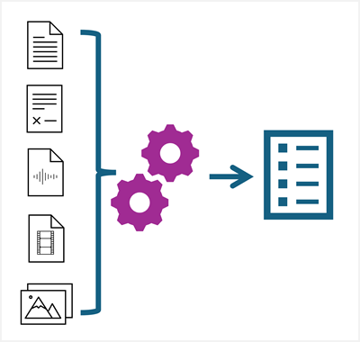

AI-powered information extraction and analysis enables organizations to gain actionable insights from data that might otherwise be locked up in documents, images, audio files, or other assets.

Examples of information extraction scenarios include:
- A company needs to process employee expense claims, and has to extract expense descriptions and amounts from scanned receipts.
- A customer service agency wants to analyze recorded support calls to identify common problems and resolutions.
- A historical society needs to extract and store data from census records in scanned historical documents.
- A tourist organization wants to analyze video footage and images taken at popular sites to help estimate visitor volumes and improve capacity planning for tours.
- A finance department in a large corporation wants to automate accounts-payable processing by routing invoices received centrally to the appropriate departments for payment.
- A marketing organization wants to analyze a large volume of digital images and documents, extracting and indexing the extracted data so it can be easily searched.

Azure AI includes multiple services that can be used, individually or in combination, so support these kinds of information extraction scenarios. In this module, we'll explore some of these services and their capabilities.
