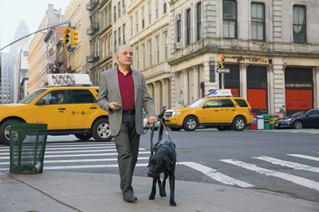
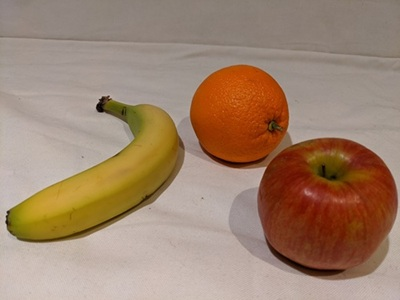
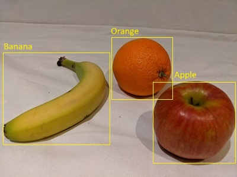
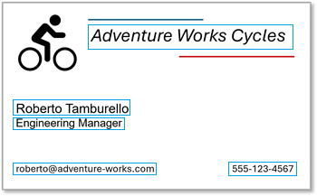

The Azure AI Vision Image Analysis service is a great choice when you need to extract insights from photographs or small scanned documents, such as business cards or menus.

## Automated caption and tag generation

You can use Azure AI Vision Image Analysis to generate descriptive text associated with an image. The service can analyze an image and generate:

- A **caption** that describes the image.
- A set of suggested **dense captions** for the key objects in the image.
- A collection of **tags** that help categorize the image.

For example, suppose you want to capture the key details related to this image:



The AI Vision Image Analysis service generates the following descriptive text values.

- **Caption**: A man walking a dog on a leash
- **Dense captions**:
    - A man walking a dog on a leash
    - A man walking on the street
    - A yellow car on the street
    - A yellow car on the street
    - A green telephone booth with a green sign
- **Tags**:
    - outdoor
    - land vehicle
    - vehicle
    - building
    - road
    - street
    - wheel
    - taxi
    - person
    - clothing
    - car
    - dog
    - yellow
    - walking
    - city

## Object detection

Azure AI Vision Image Analysis can also detect common objects and people in an image.

For example, consider the following image:

.

Azure AI Vision Image Analysis detects the types and locations of objects in this image, as shown here:

.

## Optical character recognition (OCR)

When an image contains printed or handwritten text, Azure AI Vision Image Analysis can use a technique called *optical character recognition* (OCR) to determine the location and contents of each *line* of text, and each individual *word*. The OCR capabilities of Azure AI Vision Image Analysis are useful when you need to read text in an image for further processing, for example to translate a menu using a cellphone application. Azure AI Vision Image Analysis can also be useful to extract small volumes of free-form text from simple documents; for example, to extract contact details from a business card.

Consider the following scanned business card:


You could use Azure AI Vision Image Analysis to locate and extract the text from this card, with the following results:



```text
Adventure Works Cycles
Roberto Tamburello
Engineering Manager
roberto@adventure-works.com
555-123-4567
```
