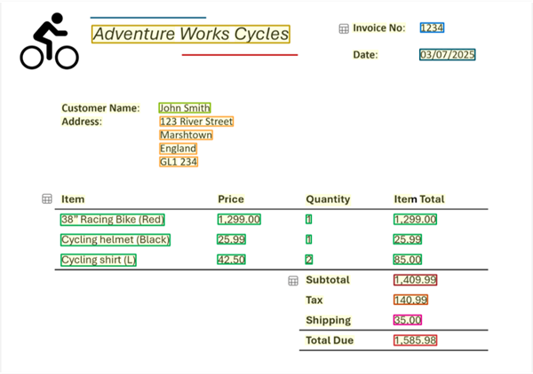

Azure AI Content Understanding uses state of the art AI models to analyze content in multiple formats, including:

- Text-based forms and documents
- Audio
- Images
- Video

## Analyzing forms and documents

Azure AI Content Understanding's document analysis capabilities go beyond simple OCR-based text extraction to include schema-based extraction of fields and their values.

For example, suppose you define a schema that includes the common fields typically found in an invoice, such as:

- Vendor name
- Invoice number
- Invoice date
- Customer name
- Custom address
- Items - the items ordered, each of which includes:
    - Item description
    - Unit price
    - Quantity ordered
    - Line item total
- Invoice subtotal
- Tax
- Shipping Charge
- Invoice total

Now suppose you need to extract this information from the following invoice:


Azure AI Content Understanding can apply the invoice schema to your invoice and identify the corresponding fields, even when they are labeled with different names (or not labeled at all). The resulting analysis produces a result like this:



For each detected field, the value is extracted from the invoice:

- **Vendor name**: Adventure Works Cycles
- **Invoice number**: 1234
- **Invoice date**: 03/07/2025
- **Customer name**: John Smith
- **Custom address**: 123 River Street, Marshtown, England, GL1 234
- **Items**:
    - Item 1:
        - **Item description**: 38" Racing Bike (Red)
        - **Unit price**: 1299.00
        - **Quantity ordered**: 1
        - **Line item total**: 1299.00
     - Item 2:
        - **Item description**: Cycling helmet (Black)
        - **Unit price**: 25.99
        - **Quantity ordered**: 1
        - **Line item total**: 25.99
     - Item 3:
        - **Item description**: Cycling shirt (L)
        - **Unit price**: 42.50
        - **Quantity ordered**: 2
        - **Line item total**: 85.00
- **Invoice subtotal**: 1409.99
- **Tax**: 140.99
- **Shipping Charge**: 35.00
- **Invoice total**: 1585.98

## Analyzing audio

In addition to text-based documents, Azure AI Content Understanding is capable of analyzing audio files to provide transcriptions, summaries, and other key insights.

Suppose you want to have AI summarize your voice mail. You might define a schema of key insights to extract from each recorded call, like this:

- Caller
- Message summary
- Requested actions
- Callback number
- Alternative contact details

Now suppose, a caller leaves you the following voice message:

```
Hi, this is Ava from Contoso.

Just calling to follow up on our meeting last week.

I wanted to let you know that I've run the numbers and I think we can meet your price expectations.

Please call me back on 555-12345 or send me an e-mail at Ava@contoso.com and we'll discuss next steps.

Thanks, bye!
```

Using Azure AI Content Understanding to analyze the audio recording and apply your schema produces the following results:

- **Caller**: Ava from Contoso
- **Message summary**: Ava from Contoso called to follow up on a meeting and mentioned that they can meet the price expectations. She requested a callback or an email to discuss next steps.
- **Requested actions**: Call back or send an email to discuss next steps.
- **Callback number**: 555-12345
- **Alternative contact details**: Ava@contoso.com

## Analyzing images and video

Azure AI Content Understanding supports analysis of images and video to extract information based on a custom schema. For example, you could analyze images of a video conference to extract details of attendance, location, and other information.

Suppose you defined the following schema for an image taken by a collaborative messaging system that combines in-room attendees and remote attendees on a conference call system:

- Location
- In-person attendees
- Remote attendees
- Total attendees

You can use Azure AI Content Understanding to analyze the following still image from the conference room camera:


When applying the schema above to this image, Azure AI Content Understanding produces the following results:

- **Location**: Conference room
- **In-person attendees**: 1
- **Remote attendees**: 3
- **Total attendees**: 4

If instead of analyzing the still image, you were to create an analyzer for recorded video of the call; the schema could include attendance counts at various time intervals, details of who spoke during the call and what they said, a summary of the discussion, and a list of assigned actions from the meeting.
