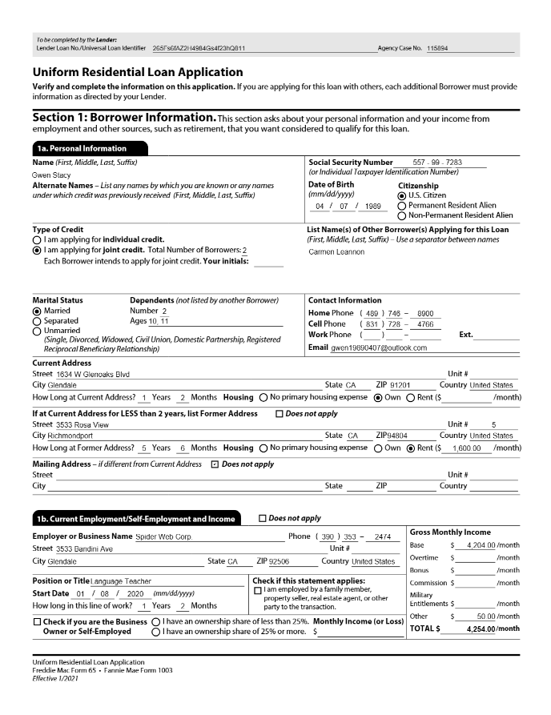

Azure AI Document Intelligence is designed to support complex document and form processing scenarios. While you can also use Azure AI Content Understanding to extract fields from forms and documents, Azure AI Document Intelligence offers a large library of prebuilt models, from simple receipts to complex tax forms. You can also create sophisticated custom models of your own.

## Using prebuilt models

Let's explore an example of using Azure AI Document Intelligence to extract data from a form.

Suppose a financial loan company needs to hundreds of mortgage applications each day. Here's an example of just the first page of a standard 11-page mortgage application form:

Azure AI Document Intelligence includes a prebuilt model for this type of form, making it easy to build a solution that can locate and extract fields, such as:

- Borrower Name
- Address
- Telephone number
- Social security number
- Date of birth
- Marital status
- Employment status
- Employer name
- Employer address
- Income
- Citizenship
- *and more*

## Creating custom models

With Azure AI Document Intelligence, you can train custom models by using labeled examples of the documents you want to analyze. Labeling your documents involves using OCR to define the *layout* of your document and identifying the discrete *fields* in your documents that you want to extract.
