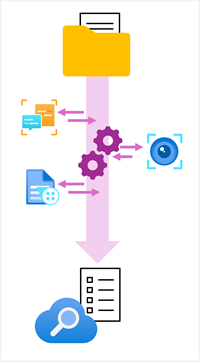
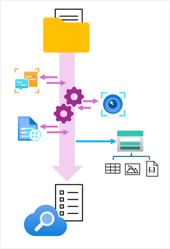

Fundamentally, Azure AI Search is a cloud service for indexing and searching data. However, its use of AI *skills* to extract insights from multiple formats of data and the ability to integrate it with other AI services, including Azure AI Vision and Azure AI Document Intelligence make it a powerful platform for building digital asset management and knowledge mining solutions.

## Indexers, indexes, and skills

At the heart of an Azure AI Search solution is an *indexer*, which defines a repeatable process to:

1. Ingest data from a *source*, such as an Azure Storage container of documents or a database.
1. *Crack* documents to extract their contents - for example, retrieving the text and image data in a PDF document.
1. Apply a sequence of tasks to retrieve information from the data and generate a hierarchy of *fields* for the index. Some fields are core attributes of the source data (for example document file names and last saved dates), while others are generated by using AI *skills*. For example:
    - Using **Azure AI Vision** services to generate *tags* and *captions* for images.
    - Using **Azure AI Language** services to derive fields for *sentiment* or *named entities*.
    - Using **Azure AI Document Intelligence** to extract field values from forms.
1. Persisting the extracted fields as an *index*.

    

The resulting index can be used to enable users to search for information in the extracted fields based on keywords and filtering criteria.

## Persisting extracted data to a knowledge store

As well as creating a searchable index, Azure AI Search can persist the extracted data assets to a *knowledge store* in Azure Storage.

The indexer can save the following kinds of asset in a knowledge store:

- Tables of field values.
- Images extracted from documents.
- JSON documents representing data structures; which can be complex hierarchies of fields and values.

    