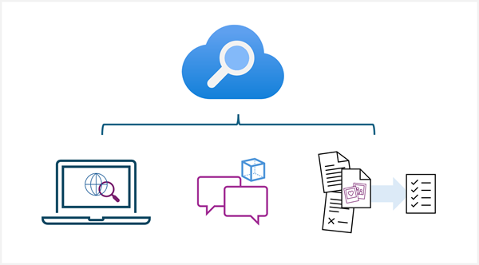

Azure AI Search provides a cloud-based solution for indexing and querying a wide range of data sources, and creating comprehensive and high-scale search solutions. It provides the infrastructure and tools to create search solutions that extract data from structured, semi-structured, and non-structured documents and other data sources.

With Azure AI Search, you can:

- Index documents and data from a range of sources.
- Use AI skills to enrich index data.
- Store extracted insights in a knowledge store for analysis and integration.

Azure AI Search indexes contain insights extracted from your data; which can include text inferred or read using OCR from images, entities and key phrases detection through text analytics, and other derived information based on AI skills that are integrated into the indexing process.

Azure AI search has many applications, including:

- Implementing an *enterprise search* solution to help employees or customers find information in websites or applications.
- Supporting *retrieval augmented generation* (RAG) in generative AI applications by using vector-based indexes for prompt grounding data.
- Creating *knowledge mining* solutions in which the indexing process is used to infer insights and extract granular data assets from documents to support data analytics.

In this module, we'll focus on Azure AI Search in knowledge mining scenarios.
