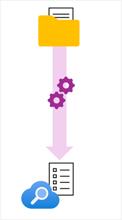

At the heart of Azure AI Search solutions is the creation of an *index* An index contains your searchable content and is created and updated, unsurprisingly, by an *indexer*.

The indexing process starts with a data source: the storage location of your original data artifacts; for example, an Azure blob store container full of documents, a database, or some other store.

The Indexer automates the extraction and indexing of data *fields* through an *enrichment pipeline*, in which it applies *document cracking* to extract the contents of the source documents and applies incremental steps to create a hierarchical (JSON-based) document with the required fields for the index definition.

The result is a populated index, which can be queried to return specified fields from documents that match the query criteria.

## How documents are constructed during indexing

The indexing process works by creating a document for each indexed entity. During indexing, an *enrichment pipeline* iteratively builds the documents that combine metadata from the data source with enriched fields extracted or generated by *skills*. You can think of each indexed document as a JSON structure, which initially consists of a document with the index fields you have mapped to fields extracted directly from the source data, like this:

- **document**
    - **metadata_storage_name**
    - **metadata_author**
    - **content**

When the documents in the data source contain images, you can configure the indexer to extract the image data and place each image in a **normalized_images** collection, like this:

- **document**
    - **metadata_storage_name**
    - **metadata_author**
    - **content**
    - **normalized_images**
        - **image0**
        - **image1**

Normalizing the image data in this way enables you to use the collection of images as an input for skills that extract information from image data.

Each skill adds fields to the **document**, so for example a skill that detects the *language* in which a document is written might store its output in a **language** field, like this:

- **document**
    - **metadata_storage_name**
    - **metadata_author**
    - **content**
    - **normalized_images**
        - **image0**
        - **image1**
    - **language**

The document is structured hierarchically, and the skills are applied to a specific *context* within the hierarchy, enabling you to run the skill for each item at a particular level of the document. For example, you could run an optical character recognition (*OCR*) skill for each image in the normalized images collection to extract any text they contain:

- **document**
    - **metadata_storage_name**
    - **metadata_author**
    - **content**
    - **normalized_images**
        - **image0**
            - **Text**
        - **image1**
            - **Text**
    - **language**

The output fields from each skill can be used as inputs for other skills later in the pipeline, which in turn store *their* outputs in the document structure. For example, we could use a *merge* skill to combine the original text content with the text extracted from each image to create a new **merged_content** field that contains all of the text in the document, including image text.

- **document**
    - **metadata_storage_name**
    - **metadata_author**
    - **content**
    - **normalized_images**
        - **image0**
            - **Text**
        - **image1**
            - **Text**
    - **language**
    - **merged_content**

The fields in the final document structure at the end of the pipeline are mapped to index fields by the indexer in one of two ways:

- Fields extracted directly from the source data are all mapped to index fields. These mappings can be *implicit* (fields are automatically mapped to in fields with the same name in the index) or *explicit* (a mapping is defined to match a source field to an index field, often to rename the field to something more useful or to apply a function to the data value as it is mapped).
- Output fields from the skills in the skillset are explicitly mapped from their hierarchical location in the output to the target field in the index.
