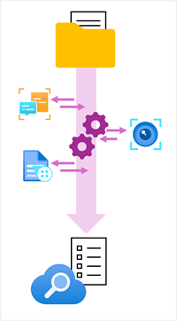

The enrichment pipeline that is orchestrated by an indexer uses a *skillset* of AI skills to create AI-enriched fields. The indexer applies each skill in order, refining the index document at each step.

## Built-in skills

Azure AI Search provides a collection of *built-in* skills that you can include in a skillset for your indexer. Built-in skills include functionality from Azure AI services such as Azure AI Vision and Azure AI Language, enabling you to apply enrichments such as:

- Detecting the language that text is written in.
- Detecting and extracting places, locations, and other entities in the text.
- Determining and extracting key phrases within a body of text.
- Translating text.
- Identifying and extracting (or removing) personally identifiable information (PII) within the text.
- Extracting text from images.
- Generating captions and tags to describe images.

To use the built-in skills, your indexer must have access to an Azure AI services resource. You can use a restricted Azure AI search resource that is included in Azure AI Search (and which is limited to indexing 20 or fewer documents) or you can attach an Azure AI services resource in your Azure subscription (which must be in the same region as your Azure AI Search resource).

## Custom skills

You can further extend the enrichment capabilities of your index by creating *custom* skills. As the name suggests, custom skills perform custom logic on input data from your index document to return new field values that can be incorporated into the index. Often, custom skills are "wrappers" around services that are specifically designed to extract data from documents. For example, you could implement a custom skill as an Azure Function, and use it to pass data from your index document to an Azure AI Document Intelligence model, which can extract fields from a form.

> [!TIP]
> To learn mode about using custom skills with Azure AI Search, see **[Add a custom skill to an Azure AI Search enrichment pipeline](/azure/search/cognitive-search-custom-skill-interface)** in the Azure AI Search documentation.
