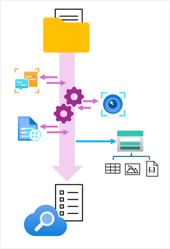

While the index might be considered the primary output from an indexing process, the enriched data it contains might also be useful in other ways. For example:

- Since the index is essentially a collection of JSON objects, each representing an indexed record, it might be useful to export the objects as JSON files for integration into a data orchestration process for extract, transform, and load (ETL) operations.
- You may want to normalize the index records into a relational schema of tables for analysis and reporting.
- Having extracted embedded images from documents during the indexing process, you might want to save those images as files.

Azure AI Search supports these scenarios by enabling you to define a *knowledge store* in the skillset that encapsulates your enrichment pipeline. The knowledge store consists of *projections* of the enriched data, which can be JSON objects, tables, or image files. When an indexer runs the pipeline to create or update an index, the projections are generated and persisted in the knowledge store.

> [!TIP]
> To learn more about using a knowledge store, see **[Knowledge store in Azure AI Search](/azure/search/knowledge-store-concept-intro)** in the Azure AI Search documentation.
