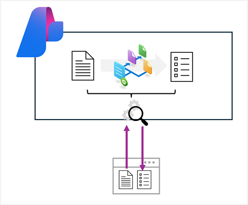

Azure AI Content Understanding is a multimodal service that simplifies the creation of AI-powered analyzers that can extract information from multiple content formats, including documents, images, audio files, and videos.

> [!TIP]
> To learn how to build Azure AI Content Understanding analyzers, complete the **[Create a multimodal analysis solution with Azure AI Content Understanding](/training/modules/analyze-content-ai/)** module.

You can develop client applications that use Azure AI Content Understanding analyzers by using the Azure AI Content Understanding REST API; which is the focus of this module.

In this module, you'll learn how to write code that uses the REST API to submit a content file to an analyzer and process the results.

> [!NOTE]
> Azure AI Content Understanding is currently in public preview. Details described in this module are subject to change.
