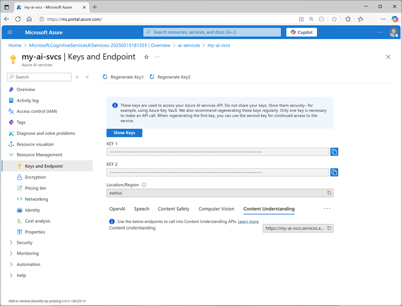
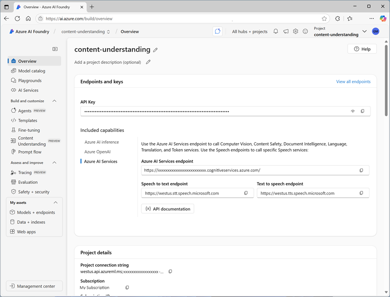

Before you can use the Azure AI Content Understanding REST API, you need an Azure AI services multi-services resource in your Azure subscription. You can provision this resource in the following ways:

- Create an **Azure AI services** resource in the Azure portal.
- Create an **Azure AI Foundry** hub, which includes an Azure AI services resource by default.

> [!TIP]
> Creating an Azure AI Foundry hub enables you to work in an Azure AI Foundry project, in which you can use visual tools to create and manage Azure AI Content Understanding schemas and analyzers.

After you've provisioned an Azure AI services resource, you need the following information to connect to the Azure AI Content Understanding REST API from a client application:

- The Azure AI services resource *endpoint*
- One of the API *keys* associated with the endpoint.

You can obtain these values from the Azure portal, as shown in the following image:

 If you're working within an Azure AI Foundry project, you can find the endpoint and key for the associated Azure AI services resource in the Azure AI Foundry portal, as shown in the following image:

When working in an Azure AI Foundry project, you can also write code that uses the Azure AI Foundry SDK to connect to the project using Microsoft Entra ID authentication, and retrieve the connection details for the Azure AI services resource; including the endpoint and key.

> [!TIP]
> To learn more about programming with the Azure AI Foundry SDK, complete the **[Develop an AI app with the Azure AI Foundry SDK](/training/modules/ai-foundry-sdk/)** module.
