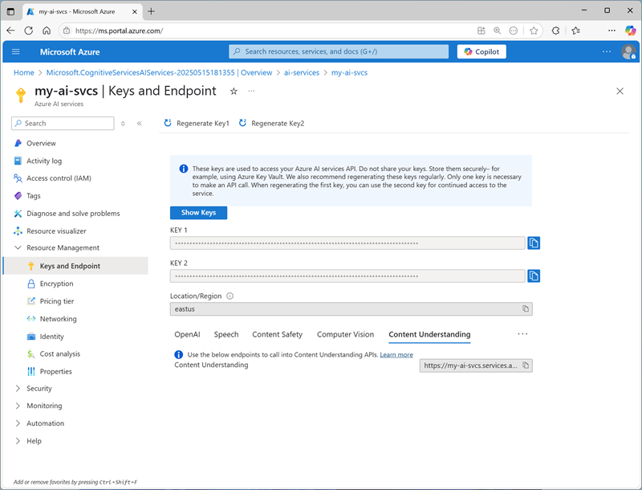

Before you can use the Azure Content Understanding API, you need a Microsoft Foundry resource in your Azure subscription. You can provision this resource in the following ways:

- Create a **Microsoft Foundry** resource in the Azure portal.
- Create a **Microsoft Foundry** project, which includes a Microsoft Foundry resource by default.

> [!TIP]
> Creating a Microsoft Foundry project enables you to use visual tools to create and manage Azure Content Understanding schemas and analyzers.

After you've provisioned a Microsoft Foundry resource, you need the following information to connect to the Azure Content Understanding API from a client application:

- The Microsoft Foundry resource *endpoint*
- One of the API *keys* associated with the endpoint.

You can obtain these values from the Azure portal, as shown in the following image:



 If you're working within a Microsoft Foundry project, you can find the endpoint and key for the associated Foundry resource in the Foundry portal project home page.

When working in a Microsoft Foundry project, you can also write code that uses the Microsoft Foundry SDK to connect to the project using Microsoft Entra ID authentication, and retrieve the connection details for the Microsoft Foundry resource.

## Installing the Python SDK

To use the Python SDK for Content Understanding, install the `azure-ai-contentunderstanding` package:

```bash
pip install azure-ai-contentunderstanding
```

> [!NOTE]
> The Python SDK requires Python 3.9 or later. You can also use the REST API directly from any language that supports HTTP requests.

> [!IMPORTANT]
> Before using the Content Understanding API, you must set up default model deployments for your Microsoft Foundry resource. Content Understanding requires `GPT-4.1`, `GPT-4.1-mini`, and `text-embedding-3-large` model deployments. You can configure these in the Azure portal or by using the API. For more information, see **[Set up model deployments](/azure/ai-services/content-understanding/how-to/migration-preview-to-ga#prerequisites)**.

> [!TIP]
> To learn more about programming with the Microsoft Foundry SDK, complete the **[Develop an AI app with the Microsoft Foundry SDK](/training/modules/ai-foundry-sdk/)** module.


