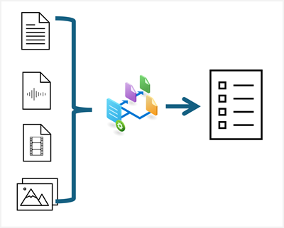


::: zone pivot="video"

>[!VIDEO https://learn-video.azurefd.net/vod/player?id=eaa72c12-112e-4efe-a1b5-6fca3e1ae45d]

::: zone-end

::: zone pivot="text"

Organizations today rely on information that is often locked up in content assets such as documents, images, videos, and audio recordings. Extracting information from this content can be challenging, laborious, and time-consuming, and organizations often need to build solutions based on multiple technologies for content analysis depending on the formats being used.

Azure Content Understanding is a multimodal service that simplifies the creation of AI-powered analyzers that can extract information from content in practically any format.

In this module, you'll explore the capabilities of Azure Content Understanding, and learn how to use it to build custom analyzers.

::: zone-end

> [!NOTE]
> We recognize that different people like to learn in different ways. You can choose to complete this module in video-based format or you can read the content as text and images. The text contains greater detail than the videos, so in some cases you might want to refer to it as supplemental material to the video presentation.
