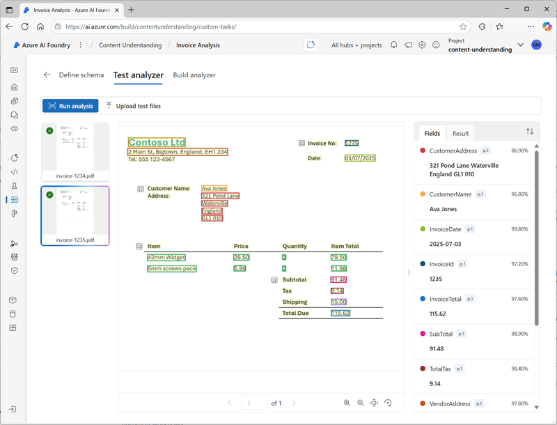
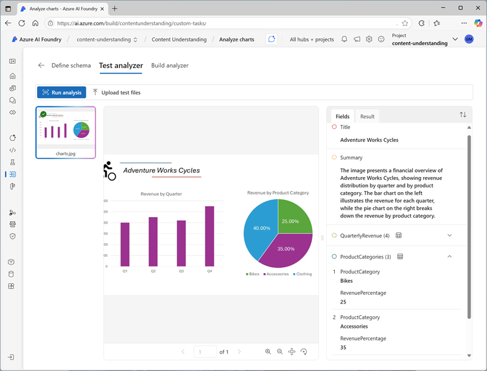
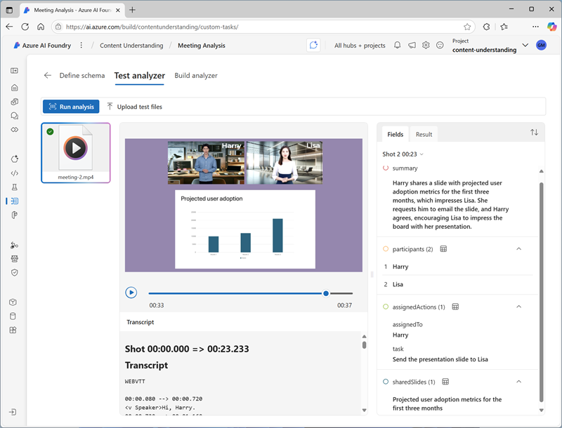

Azure AI Content Understanding is a generative AI service that you can use to extract insights and data from multiple kinds of content. With Content Understanding, you can quickly build applications that analyze complex data and generate outputs that can be used to automate and optimize processes.

Content Understanding is a component of Azure AI services. To use it, you need to provision an Azure AI services resource in your Azure subscription. You can develop and manage a Content Understanding solution:

- In the Azure AI Foundry portal
- By using the Content Understanding REST API

## Multimodal content analysis

Content Understanding can extract information from common kinds of content, enabling you to use a single service with a straightforward and consistent development process to build multimodal content analysis solutions. 

### Documents and forms

You can use Content Understanding to analyze documents and forms and retrieve specific field values. For example, you could extract key data values from an invoice to automate payment processing.

### Images

You can analyze images to infer information from visuals such as charts, identify physical defects in products or other items, detect the presence of specific objects or people, or determine other information visually.

### Audio

Analysis of audio enables you to automate tasks like summarizing conference calls, determining sentiment of recorded customer conversations, or extracting key data from telephone messages.

### Video

Video accounts for a large volume of the data captured today, and you can use Content Understanding to analyze and extract insights from video to support many scenarios. For example, to summarize and extract key points from presentations or to detect the presence of specific activity in security footage.

