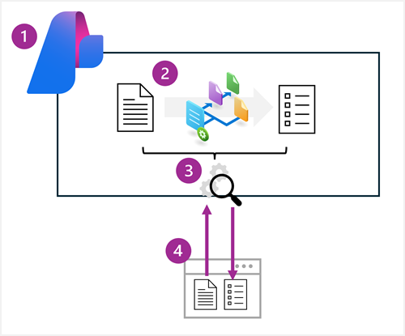
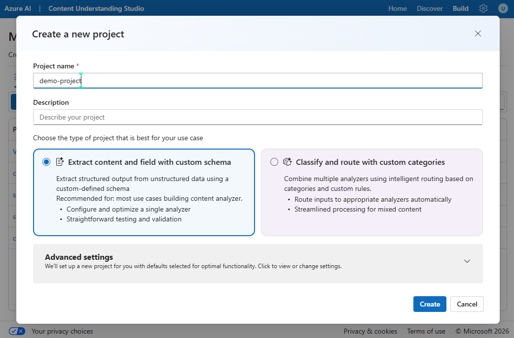

Content Understanding solutions are based on the creation of an *analyzer*; which is trained to extract specific information from a particular type of content based on a *schema* that you define.

The high-level process for creating a Content Understanding solution includes the following steps:

1. Create a Foundry resource.
1. Define a Content Understanding schema for the information to be extracted. This can be based on a content sample and an analyzer template.
1. Build an analyzer based on the completed schema.
1. Use the analyzer to extract or generate fields from new content.

Numerous analyzer templates are provided to help you develop an appropriate analyzer for your needs quickly. Additionally, because of the generative AI capabilities of Content Understanding, you can use minimal training data to define a schema by example. In many cases, the service accurately identifies the data values in the sample content that map to the schema elements automatically, though you can also explicitly label fields in content such as documents to improve the performance of your analyzer.

## Creating an analyzer with Content Understanding Studio

While you can develop a complete Content Understanding solution through the API or a language specific SDK, Content Understanding Studio provides a visual interface to create a project, define a Content Understanding schema, and build and test an analyzer.

> [!TIP]
> Only certain prebuilt models are available for use directly in the Microsoft Foundry portal. For custom analyzer creation and testing, use **[Content Understanding Studio](https://ai.azure.com/contentunderstanding)**.

### Creating a Content Understanding project

In Content Understanding Studio, you can create a new project that is associated with a Microsoft Foundry resource. Creating a project provisions the Azure resources needed to support your Content Understanding solution, including storage and a key vault resource to store sensitive details like credentials and keys.

> [!NOTE]
> Content Understanding schemas can only be created in Azure locations where the service is supported. For more information, see **[Content Understanding region and language support](/azure/ai-services/content-understanding/language-region-support)**.

### Defining a schema

After creating a project, the first step in building an analyzer is to define a schema for the content the analyzer will process, and the information it will extract. Content Understanding Studio provides a schema editor interface in which you can upload a file (document, image, audio, or video) on which the schema should be based. You can then apply an appropriate schema template and define the specific fields you want the analyzer to identify.

> [!NOTE]
> The templates and field types available in a schema depend on the content type of the file on which the schema is based. Some content types support additional optional functionality, such as extracting barcodes and formulae from text in documents. For more information about using Content Understanding with different content types, see the following articles in the product documentation:
>
> - **[Content Understanding document solutions](/azure/ai-services/content-understanding/document/overview)**
> - **[Content Understanding image solutions](/azure/ai-services/content-understanding/image/overview)**
> - **[Content Understanding audio solutions](/azure/ai-services/content-understanding/audio/overview)**
> - **[Content Understanding video solutions](/azure/ai-services/content-understanding/video/overview)**

### Testing

You can test the analyzer schema at any time during the development process by running analysis on the sample file used to define the schema or other uploaded files. The test results include the extracted field values and the JSON format output returned by the analyzer to client applications.

### Building an analyzer

When you're satisfied with the performance of your schema, you can build your analyzer. Building an analyzer makes it accessible to client applications through the endpoint for the Microsoft Foundry resource associated with your project.

After building your analyzer, you can continue to test it in Content Understanding Studio, and refine the schema to create new named versions with different capabilities.

