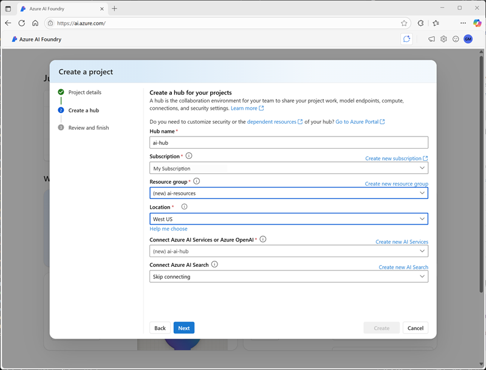

Content Understanding solutions are based on the creation of an *analyzer*; which is trained to extract specific information from a particular type of content based on a *schema* that you define.

The high-level process for creating a Content Understanding solution includes the following steps:

1. Provision an Azure AI services resource.
1. Define a schema for the information to be extracted. This can be based on a content sample and an analyzer template.
1. Build an analyzer based on the completed schema.
1. Use the Content Understanding REST interface to submit new content for analysis and retrieve the extracted data.

Numerous analyzer templates are provided to help you develop an appropriate analyzer for your needs quickly. Additionally, because of the generative AI capabilities of Content Understanding, you can use minimal training data to define a schema by example. In many cases, the service accurately identifies the data values in the sample content that map to the schema elements automatically, though you can also explicitly label fields in content such as documents to improve the performance of your analyzer.

## Creating an analyzer with Azure AI Foundry

While you can provision an Azure AI services resource and develop a complete Content Understanding solution through the REST API, the preferred approach for AI development projects is to use Azure AI Foundry. Specifically, you can use the Azure AI Foundry portal to create a Content Understanding project, define a schema, and build and test an analyzer.

### Creating a Content Understanding project

In Azure AI Foundry, you can create a Content Understanding project in an existing AI hub, or you can create a new hub as you create the project. In addition to the AI hub itself, creating a hub provisions the Azure resources needed to support one or more projects; including an Azure AI services resource, storage, and a key vault resource to store sensitive details like credentials and keys.

> [!NOTE]
> Content Understanding projects can only be created in Azure locations where the service is supported. When creating a new hub as part of a new Content Understanding project, only supported locations are listed. For more information, see **[Content Understanding region and language support](/azure/ai-services/content-understanding/language-region-support)**.

### Defining a schema

After creating a project, the first step in building an analyzer is to define a schema for the content the analyzer will process, and the information it will extract. Azure AI Foundry provides a schema editor interface in which you can upload a file (document, image, audio, or video) on which the schema should be based. You can then apply an appropriate schema template and define the specific fields you want the analyzer to identify.

> [!NOTE]
> The templates and field types available in a schema depend on the content type of the file on which the schema is based. Some content types support additional optional functionality, such as extracting barcodes and formulae from text in documents. For more information about using Content Understanding with different content types, see the following articles in the product documentation:
>
> - **[Content Understanding document solutions](/azure/ai-services/content-understanding/document/overview)**
> - **[Content Understanding image solutions](/azure/ai-services/content-understanding/image/overview)**
> - **[Content Understanding audio solutions](/azure/ai-services/content-understanding/audio/overview)**
> - **[Content Understanding video solutions](/azure/ai-services/content-understanding/video/overview)**

### Testing

You can test the analyzer schema at any time during the development process by running analysis on the sample file used to define the schema or other uploaded files. The test results include the extracted field values as well as the JSON format output returned by the analyzer to client applications.

### Building an analyzer

When you're satisfied with the performance of your schema, you can build your analyzer. Building an analyzer makes it accessible to client applications through Content Understanding endpoint for the Azure AI services resource associated with your project.

After building your analyzer, you can continue to test it in the Azure AI Foundry portal, and refine the schema to create new named versions with different capabilities.
