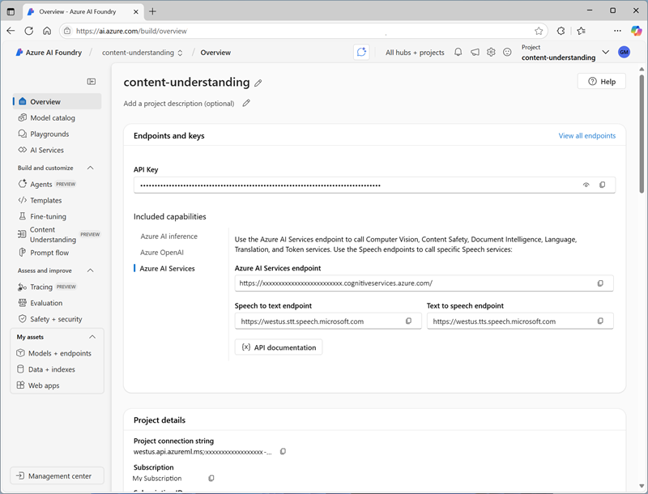

The Content Understanding REST API provides a programmatic interface that you can use to create, manage, and consume analyzers.

To use the REST API, your client application submits HTTP calls to the Content Understanding endpoint for your Azure AI services resource, passing one of the authorization keys in the header. You can obtain the endpoint and keys in the Azure portal.



## Using the REST API to analyze content

One of the most common uses of the REST API is to submit content to an existing analyzer that you have previously built, and retrieve the results of analysis. To perform this task, the API provides two operations:

- **Analyze**: Used to submit a URL to the file that is to be analyzed.
- **Analyze Binary**: Used to submit the binary content to be analyzed.

Both of these operations return an operation ID value that represents an asynchronous task. Your client application must then use the GET request to pass the operation ID back to the endpoint and retrieve the operation status - potentially polling multiple times until the operation is complete and the results are returned in JSON format.

For example, to analyze a document, a client application might submit a POST request to the **Analyze** operation containing the following JSON body:

```json
POST {endpoint}/contentunderstanding/analyzers/{analyzer}:analyze?api-version={api version}
{
  "url": "https://host.com/doc.pdf"
}
```
            
Assuming the request is authenticated and initiated successfully, the response will be similar to this example:

```http
Operation-Id: 1234abcd-1234-abcd-1234-abcd1234abcd
Operation-Location: {endpoint}/contentunderstanding/analyzers/{analyzer}/results/1234abcd-1234-abcd-1234-abcd1234abcd?api-version={api version}
{
  "id": "1234abcd-1234-abcd-1234-abcd1234abcd",
  "status": "NotStarted"
}
```

Your client application must then use the operation ID that has been returned to check the status of the operation until it has succeeded (or failed) by submitting a GET request to the **Get Analysis Results** operation.

```http
GET {endpoint}/contentunderstanding/analyzers/{analyzer}/results/1234abcd-1234-abcd-1234-abcd1234abcd?api-version={api version}
```

When the operation has completed successfully, the response to the GET request contains a JSON payload representing the results of the analysis, similar to this example (the specific results depend on the content and schema):

```json
{
  "id": "1234abcd-1234-abcd-1234-abcd1234abcd",
  "status": "Succeeded",
  "result": {
    "analyzerId": "{analyzer}",
    "apiVersion": "{api version}",
    "createdAt": "2024-10-14T18:46:36.244Z",
    "stringEncoding": "utf16",
    "contents": [
      {
        "kind": "document",
        "markdown": "# CONTOSO\n\n...",
        "startPageNumber": 1,
        "endPageNumber": 2,
        "unit": "inch",
        "pages": [
          {
            "pageNumber": 1,
            "width": 8.5,
            "height": 11
          },
          {
            "pageNumber": 2,
            "width": 8.5,
            "height": 11
          }
        ],
        "fields": {
          "Company": {
            "type": "string",
            "valueString": "CONTOSO",
            "spans": [
              {
                "offset": 7,
                "length": 2
              }
            ],
            "confidence": 0.95,
            "source": "D(1,5,1,7,1,7,1.5,5,1.5)"
          }
        }
      }
    ]
  }
}
```

> [!NOTE]
> For more information about the Content Understanding REST API, see the **[reference documentation](/rest/api/contentunderstanding/operation-groups)**.
