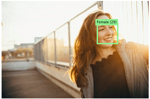

Microsoft's Azure AI Vision service provides pre-built computer vision capabilities. The service can analyze images, and return detailed information about an image and the objects it depicts.

## Azure resources for Azure AI Vision service

To use Azure AI Vision, you need to create a resource for it in your Azure subscription. You can use either of the following resource types:

- **Computer Vision**: A specific resource for the Computer Vision service. Use this resource type if you don't intend to use any other Azure AI Services, or if you want to track utilization and costs for your Computer Vision resource separately.
- **Azure AI services**: A general resource that includes Computer Vision along with many other Azure AI services; such as Azure AI Language, Azure AI Custom Vision, Azure AI Translator, and others. Use this resource type if you plan to use multiple AI services and want to simplify administration and development.

Whichever type of resource you choose to create, it will provide two pieces of information that you will need to use it:

- A **key** that is used to authenticate client applications.
- An **endpoint** that provides the HTTP address at which your resource can be accessed.

> [!NOTE]
> If you create an Azure AI services resource, client applications use the same key and endpoint regardless of the specific service they are using.

## Analyzing images with the Azure AI Vision service

After you've created a suitable resource in your subscription, you can submit images to the Azure AI Vision service to perform a wide range of analytical tasks.

### Describing an image

Azure AI Vision has the ability to analyze an image, evaluate the objects that are detected, and generate a human-readable phrase or sentence that can describe what was detected in the image. Depending on the image contents, the service may return multiple results, or phrases. Each returned phrase will have an associated confidence score, indicating how confident the algorithm is in the supplied description. The highest confidence phrases will be listed first.

To help you understand this concept, consider the following image of the Empire State building in New York. The returned phrases are listed below the image in the order of confidence.

- A black and white photo of a city
- A black and white photo of a large city
- A large white building in a city

### Tagging visual features

The image descriptions generated by Azure AI Vision are based on a set of thousands of recognizable objects, which can be used to suggest *tags* for the image. These tags can be associated with the image as metadata that summarizes attributes of the image; and can be particularly useful if you want to index an image along with a set of key terms that might be used to search for images with specific attributes or contents.

For example, the tags returned for the Empire State building image include:

- skyscraper
- tower
- building

### Detecting objects

The object detection capability is similar to tagging, in that the service can identify common objects; but rather than tagging, or providing tags for the recognized objects only, this service can also return what is known as bounding box coordinates. Not only will you get the type of object, but you will also receive a set of coordinates that indicate the top, left, width, and height of the object detected, which you can use to identify the location of the object in the image, like this:

### Detecting brands

This feature provides the ability to identify commercial brands. Azure AI Vision has an existing database of thousands of globally recognized logos from commercial brands of products.

When you call the service and pass it an image, it performs a detection task and determine if any of the identified objects in the image are recognized brands. The service compares the brands against its database of popular brands spanning clothing, consumer electronics, and many more categories. If a known brand is detected, the service returns a response that contains the brand name, a confidence score (from 0 to 1 indicating how positive the identification is), and a bounding box (coordinates) for where in the image the detected brand was found.

For example, in the following image, a laptop has a Microsoft logo on its lid, which is identified and located by Azure AI Vision.

### Detecting faces

Azure AI Vision can detect and analyze human faces in an image, including the ability to determine age and a bounding box rectangle for the location of the face(s). The facial analysis capabilities of Azure AI Vision service are a subset of those provided by the dedicated [Azure AI Face service](/azure/cognitive-services/face/). If you need basic face detection and analysis, combined with general image analysis capabilities, you can use the Azure AI Vision service; but for more comprehensive facial analysis and facial recognition functionality, use the Azure AI Face service.

The following example shows an image of a person with their face detected and approximate age estimated.

### Categorizing an image

Azure AI Vision can categorize images based on their contents. The service uses a parent/child hierarchy with a "current" limited set of categories. When analyzing an image, detected objects are compared to the existing categories to determine the best way to provide the categorization. As an example, one of the parent categories is **people_**. This image of a person on a roof is assigned a category of **people_**.

A slightly different categorization is returned for the following image, which is assigned to the category **people_group** because there are multiple people in the image:

Review the 86-category list [here](/azure/cognitive-services/computer-vision/category-taxonomy).

### Detecting domain-specific content

When categorizing an image, the Azure AI Vision service supports two specialized domain models:

- **Celebrities** - The service includes a model that has been trained to identify thousands of well-known celebrities from the worlds of sports, entertainment, and business.
- **Landmarks** - The service can identify famous landmarks, such as the Taj Mahal and the Statue of Liberty.

For example, when analyzing the following image for landmarks, the Computer Vision service identifies the Eiffel Tower, with a confidence of 99.41%.

### Optical character recognition

Azure AI Vision service can use optical character recognition (OCR) capabilities to detect printed and handwritten text in images. This capability is explored in the [following module](/learn/modules/read-text-computer-vision/) on Microsoft Learn.

### Additional capabilities

In addition to these capabilities, the Azure AI Vision service can:

- Detect image types - for example, identifying clip art images or line drawings.
- Detect image color schemes - specifically, identifying the dominant foreground, background, and overall colors in an image.
- Generate thumbnails - creating small versions of images.
- Moderate content - detecting images that contain adult content or depict violent, gory scenes.
