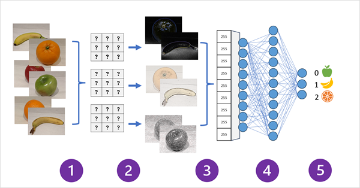
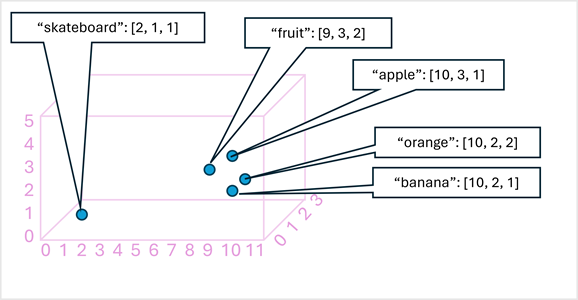
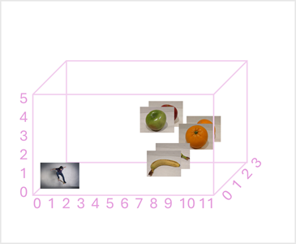

The ability to use filters to apply effects to images is useful in image processing tasks, such as you might perform with image editing software. However, the goal of computer vision is often to extract meaning, or at least actionable insights, from images; which requires the creation of machine learning models that are trained to recognize features based on large volumes of existing images.

> [!TIP]
> This unit assumes you are familiar with the fundamental principles of machine learning, and that you have conceptual knowledge of deep learning with neural networks. If you are new to machine  learning, consider completing the **[Fundamentals of machine learning](/training/modules/fundamentals-machine-learning/)** module on Microsoft Learn.

## Convolutional neural networks (CNNs)

One of the most common machine learning model architectures for computer vision is a *convolutional neural network* (CNN). CNNs use filters to extract numeric feature maps from images, and then feed the feature values into a deep learning model to generate a label prediction. For example, in an *image classification* scenario, the label represents the main subject of the image (in other words, what is this an image of?). You might train a CNN model with images of different kinds of fruit (such as apple, banana, and orange) so that the label that is predicted is the type of fruit in a given image.

During the *training* process for a CNN, filter kernels are initially defined using randomly generated weight values. Then, as the training process progresses, the models predictions are evaluated against known label values, and the filter weights are adjusted to improve accuracy. Eventually, the trained fruit image classification model uses the filter weights that best extract features that help identify different kinds of fruit.

The following diagram illustrates how a CNN for an image classification model works:

1. Images with known labels (for example, 0: apple, 1: banana, or 2: orange) are fed into the network to train the model.
1. One or more layers of filters is used to extract features from each image as it is fed through the network. The filter kernels start with randomly assigned weights and generate arrays of numeric values called *feature maps*.
1. The feature maps are flattened into a single dimensional array of feature values.
1. The feature values are fed into a fully connected neural network.
1. The output layer of the neural network uses a *softmax* or similar function to produce a result that contains a probability value for each possible class, for example [0.2, 0.5, 0.3].

During training the output probabilities are compared to the actual class label - for example, an image of a banana (class 1) should have the value [0.0, 1.0, 0.0]. The difference between the predicted and actual class scores is used to calculate the *loss* in the model, and the weights in the fully connected neural network and the filter kernels in the feature extraction layers are modified to reduce the loss.

The training process repeats over multiple *epochs* until an optimal set of weights has been learned. Then, the weights are saved and the model can be used to predict labels for new images for which the label is unknown.

> [!NOTE]
> CNN architectures usually include multiple convolutional filter layers and additional layers to reduce the size of feature maps,  constrain the extracted values, and otherwise manipulate the feature values. These layers have been omitted in this simplified example to focus on the key concept, which is that filters are used to extract numeric features from images, which are then used in a neural network to predict image labels.

## Transformers and multi-modal models

CNNs have been at the core of computer vision solutions for many years. While they're commonly used to solve image classification problems as described previously, they're also the basis for more complex computer vision models. For example, *object detection* models combine CNN feature extraction layers with the identification of *regions of interest* in images to locate multiple classes of object in the same image.

### Transformers

Most advances in computer vision over the decades have been driven by improvements in CNN-based models. However, in another AI discipline - *natural language processing* (NLP), another type of neural network architecture, called a *transformer* has enabled the development of sophisticated models for language. Transformers work by processing huge volumes of data, and encoding language *tokens* (representing individual words or phrases) as vectors (arrays of numeric values). You can think of a vector as representing the coordinates for a point in space, and the language tokens are encoded such that words and phrases that are commonly used in the same context are closer together than unrelated words.

As a simple example, the following diagram shows some words encoded as three-dimensional vectors, and plotted in a 3D space:

> [!NOTE]
> We've used only three dimensions, because that's easy to visualize. In reality, encoders in transformer networks create vectors with many more dimensions, defining complex semantic relationships between tokens based on linear algebraic calculations. The math involved is complex, as is the architecture of a transformer model. Our goal here is to provide a *conceptual* understanding of how encoding creates a model that encapsulates relationships between entities.

Words that are semantically similar are encoded in similar positions, creating a semantic language model that makes it possible to build sophisticated NLP solutions for text analysis, translation, language generation, and other tasks.

The success of transformers as a way to build language models has led AI researchers to consider whether the same approach would be effective for image data. To create a transformer network for a computer vision model, the image data is encoded so that images with similar visual features (based on their pixel values) are placed close to one another, as shown here:

### Multi-modal models

Since it's possible to use transformer networks to encode both language and image data, a logical next step is to combine these approaches to create a multi-modal model that encapsulates the relationships between images *and* their natural language descriptions. The Microsoft *Florence* model is just such a model. Trained with huge volumes of captioned images from the Internet, it includes both a language encoder and an image encoder, as shown here:

As shown in the diagram, Florence is an example of a *foundation* model. In other words a pre-trained general model on which you can build multiple *adaptive* models for specialist tasks. For example, you can use Florence as a foundation model for adaptive models that perform:

- *Image classification*: Identifying to which category an image belongs.
- *Object detection*: Locating individual objects within an image.
- *Captioning*: Generating appropriate descriptions of images.
- *Tagging*: Compiling a list of relevant text tags for an image.

Multi-modal models like Florence are at the cutting edge of computer vision and AI in general, and are expected to drive advances in the kind of solution that are possible.
