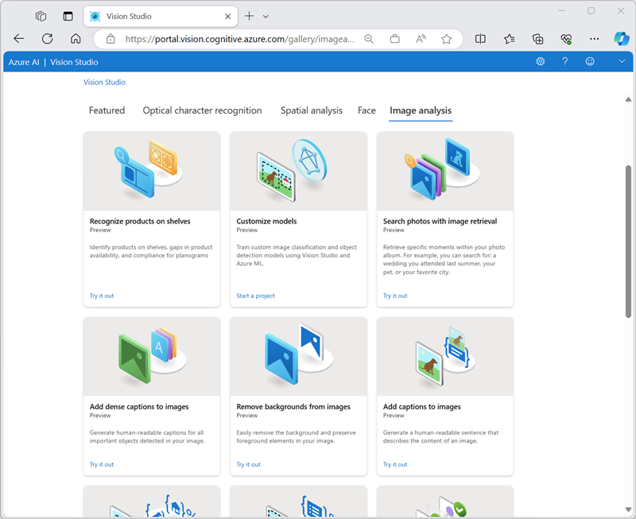
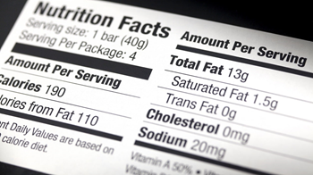

While you can train your own machine learning models for computer vision, the architecture for computer vision models can be complex; and you require significant volumes of training images and compute power to perform the training process.

Microsoft's Azure AI Vision service provides prebuilt and customizable computer vision models that are based on the Florence foundation model and provide various powerful capabilities. With Azure AI Vision, you can create sophisticated computer vision solutions quickly and easily; taking advantage of "off-the-shelf" functionality for many common computer vision scenarios, while retaining the ability to create custom models using your own images.

## Azure resources for Azure AI Vision service

To use Azure AI Vision, you need to create a resource for it in your Azure subscription. You can use either of the following resource types:

- **Azure AI Vision**: A specific resource for the Azure AI Vision service. Use this resource type if you don't intend to use any other Azure AI services, or if you want to track utilization and costs for your Azure AI Vision resource separately.
- **Azure AI services**: A general resource that includes Azure AI Vision along with many other Azure AI services; such as Azure AI Language, Azure AI Custom Vision, Azure AI Translator, and others. Use this resource type if you plan to use multiple AI services and want to simplify administration and development.

## Analyzing images with the Azure AI Vision service

After you've created a suitable resource in your subscription, you can submit images to the Azure AI Vision service to perform a wide range of analytical tasks.

Azure AI Vision supports multiple image analysis capabilities, including:

- Optical character recognition (OCR) - extracting text from images.
- Generating captions and descriptions of images.
- Detection of thousands of common objects in images.
- Tagging visual features in images

These tasks, and more, can be performed in [**Azure AI Vision Studio**](https://portal.vision.cognitive.azure.com/gallery/featured?azure-portal=true).



### Optical character recognition

Azure AI Vision service can use optical character recognition (OCR) capabilities to detect text in images. For example, consider the following image of a nutrition label on a product in a grocery store:



The Azure AI Vision service can analyze this image and extract the following text:

```
Nutrition Facts Amount Per Serving
Serving size:1 bar (40g)
Serving Per Package: 4
Total Fat 13g
Saturated Fat 1.5g
Amount Per Serving
Trans Fat 0g
calories 190
Cholesterol 0mg
ories from Fat 110
Sodium 20mg
ntDaily Values are based on
Vitamin A 50
calorie diet
```

> [!TIP]
> You can explore Azure AI Vision's OCR capabilities further in the **[Read text with Azure AI Vision](/learn/modules/read-text-computer-vision/)** module on Microsoft Learn.

### Describing an image with captions

Azure AI Vision has the ability to analyze an image, evaluate the objects that are detected, and generate a human-readable phrase or sentence that can describe what was detected in the image. For example, consider the following image:


Azure AI Vision returns the following caption for this image:

*A man jumping on a skateboard*


### Detecting common objects in an image

Azure AI Vision can identify thousands of common objects in images. For example, when used to detect objects in the skateboarder image discussed previously,  Azure AI Vision returns the following predictions:

- *Skateboard (90.40%)*
- *Person (95.5%)*

The predictions include a *confidence score* that indicates the probability the model has calculated for the predicted objects.

In addition to the detected object labels and their probabilities, Azure AI Vision returns *bounding box* coordinates that indicate the top, left, width, and height of the object detected. You can use these coordinates to determine where in the image each object was detected, like this:


### Tagging visual features

Azure AI Vision can suggest *tags* for an image based on its contents. These tags can be associated with the image as metadata that summarizes attributes of the image and can be useful if you want to index an image along with a set of key terms that might be used to search for images with specific attributes or contents.

For example, the tags returned for the skateboarder image (with associated confidence scores) include:

- *sport (99.60%)*
- *person (99.56%)*
- *footwear (98.05%)*
- *skating (96.27%)*
- *boardsport (95.58%)*
- *skateboarding equipment (94.43%)*
- *clothing (94.02%)*
- *wall (93.81%)*
- *skateboarding (93.78%)*
- *skateboarder (93.25%)*
- *individual sports (92.80%)*
- *street stunts (90.81%)*
- *balance (90.81%)*
- *jumping (89.87%)*
- *sports equipment (88.61%)*
- *extreme sport (88.35%)*
- *kickflip (88.18%)*
- *stunt (87.27%)*
- *skateboard (86.87%)*
- *stunt performer (85.83%)*
- *knee (85.30%)*
- *sports (85.24%)*
- *longboard (84.61%)*
- *longboarding (84.45%)*
- *riding (73.37%)*
- *skate (67.27%)*
- *air (64.83%)*
- *young (63.29%)*
- *outdoor (61.39%)*

## Training custom models

If the built-in models provided by Azure AI Vision don't meet your needs, you can use the service to train a custom model for *image classification* or *object detection*. Azure AI Vision builds custom models on the pre-trained foundation model, meaning that you can train sophisticated models by using relatively few training images.

### Image classification

An image classification model is used to predict the category, or *class* of an image. For example, you could train a model to determine which type of fruit is shown in an image, like this:

| Apple | Banana | Orange |
|--|--|--|
|  |  |  |

### Object detection

Object detection models detect and classify objects in an image, returning bounding box coordinates to locate each object. In addition to the built-in object detection capabilities in Azure AI Vision, you can train a custom object detection model with your own images. For example, you could use photographs of fruit to train a model that detects multiple fruits in an image, like this:


> [!NOTE]
> Details of how to use Azure AI Vision to train a custom model are beyond the scope of this module. You can find information about custom model training in the **[Azure AI Vision documentation](/azure/ai-services/computer-vision/how-to/model-customization?tabs=python)**.