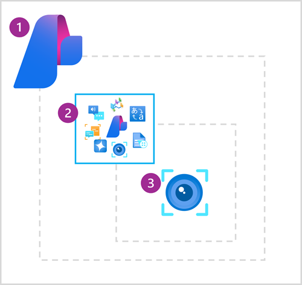

To use Azure AI Vision image analysis services, you need to provision an Azure AI Vision resource in your Azure subscription. You can choose from multiple provisioning options:



1. Create an **Azure AI Foundry** *project* and an associated *hub*. By default, an Azure AI Foundry hub includes an **Azure AI services** multi-service resource, which includes Azure AI Vision. Azure AI Foundry projects are recommended for development of AI solutions on Azure that combine generative AI, agents, and pre-built Azure AI services, or which involve collaborative development by a team of software engineers and service operators.
1. If you don't need all of the functionality in an Azure AI Foundry hub, you can create an **Azure AI services** multi-service resource in your Azure subscription. You can then use this resource to access Azure AI Vision services and other AI services through a single endpoint and key.
1. If you only need to use Azure AI Vision functionality, or you're just experimenting with the service, you can create a standalone **Computer Vision** resource in your Azure subscription. One benefit of this approach is that the standalone service provides a free tier that you can use to explore the service at no cost.

> [!TIP]
> If you're unfamiliar with Azure AI Foundry and Azure AI services, consider completing the **[Plan and prepare to develop AI solutions on Azure](/training/modules/prepare-azure-ai-development/)** module.

## Connecting to your resource

After you've deployed your resource, you can use the [Azure AI Vision REST API](/rest/api/computervision/image-analysis?azure-portal=true) or a language-specific SDK (such as the [Python SDK](/python/api/overview/azure/ai-vision-imageanalysis-readme?azure-portal=true) or [Microsoft .NET SDK](/dotnet/api/overview/azure/ai.vision.imageanalysis-readme?azure-portal=true)) to connect to it from a client application.

Every Azure AI Vision resource provides an *endpoint* to which client applications must connect. You can find the endpoint for your resource in the Azure portal, or if you're working in an Azure AI Foundry project, in the Azure AI Foundry portal. The endpoint is in the form of a URL, and typically looks something like this:

```
https://<resource_name>.cognitiveservices.azure.com/
```

To connect to the endpoint, client applications must be authenticated. Options for authentication include:

- **Key-based authentication**: Client applications are authenticated by passing an authorization key (which you can find and manage in the portal).
- **Microsoft Entra ID authentication**: Client applications are authenticated by using a Microsoft Entra ID token for credentials that have permission to access the Azure AI Vision resource in Azure.

When developing and testing an application, it's common to use key-based authentication or Microsoft Entra ID authentication based on your own Azure credentials. In production, consider using Microsoft Entra ID authentication based on a managed identity for your Azure application or use Azure Key Vault to store authorization keys securely.

> [!NOTE]
> When using an Azure AI services resource in an Azure AI Foundry project, you can use the Azure AI Foundry SDK to connect to the project using Microsoft Entra ID authentication, and then retrieve the connection information for your Azure AI services resource, including the authorization key, from the project.
