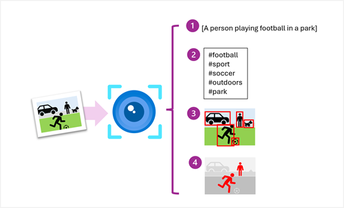

The **Azure AI Vision** service is designed to help you extract information from images. It provides functionality that you can use for:

- *Description and tag generation* - determining an appropriate caption for an image, and identifying relevant "tags" that can be used as keywords to indicate its subject.
- *Object detection* - detecting the presence and location of specific objects within the image.
- *Face detection* - detecting the presence, location, and features of human faces in the image.
- *Image metadata, color, and type analysis* - determining the format and size of an image, its dominant color palette, and whether it contains clip art.
- *Category identification* - identifying an appropriate categorization for the image, and if it contains any known landmarks.
- *Brand detection* - detecting the presence of any known brands or logos.
- *Moderation rating* - determine if the image includes any adult or violent content.
- *Optical character recognition* - reading text in the image.
- *Smart thumbnail generation* - identifying the main region of interest in the image to create a smaller "thumbnail" version.

You can provision **Azure AI Vision** as a single-service resource, or you can use the Azure AI Vision API in a multi-service **Azure AI Services** resource.

> [!NOTE]
> In this module, we'll focus on the image analysis and thumbnail generation capabilities of the Azure AI Vision service. To learn how to use the Azure AI Vision service for optical character recognition, check out the [Read Text in images and documents with the Azure AI Vision service](/training/modules/read-text-images-documents-with-computer-vision-service/) module.
