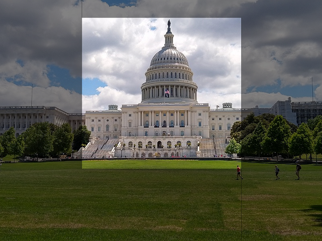

Thumbnails are often used to provide smaller versions of images in applications and websites. For example, a tourism site might display a list of tourist attractions in a city with a small, representative thumbnail image for each attraction; and only display the full image when the user selects the "details" page for an individual attraction.

The Azure AI Vision service enables you to create a thumbnail with different dimensions (and aspect ratio) from the source image, and optionally to use image analysis to determine the *region of interest* in the image (its main subject) and make that the focus of the thumbnail. This ability to determine the region of interest is especially useful when cropping the image to change its aspect ratio.

You can generate thumbnails with a width and height up to 1024 pixels, with a recommended minimum size of 50x50 pixels.
