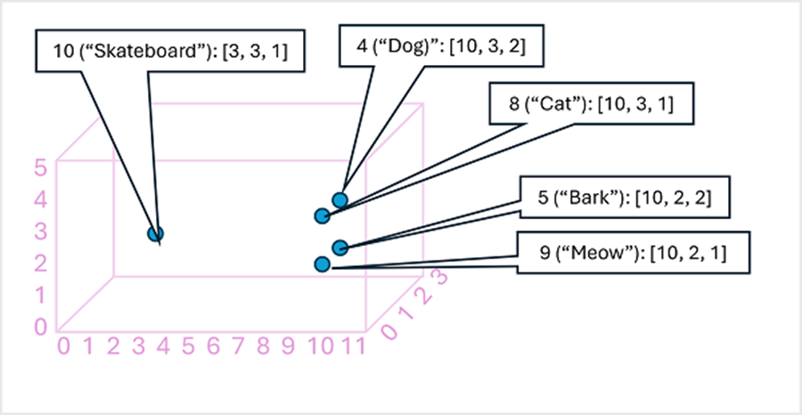

Before exploring the text analytics capabilities of the Azure AI Language service, let's examine some general principles and common techniques used to perform text analysis and other natural language processing (NLP) tasks.

Some of the earliest techniques used to analyze text with computers involve statistical analysis of a body of text (a *corpus*) to infer some kind of semantic meaning. Put simply, if you can determine the most commonly used words in a given document, you can often get a good idea of what the document is about.

## Tokenization

The first step in analyzing a corpus is to break it down into *tokens*. For the sake of simplicity, you can think of each distinct word in the training text as a token, though in reality, tokens can be generated for partial words, or combinations of words and punctuation.

For example, consider this phrase from a famous US presidential speech: "*we choose to go to the moon*". The phrase can be broken down into the following tokens, with numeric identifiers:

1. we 
2. choose
3. to
4. go
5. the
6. moon

Notice that "to" (token number 3) is used twice in the corpus. The phrase "*we choose to go to the moon*" can be represented by the tokens [*1,2,3,4,3,5,6*].

> [!NOTE]
> We've used a simple example in which tokens are identified for each distinct word in the text. However, consider the following concepts that may apply to tokenization depending on the specific kind of NLP problem you're trying to solve:
>
> - **Text normalization**: Before generating tokens, you may choose to *normalize* the text by removing punctuation and changing all words to lower case. For analysis that relies purely on word frequency, this approach improves overall performance. However, some semantic meaning may be lost - for example, consider the sentence "*Mr Banks has worked in many banks.*". You may want your analysis to differentiate between the person *Mr Banks* and the *banks* in which he has worked. You may also want to consider "*banks.*" as a separate token to "*banks*" because the inclusion of a period provides the information that the word comes at the end of a sentence
> - **Stop word removal**. Stop words are words that should be excluded from the analysis. For example, "*the*", "*a*", or "*it*" make text easier for people to read but add little semantic meaning. By excluding these words, a text analysis solution may be better able to identify the important words.
> - **n-grams** are multi-term phrases such as "I have" or "he walked". A single word phrase is a *unigram*, a two-word phrase is a *bi-gram*, a three-word phrase is a *tri-gram*, and so on. By considering words as groups, a machine learning model can make better sense of the text. 
> - **Stemming** is a technique in which algorithms are applied to consolidate words before counting them, so that words with the same root, like "power", "powered", and "powerful", are interpreted as being the same token.

## Frequency analysis

After tokenizing the words, you can perform some analysis to count the number of occurrences of each token. The most commonly used words (other than *stop words* such as "*a*", "*the*", and so on) can often provide a clue as to the main subject of a text corpus. For example, the most common words in the entire text of the "go to the moon" speech we considered previously include "*new*", "*go*", "*space*", and "*moon*". If we were to tokenize the text as bi-grams (word pairs), the most common bi-gram in the speech is "*the moon*". From this information, we can easily surmise that the text is primarily concerned with space travel and going to the moon.

> [!TIP]
> Simple frequency analysis in which you simply count the number of occurrences of each token can be an effective way to analyze a single document, but when you need to differentiate across multiple documents within the same corpus, you need a way to determine which tokens are most relevant in each document. *Term frequency - inverse document frequency* (TF-IDF) is a common technique in which a score is calculated based on how often a word or term appears in one document compared to its more general frequency across the entire collection of documents. Using this technique, a high degree of relevance is assumed for words that appear frequently in a particular document, but relatively infrequently across a wide range of other documents.

## Machine learning for text classification

Another useful text analysis technique is to use a classification algorithm, such as *logistic regression*, to train a machine learning model that classifies text based on a known set of categorizations. A common application of this technique is to train a model that classifies text as *positive* or *negative* in order to perform *sentiment analysis* or *opinion mining*.

For example, consider the following restaurant reviews, which are already labeled as **0** (*negative*) or **1** (*positive*):

- *The food and service were both great*: 1
- *A really terrible experience*: 0
- *Mmm! tasty food and a fun vibe*: 1
- *Slow service and substandard food*: 0

With enough labeled reviews, you can train a classification model using the tokenized text as *features* and the sentiment (0 or 1) a *label*. The model will encapsulate a relationship between tokens and sentiment - for example, reviews with tokens for words like *"great*", "*tasty*", or "*fun*" are more likely to return a sentiment of **1** (*positive*), while reviews with words like "*terrible*", "*slow*", and "*substandard*" are more likely to return **0** (*negative*).

## Semantic language models

As the state of the art for NLP has advanced, the ability to train models that encapsulate the semantic relationship between tokens has led to the emergence of powerful language models. At the heart of these models is the encoding of language tokens as vectors (multi-valued arrays of numbers) known as *embeddings*.

It can be useful to think of the elements in a token embedding vector as coordinates in multidimensional space, so that each token occupies a specific "location." The closer tokens are to one another along a particular dimension, the more semantically related they are. In other words, related words are grouped closer together. As a simple example, suppose the embeddings for our tokens consist of vectors with three elements, for example:

- 4 ("dog"): [10.3.2]
- 5 ("bark"): [10,2,2]
- 8 ("cat"): [10,3,1]
- 9 ("meow"): [10,2,1]
- 10 ("skateboard"): [3,3,1]

We can plot the location of tokens based on these vectors in three-dimensional space, like this:

The locations of the tokens in the embeddings space include some information about how closely the tokens are related to one another. For example, the token for "dog" is close to "cat" and also to "bark." The tokens for "cat" and "bark" are close to "meow." The token for "skateboard" is further away from the other tokens.

The language models we use in industry are based on these principles but have greater complexity. For example, the vectors used generally have many more dimensions. There are also multiple ways you can calculate appropriate embeddings for a given set of tokens. Different methods result in different predictions from natural language processing models.

A generalized view of most modern natural language processing solutions is shown in the following diagram. A large corpus of raw text is tokenized and used to train language models, which can support many different types of natural language processing task.

Common NLP tasks supported by language models include:
- Text analysis, such as extracting key terms or identifying named entities in text.
- Sentiment analysis and opinion mining to categorize text as *positive* or *negative*.
- Machine translation, in which text is automatically translated from one language to another.
- Summarization, in which the main points of a large body of text are summarized.
- Conversational AI solutions such as *bots* or *digital assistants* in which the language model can interpret natural language input and return an appropriate response.

These capabilities and more are supported by the models in the Azure AI Language service, which we'll explore next.