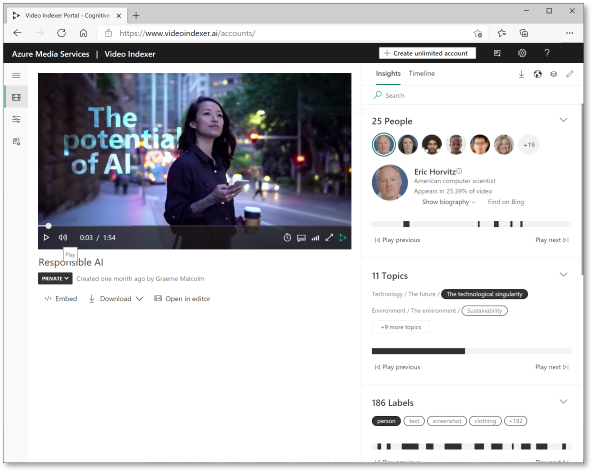

The **Azure Video Indexer** service is designed to help you extract information from videos. It provides functionality that you can use for:

- *Facial recognition* - detecting the presence of individual people in the image. This requires [Limited Access](https://aka.ms/cog-services-limited-access) approval.
- *Optical character recognition* - reading text in the video.
- *Speech transcription* - creating a text transcript of spoken dialog in the video.
- *Topics* - identification of key topics discussed in the video.
- *Sentiment* - analysis of how positive or negative segments within the video are.
- *Labels* - label tags that identify key objects or themes throughout the video.
- *Content moderation* - detection of adult or violent themes in the video.
- *Scene segmentation* - a breakdown of the video into its constituent scenes.

The Video Analyzer service provides a portal website that you can use to upload, view, and analyze videos interactively.

You can use a free, standalone version of the Video Analyzer service (with some limitations), or you can connect it to an **Azure Media Services** resource in your Azure subscription for full functionality.
