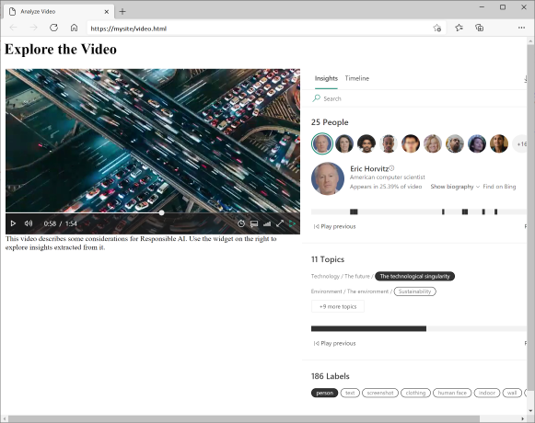

While you can perform all video analysis tasks in the Azure Video Indexer portal, you may want to incorporate the service into custom applications. There are two ways you can accomplish this.

## Azure Video Indexer widgets

The widgets used in the Azure Video Indexer portal to play, analyze, and edit videos can be embedded in your own custom HTML interfaces. You can use this technique to share insights from specific videos with others without giving them full access to your account in the Azure Video Indexer portal.



## Azure Video Indexer API

Azure Video Indexer provides a REST API that you can subscribe to in order to get a subscription key. You can then use your subscription key to consume the REST API and automate video indexing tasks, such as uploading and indexing videos, retrieving insights, and determining endpoints for Video Analyzer widgets.

For example, a call to the `https://api.videoindexer.ai.your_endpoint/Videos` REST interface returns details of videos in your account, similar to the following JSON example:

```JSON
{
  "results": [
    {
      "accountId":  "1234abcd-9876fghi-0156kihb-00123",
      "id":  "a12345bc6",
      "name":  "Responsible AI",
      "description":  "Microsoft Responsible AI video",
      "created":  "2021-01-05T15:33:58.918+00:00",
      "lastModified":  "2021-01-05T15:50:03.123+00:00",
      "lastIndexed":  "2021-01-05T15:34:08.007+00:00",
      "processingProgress":  "100%",
      "durationInSeconds":  114,
      "sourceLanguage":  "en-US",
    }
  ],
}
```