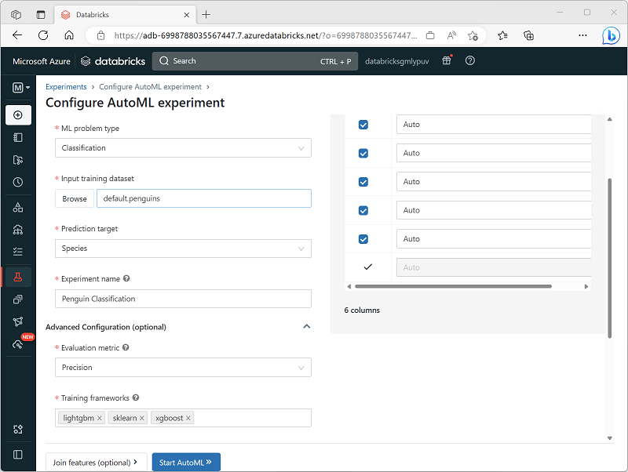
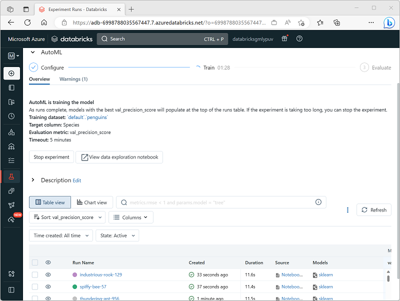

You can use the graphical user interface in the Azure Databricks portal to create and manage AutoML experiments.

## Configure an AutoML experiment

To configure the AutoML experiment, you must specify the settings for your specific model training requirements, including:

- The cluster on which to run the experiment.
- The type of machine learning model to be trained (clustering, regression, or forecasting).
- The table containing the training data.
- The target label field to be predicted by the model.
- A unique name for the AutoML experiment (child runs for each training trial are uniquely named automatically).
- The evaluation metric you want to use to determine the best performing model.
- The machine learning training frameworks you want to try.
- The maximum time for the experiment.
- The positive label value (for binary classification only).
- The time column (for forecasting models only).
- Where to save the trained models (as MLflow artifacts or in the DBFS store).

## Review AutoML results

As the AutoML experiment progresses, its child runs are displayed, with the experiment that produced the best performing model so far first.

You can wait for the experiment to finish, or explore the models produced so far and stop the experiment if you're satisfied that one of them fits your needs.

You can explore each run to view the notebook that was generated and the metrics for the model it produced. Then you can register the model and deploy it for inferencing.
