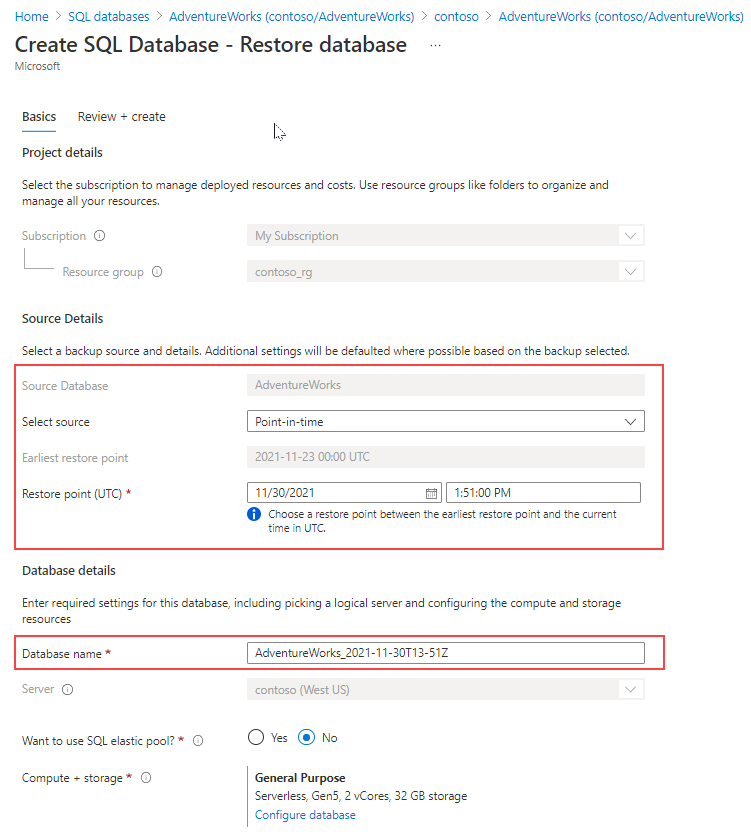
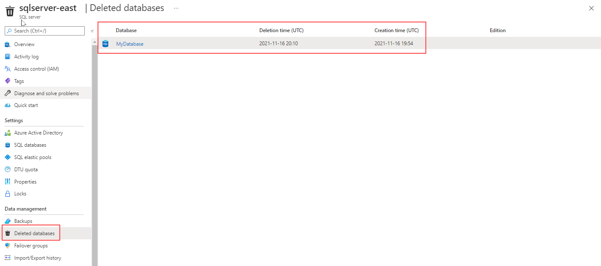

Back up and restore on SQL Server PaaS offering work differently than on IaaS. Backups are generated automatically for Azure SQL Database, and Azure SQL Managed Instance. A full backup is created once a week, a differential every 12 hours, and transaction log backups every 5 – 10 minutes. All backups are located in read-access, geo-redundant (RA-GRS) blobs replicated to a datacenter that is paired based on Azure rules. That means backups are safe from an outage in a single data center.

## Database backup and restore for SQL Database

SQL Database can assist you to be compliant with mandatory backups for regulatory purposes with retention policies. Backup policies can be configured per database as shown in the image below:

:::image type="content" source="../media/module-77-high-availability-final-16.png" alt-text="Configuring automated backups for Azure SQL Database":::

If the server containing the database is deleted, all backups will be deleted at the same time, and there is no way to recover them. If the server is not deleted but the database is, you can restore the database normally.

Both SQL Database, and SQL Database Managed Instance have a feature called Accelerated Database Recovery (ADR). This feature is enabled by default, and its purpose is to decrease the time it takes to deal with long running transactions so they do not impact the recovery time. Although Accelerated Database Recovery was developed for Azure and was originally an Azure-based feature, ADR was implemented in SQL Server 2019 as well.

> [!NOTE]
> You can't restore SQL Database Managed Instance backups on SQL Database.

### Point in time restore

To restore a database to a specific point in time on SQL Database, you can use either Azure portal, Azure PowerShell, Azure CLI, or REST API.

> [](../media/restore-sql-database.png#lightbox)

The image above shows the SQL Database restore page on Azure portal, where you can restore a database to a specific point in time.

Restore in place is not supported on SQL Database, and SQL Managed Instance. You need to make sure the database does not exist before attempting the restore operation. By default, point in time retention policy is set to seven days, and you can change it to up to 35-days.

### Restore a deleted database

Both SQL Database, and SQL Managed Instance have a feature to restore a deleted database to the last point in time available before the `DROP DATABASE` took place.

> [](../media/restore-sql-database-deleted.png#lightbox)

The image above shows how to restore a deleted database on SQL Database. The *deleted databases* page shows a list of deleted databases available to restore, the database deletion time in UTC, and the database creation time in UTC. Once you select the database, the *Create SQL Database - Restore database* page will open. On that page you will find the earliest restore point in time available for the selected database.

## Database backup and restore for SQL Database Managed Instance

Azure manages backups for databases in SQL Database Managed Instance automatically, and they operate similar to SQL Database.

You can also manually back up, and restore databases with SQL Database Managed Instance using the same backup to URL/restore from URL functionality found in SQL Server covered earlier. That requires the use of credentials to access the Azure Blob Storage container. SQL Database does not support this feature.

You can only generate a `COPY_ONLY` backup since SQL Database Managed Instance is maintaining the log chain. A sample backup statement would look like:

```sql
BACKUP DATABASE contoso
TO URL = 'https://myacc.blob.core.windows.net/mycontainer/contoso.bak' 
WITH COPY_ONLY
```

> [!NOTE]
> You can't restore SQL Database Managed Instance backups on SQL Database.

## Database backup and restore for Azure Database for MySQL

Backups of the data files and transaction log are automatically created for Azure Database for MySQL in either locally- or geo-redundant storage. The backups are encrypted with a default retention of seven days, and a maximum of 35. One nice thing about the backups is that there is no cost; if a server is provisioned with 100 GB of storage, you get the equivalent amount of backup space included with what you are already paying. If backup storage exceeds the 100 GB, there will be a charge.

Restores can be done either to a point in time or as a geo-restore, which recovers the database in another region if geo-redundant storage was configured.

Similar to Azure SQL Database and Azure SQL Database Managed Instance, these backups can only be used by Azure Database for MySQL and not a standard installation of MySQL.

## Database backup and restore for Azure Database for PostgreSQL

The backup and restore situation for Azure Database for PostgreSQL is similar to that of MySQL. Backups occur automatically and both data files and the transaction log are backed up. The retention and encryption are the same as are the options for local- or geo-redundancy, cost, and restore options. The only difference is that depending on the supported maximum storage size, Azure will create full and differential backups (max of 4 TB) or snapshot backups (up to 16 TB).

Similar to all other Azure PaaS offerings, these backups can only be used by Azure Database for PostgreSQL and not a standard installation of PostgreSQL.
